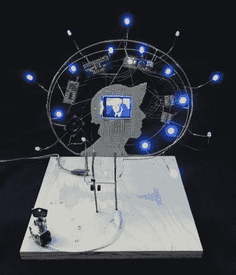

# 新竞赛:在家制造技术

> 原文：<https://hackaday.com/2020/04/30/new-contest-making-tech-at-home/>

好好利用零件箱，建造一些东西！这就是[在家制作技术竞赛](https://hackaday.io/contest/171008-the-tech-home-challenge)的主旨，在这里，你的内心可以通过利用你手头的部件进行制作而发光。

那你打算建什么？我们并不挑剔，我们只是希望它很酷。用一个令人敬畏的项目抓住每个人的注意力，然后用你在哪里找到组件的故事赢得我们的心。

Daniel Domínguez’s [Parts Bin Self Portrait](https://hackaday.io/project/163183-parts-bin-self-portrait) is an excellent example

一个很好的例子是这里看到的[零件箱自画像](https://hackaday.io/project/163183-parts-bin-self-portrait)，它是电路雕塑比赛的亚军。[Daniel Domínguez]讲述了从一块原型板的碎片上剪下他的剪影，从零件箱中拉出开发板，并在路边找到一个吊扇，最终捐赠了其电机绕组的电线。

你的故事才是最重要的。你可以制作出一个光滑漂亮、看起来一点也不粗糙的设备——告诉我们完成的项目是做什么的，但我们也需要知道你手头有哪些部件，它们来自哪里，以及是什么让你使用它们。当你藏了十年的坏掉的恒温器或意外订购的 0402 电阻最终被使用时，有一种满足感。掸掉电子仓库的灰尘，开始建造吧！

## 整个比赛过程中发出的奖品

这场比赛将持续到 7 月 28 日，但你不必等那么久就能获得一些战利品。三十个参赛作品将赢得 Digi-Key 提供的一袋材料，我们每周都会挑选几个项目，朝着这个数字努力。通过[为你最喜欢的装备](https://form.jotform.com/201174875314151)投票，帮助我们决定送什么礼物。

比赛结束后，三名冠军将获得一个装满价值 500 美元组件的大袋子。你知道……添加到你的零件箱中，以备将来使用。

如果你和我们一样，人们会把他们的坏东西送给你，因为他们听说过你用坏掉的电子产品组装东西。您对保留旧硬件感到左右为难，但又对将其送去垃圾填埋场感到内疚。当您订购零件时，您会得到多个零件，这样您就可以为下一个项目准备好这些零件。[你是为这场比赛而生的](https://hackaday.io/contest/171008-the-tech-home-challenge)，无论谁获奖，我们都想看看你的零件箱。