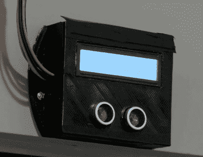

# 使用这款智能引体向上棒进行隔离健身

> 原文：<https://hackaday.com/2020/05/04/get-quarantine-fit-with-this-smart-pull-up-bar/>

由于社会距离规则，大多数健身房现在都关门了，这是我们用来证明我们懒惰生活方式的最新借口。但是很明显，有些人错过了足够多的锻炼，以至于他们临时组织了家庭健身房。[[Michael Pick]甚至为他的 DIY 引体向上站配备了 Arduino](https://www.youtube.com/watch?v=wJVbLDIWk7k)，以便在锁定状态下记录他的锻炼情况。你可能不喜欢，但这就是巅峰性能的样子。

Can you beat the HaD high score?

在广告之后的视频中，[Michael]解释了酒吧本身的设计和建造，从技术上讲，它可以被认为是自己的项目。显然 Arduino 计数器并不是绝对必要的，所以如果你只是想知道如何将一些木屑和合适的结实的杆放在一起，这样当你把体重放在上面时，它不会撕裂墙壁，这个视频就是为你准备的。

视频快结束时，他开始解释该项目的电子部分。3D 打印外壳内有一个 Arduino Pro Mini、一个 HC-SR04 超声波传感器和一个 1602 串行 LCD。一旦这个小工具被安装在正确的位置并被激活，它就会计算[迈克尔]在屏幕上做了多少个引体向上。

虽然我们在历史上没有看到很多自制运动器材，但目前新冠肺炎的情况似乎让你们中的一些人肾上腺素激增。我们最近报道了一些由五金店发现的 [DIY 哑铃，这对任何最近被驱逐出黑客帝国并试图第一次使用他们的肌肉的黑客来说都是一个极好的第一个项目。](https://hackaday.com/2020/03/29/pumping-concrete/)

 [https://www.youtube.com/embed/wJVbLDIWk7k?version=3&rel=1&showsearch=0&showinfo=1&iv_load_policy=1&fs=1&hl=en-US&autohide=2&wmode=transparent](https://www.youtube.com/embed/wJVbLDIWk7k?version=3&rel=1&showsearch=0&showinfo=1&iv_load_policy=1&fs=1&hl=en-US&autohide=2&wmode=transparent)

