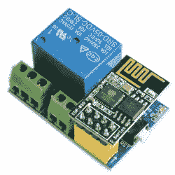

# 三美元的路由器重开机有一个工作

> 原文：<https://hackaday.com/2020/05/06/three-dollar-router-rebooter-has-one-job/>

有时，路由器重启后，连通性问题就会消失。对于一个不应该存在的问题，这是一个简单但不方便的解决方案，但这并没有阻止[Mike Diamond]为了几美元而将其部分自动化。三美元的路由器重启器可能是一个只有一项工作的简单设备，但它有很好的证明，值得一看。

 该设备是一个 ESP8266 板，被配置为尝试通过本地无线网络定期联系谷歌。如果无法联系到 Google，主板会认为需要重启，并使用继电器断开路由器的 12 V 电源。然后，延迟一段时间后，电源重新接通，所有的问题都结束了，直到下一次发生。[Mike]使用了一个继电器模块，该模块具有内置的螺丝端子和一个用于 ESP8266-01 的插座，因此看起来整个设备可以不用焊接任何东西就可以组装在一起。

虽然实现这一点的代码听起来可能微不足道，但[Mike]还是深入研究了如何记录它。它是一个很好的例子，展示了如何以一种清晰简洁的方式实现一个简单的事件驱动的有限状态机。通过构建代码，使设备可以处于有限数量的特定状态(路由器通电、路由器断电和测试连接),并准确定义设备如何以及何时在这些状态之间切换，操作和故障排除变得更加易于管理。另一个很棒的例子是这个[物联网车库门开启器项目](https://hackaday.com/2019/01/10/state-machine-controls-garage-door-over-the-internet/)。如果您正在编写与物理事物交互的设备，这些技术绝对是很好的实践。