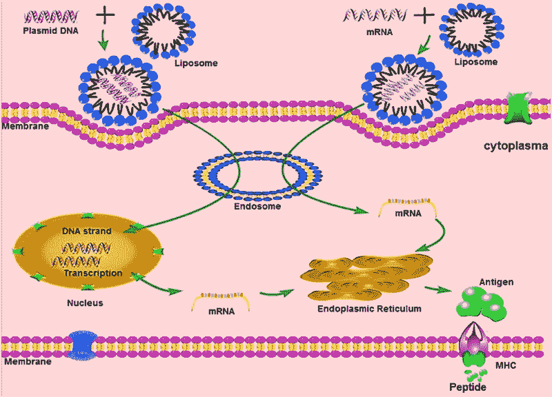

# 你体内的疫苗工厂:RNA 疫苗基础

> 原文：<https://hackaday.com/2020/05/04/the-vaccine-factory-inside-you-rna-vaccine-basics/>

随着世界从新冠肺炎疫情的急性期抽身，它将进入一个或许更具挑战性的时期:管理导致该疾病的新型冠状病毒病毒的长期存在。在现代疫苗接种实践的大约两个世纪的历史中，我们已经非常善于寻找保护自己免受传染病感染的方法，毫无疑问，我们将为新型冠状病毒做同样的事情。但是开发针对任何病毒或细菌的疫苗需要时间，在疫情的情况下，时间就是最宝贵的。

为了创造一种有效的疫苗来对抗这种最新的病毒威胁，世界各地的科学家和医生已经采取了不同的接种方法。他们不是用削弱的病毒样本以通常的方式刺激免疫系统，而是试图使用病毒的遗传物质来刺激免疫反应。这些 RNA 疫苗是一种对付新型感染的新方法，了解它们的工作原理将是决定它们是否是攻击这种疫情病毒的正确方法的关键。

## 模拟刺激

免疫系统非常复杂，由一系列细胞和组织组成，这些细胞和组织能够识别和消除入侵的生物体，并形成冲突的“机构记忆”，以便能够迅速应对未来的感染。可能有点难以理解免疫系统的术语，所以如果高中生物学已经过去了一段时间，你可能想看看我以前为新冠肺炎写的关于免疫系统测试的文章，它涵盖了免疫系统的基础知识。

在其核心，免疫系统通过对入侵微生物中存在的蛋白质做出反应来发挥作用，它通过双管齐下的攻击来实现这一点。事情始于先天免疫系统，这是一种细胞的“快速反应力”，可以结合并吞噬任何携带非自身蛋白标记的细胞，这些细胞设法进入体内。这些入侵者被分解，剩余的蛋白质被呈递到适应性免疫系统的细胞，然后开始产生抗体的缓慢过程，这些抗体以很高的特异性结合入侵者的蛋白质。这些抗体被极大地放大以应对当前的感染，当威胁结束时，携带这些抗体的细胞将保持在低水平，准备好发动另一次攻击，以防入侵者再次来访。

疫苗接种是适应性免疫系统攻击的一个开端。通过用杀死的病原体样本或已经被削弱到不会引起疾病的活的病原体样本来挑战某人，免疫系统了解疾病的样子。通过模拟感染，疫苗接种启动了适应性免疫系统，在不实际经历疾病过程的情况下赋予了一定程度的免疫力。当然，也有一些警告。不是每一种疫苗都能产生终生免疫；季节性流感病毒尤其如此，它们往往会频繁变异，并向免疫系统呈现不同的特征，因此每年都需要新的疫苗。但在大多数情况下，通过接种疫苗启动免疫系统的效果足够好，以至于数十种曾经致命的疾病不再是威胁，而且有几种已经被根除。

然而，传统的疫苗生产是一个痛苦而缓慢的过程。创造一种病原体，正确地刺激免疫系统，而不引起它本应预防的疾病，是一件棘手的事情。对于病毒疫苗，第一步是分离病毒并大量培养。对于流感病毒来说，这是用鸡蛋完成的，每年高达数百万个。其他病毒在哺乳动物细胞培养中生长，这往往对生长条件非常挑剔。一旦培养出足够多的病毒，就需要将其从生长培养基中分离出来，进行纯化，并加入到其他成分中，使疫苗适合注射。这就是简单的制造过程。加上研发和进行安全性和有效性试验所需的时间，新疫苗的上市时间可以很容易地用几年来衡量。

 [https://www.youtube.com/embed/krbIdBRWvLA?version=3&rel=1&showsearch=0&showinfo=1&iv_load_policy=1&fs=1&hl=en-US&autohide=2&wmode=transparent](https://www.youtube.com/embed/krbIdBRWvLA?version=3&rel=1&showsearch=0&showinfo=1&iv_load_policy=1&fs=1&hl=en-US&autohide=2&wmode=transparent)

## 你体内的疫苗工厂

为了缩短新疫苗的研发时间，制造商正试图利用基因工程，从本质上让病人成为制造工厂。RNA 疫苗的工作原理不是将病毒蛋白引入患者体内，而是在患者自身细胞中制造这些蛋白的指令。

回想一下，信使 RNA 或 mRNA 是通过转录过程在细胞中产生的，其中细胞核内的 DNA 片段被复制到单链核酸 RNA 中。这个转录物移出细胞核，被核糖体用来在翻译过程中产生氨基酸链。这些多肽链然后折叠成复杂的形状，决定它们作为成品蛋白质的功能。关于这个过程的更多细节，请查看我关于蛋白质折叠的文章。

Schematic for mRNA vaccination. A DNA vaccine is shown as well; the advantage of RNA vaccines is that translation occurs directly in the cytosol without transport of the DNA to the nucleus for transcription first. Source: Zhang *et al*. Advances in mRNA Vaccines for Infectious Diseases, [*Front. Immunol.*](https://www.frontiersin.org/articles/10.3389/fimmu.2019.00594/full)*, 27 March 2019.*

 *然后，RNA 疫苗寻求将特定的 RNA 序列放入细胞中，使其能够被细胞翻译成蛋白质。这与病毒感染的实际过程没有任何不同，病毒感染的结果是病毒的遗传载荷劫持细胞的机器来复制更多的自身。但是，当病毒将完整的基因组注入宿主细胞时，RNA 疫苗的有效载荷非常有限，并且没有摧毁它所感染的细胞的潜力，而这正是导致病毒感染相关症状的原因。

一旦 RNA 疫苗被引入病人体内，情况就会像病毒感染一样发展。摄取 RNA 的细胞会忠实地翻译它所包含的遗传密码，产生该序列编码的蛋白质。在新型冠状病毒的情况下，大多数研究人员似乎专注于研究病毒外部的病毒刺突蛋白，使其能够与人类呼吸道和消化道的受体结合。通过产生大量这种蛋白质，患者自身的细胞正在完成通常在鸡蛋或细胞培养中完成的工作，而不需要昂贵和耗时的最终产品纯化。一旦细胞产生了目标蛋白或免疫原，就可以很容易地训练适应性免疫系统，这有望产生更广泛的免疫力。

## 利弊

RNA 疫苗的过程听起来相当简单，但正如所有涉及生物学的事情一样，故事并不简单。虽然已经尝试了一些“裸 RNA”疫苗，但简单地注射含有 RNA 片段的溶液不一定有效。任何曾经在生物实验室工作过的人都会告诉你，RNA 是出了名的微妙的东西。不像它的双链和相对健壮的表亲 DNA，RNA 的单链使它容易受到核糖核酸酶(RNA 酶)的攻击，这种酶非特异性地将 RNA 切割成片段。在体内，核糖核酸酶通过限制 mrna 的寿命在调节蛋白质生产中起着至关重要的作用，并且在产生任何有用数量的病毒蛋白质之前，仅由裸 RNA 组成的部分或全部疫苗很可能会被降解。

为了解决递送问题，一些公司正专注于通过脂质纳米颗粒递送 RNA 疫苗。这正是它听起来的样子——一个 RNA 序列被打包成一个油腻的小脂肪球。这个想法是为了让脂质容器保护 RNA 不被降解，并使患者的细胞更容易吸收，将遗传有效载荷准确地传递到可以使用它的地方。一些制造商甚至正在研究定制的脂质包装，可以针对体内的特定细胞类型。

无论 RNA 疫苗的递送载体看起来像什么，底线是我们本质上是在构建人工病毒部分——劫持细胞机制的遗传有效载荷。当然，其目的是治疗，但事实仍然是，通过利用我们细胞已经做得很好的东西，我们可能能够为新冠肺炎和其他疾病，甚至是癌症，提供疫苗，比试图以传统方式更快地到达一个等待的世界。*