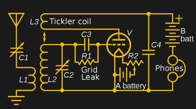
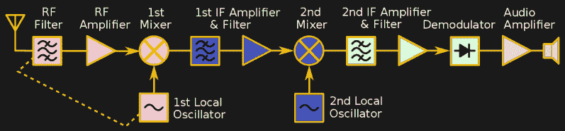

# 现代无线电接收机结构:从再生到直接转换

> 原文：<https://hackaday.com/2020/07/17/modern-radio-receiver-architecture-from-regenerative-to-direct-conversion/>

现代无线电接收机比我在上一篇文章中提到的常见的[早期设计有明显的优势。在过去的几十年里，你将会接触到的大多数接收器都是由](https://hackaday.com/?p=410524)[埃德温·阿姆斯特朗](https://hackaday.com/2018/07/24/edwin-armstrongs-battle-for-fm-radio/)设计的；再生，超再生，或最常见的超外差。这些都是由几个迷人的关键特征来区分的，这些特征既有好处也有缺点。

今天让我们来看看阿姆斯特朗先生的接收器。我还将谈到 DC 接收器，尽管它的名字，并不是用来听电池的。这些是你在现代设备中更可能遇到的接收器。

## 再生和超再生

再生接收器就是要做到事半功倍。在 RF 遥控器等简单应用中，仍然可以看到其中一些。这个想法来源于振荡器的工作原理。简单来说，振荡器是一个具有足够正反馈的放大器，任何处于正确频率的微小信号都会被放大，然后通过反馈，不断输出。如果一切都很完美，那么，一个振荡器在给定的频率下将会有无限的增益。

当然，事情并不完美，但已经足够接近了。你必须把反馈网络设置得恰到好处，以获得你想要的频率。此外，自然界中的事物往往是线性的，因此放大器不会在给定频率下没有增益，然后突然有无限的增益。增益增加，直到满足巴克豪森标准并实现稳定振荡。

 其实有时候我们想搭建一个放大器，发现它因为某种原因振荡了。也许这就是埃德温·阿姆斯特朗想到再生接收器的原因。其中，放大器几乎被推到目标频率的振荡点。这可以为单个电子管或晶体管带来巨大的增益。当使用低质量的有源器件时，这一点尤其重要。例如，一个增益为 10 的无再生电子管在振荡边缘时可能会放大 5000 到 10000 倍。

这是一个巨大的进步，意味着一个非常简单的设备就可以接收非常远的无线电信号。有很多方法可以安排积极的反馈。然而，最常见的方法(如随附的示意图所示)是在主调谐电路线圈周围放置一个称为辅助线圈的拾波线圈。如果线圈相位不一致，你会得到负面反馈，所以对这种收音机的普遍建议是，如果你做好之后它不工作，试着反转备忘录的引线。

超级再生是阿姆斯特朗的另一项设计。它本质上是相同的电路，但在高于目标带宽的某个频率后，该设计会停止振荡动作，允许其再次建立。阿姆斯特朗称之为淬火。这可以将收益提高近一百万倍。阿姆斯特朗最初的概念演示展示了一个三管接收器，其灵敏度与九管常规设计相当。

不过，这两种设计都有一些缺点。你通常必须调整再生，电路很容易进入振荡，产生尖叫。它也将信号辐射出天线，所以它是一种发射机。这不利于干扰或军事应用，因为你不希望被发现。如果你想建造自己的，过去我们有一些给你的建议，包括 T2，一些试验板上的 T4。如果你愿意，你可以在下面的视频中模拟一个。

 [https://www.youtube.com/embed/LB8ISlB8bZE?version=3&rel=1&showsearch=0&showinfo=1&iv_load_policy=1&fs=1&hl=en-US&autohide=2&wmode=transparent](https://www.youtube.com/embed/LB8ISlB8bZE?version=3&rel=1&showsearch=0&showinfo=1&iv_load_policy=1&fs=1&hl=en-US&autohide=2&wmode=transparent)

## 超外差的

阿姆斯特朗也是最成功的建筑——超外差式建筑的幕后推手。如果你有一个非软件定义的无线电，它可能使用这种技术。这个想法很简单，与选择性有关。以 TRF 电台为例。在检测器之前放置更多的级可以获得更好的性能。但是每一级都必须覆盖无线电的整个范围，并且当你改变频率时需要调谐。

阿姆斯特朗的想法是限制这一点。在混频器前可能有也可能没有相对较宽的滤波器，混频器[将两个 RF 信号相加(或相减)。然后本地振荡器向混频器提供另一个信号。假设您想要接收 1 MHz 的信号，并将本地振荡器设置为 9 MHz。你会得到一个 10 兆赫(和 8 兆赫)的信号。现在，您可以对该 10 Mhz 信号进行滤波，并使用无需调谐的滤波器和放大器进行放大(至少不会超过一次)。这使得他们的设计简单，也减少了运营商的麻烦。](https://hackaday.com/2018/06/11/understanding-a-mosfet-mixer/)

现在，如果您想要接收 1.1 MHz 的信号，您需要将本振频率更改为 8.9 MHz。你仍然能收到 10 兆赫的信号。如果有一个频率为 1.2 MHz 的电台，你也会得到一个频率为 10.1 MHz 的信号，但由于你有 10 MHz 的滤波器和放大器，你可以很容易地去掉它。在本例中，10 MHz 是 IF 或中频。

这是制造收音机的好方法。通过增加更多的中频级，可以增加增益和选择性。正如我在上一篇文章中提到的，唯一真正的缺点是图像的可能性。因为混音器既做加法又做减法，所以您可能会听到错误频率的电台。考虑本振频率为 9 MHz 的 1 MHz 信号。天线上的 19 MHz 信号也会出现在混频器的 10 MHz 输出端，因为 19-9=10，就像 1+9=10 一样。

有几种方法可以克服这一点。首先，你可以在调音台前过滤。这就是为什么许多收音机都有一个波段开关——嗯，这至少是原因之一。你选择一个滤镜，粗略地滤除图像中的干扰。高质量接收机将使用双变频，其中一个混频器产生一个中频信号，然后再次混频形成第二个中频信号。有些人甚至会使用更多的转换来优化过滤。

这在几个方面会有帮助。镜像频率始终是本地振荡器频率的两倍。回到 1 MHz 信号的例子，镜像频率为 2×9+1=19 MHz。因此，IF 越高，就越容易滤除图像。举个愚蠢的例子，假设 1 MHz 接收机使用 61 MHz 中频。现在，本地振荡器将以 60 MHz 运行，镜像频率将为 121 MHz。从 121 MHz 中滤除 1 MHz 是微不足道的。

问题是使用较高的 IF 会使抑制频率相邻的电台变得更加困难。在我们的极端例子中，选择 61 MHz 至 61.02 MHz 的滤波器比选择 10 MHz 至 10.02 MHz 的滤波器更复杂，成本也更高。诚然，有表面声波滤波器和其他器件可以完成这项工作，但通常情况下，给定成本下的最佳性能是低频滤波器和放大器。

如果你想对超外差做一个不太专业的概述，看看下面的视频。

 [https://www.youtube.com/embed/hz_mMLhUinw?version=3&rel=1&showsearch=0&showinfo=1&iv_load_policy=1&fs=1&hl=en-US&autohide=2&wmode=transparent](https://www.youtube.com/embed/hz_mMLhUinw?version=3&rel=1&showsearch=0&showinfo=1&iv_load_policy=1&fs=1&hl=en-US&autohide=2&wmode=transparent)

## 直接转换

直接变频(DC)接收机已经重新开始使用，因为许多[软件定义无线电在数字化信号之前将其用作前端](https://hackaday.com/2018/06/06/homebrew-sdr-ham-radio-in-9-parts/)。你可以把 DC 接收机想象成超外差，本地振荡器不产生中频，而是被设置到你想要接收的频率。这意味着输出是检测到的无线电信号。

使用我们的 1 MHz 例子，为了调谐它，你设置本地振荡器为 1 MHz。输出是您通常用音频放大器处理的内容(在 AM 收音机的情况下)。这个设计有几个实际问题。如果本地振荡器没有锁定到发射站，输出将是不正确的。对于 SDR，这不是问题，因为 SDR 软件可以跟踪任何偏移，但如果没有计算机来处理事情，它需要许多元件保持在频率上(本质上是一个锁相环)。

另一方面，图像都是低频的，很容易被拒绝。许多简单的业余无线电接收机使用这种技术，因为你不需要许多需要调谐的特定频率放大器和滤波器。

## 开始接收

如果你想开始设计接收器，最好的办法是做一些，看看它们是如何工作的。再生接收机的简单性和性能是无与伦比的。当然，水晶套装更容易，但它不会像 regen 那样拾取。使用 NE602 或 NE612 混频器是制作直接变频接收机的简便方法，只需多做一点工作。你可以在超级热设计中使用相同的混音器，但它肯定需要更多的工作。

即使你用的是 SDR，通常也需要某种前端。还有一些更奇特的设计我们没有谈到。如果你想了解哈特利、巴伯·韦弗和其他有趣的话题，德克萨斯的一个关于这个话题的介绍会让你了解。

当然，最好的学习方法是去建造一些东西！我们讨论过的每一种收音机都不乏设计理念。一旦你开始在真正的硬件上进行调整，你会很快发现什么可行，什么不可行。

鸣谢:大多数漂亮的框图和原理图图片都是从维基百科上的公共领域资源改编而来，尤其是来自[Chetvorno]。多么棒的资源。