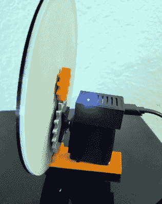

# 隔离时钟回答了这个重要问题

> 原文：<https://hackaday.com/2020/05/05/quarantine-clock-answers-the-important-question/>

对许多人来说，过去几周是一个相当大的调整期。当正常的工作或学校生活突然被打乱时，你的生物钟被打乱是很正常的。它可能开始于努力弄清楚是该吃午饭还是晚饭了，但现在它已经到了甚至日子都开始变得模糊的地步。如果你花了几秒钟才想起来今天是不是工作日，[【who sdadog】想出了一些可能帮助你回到正轨的东西](https://www.thingiverse.com/thing:4310631)。

 这个 3D 打印的时钟不是显示一天中的时间，而是告诉你你在本周的位置。每天午夜，指针将前进到第二天的中心。如果你愿意，对设备后部的传动装置和伺服装置进行轻微的改造，就可以让它顺利地度过每一天。这将让你了解你在每 24 小时内的进展，但是，如果你甚至不知道是早上还是晚上，你可能对这个建筑来说太远了。

时钟的伺服系统由 Wemos D1 Mini ESP8266 开发板驱动，这自然意味着它可以访问 WiFi，并可以通过 NTP 将自己设置为当前时间(或至少是一天)。你所要做的就是把你的网络信息放到草图里，然后闪到 ESP，你就可以开始了。

这个项目自然有点开玩笑，但我们确实认为这个设计有实际应用价值。有了新面孔和一些调整的代码，这可能是一种显示各种不需要高度粒度的数据的简单方法。我们自己的[【埃利奥特·威廉姆斯】最近做了一个展示，帮助他年幼的儿子了解他的新的家庭时间表](https://hackaday.com/2020/03/19/the-corona-clock/)，它也是以类似的原则运作的。