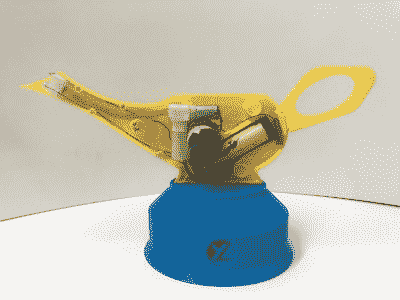

# 阿拉丁神灯用手指一弹就射出火焰

> 原文：<https://hackaday.com/2020/05/13/aladdin-lamp-shoots-flames-with-a-snap-of-your-fingers/>

尽管存在危险，但即使是玛丽·近藤也不会说服我们放弃喷火器项目，因为它们确实能激发我们的快乐。为了制作这个[火焰射击阿拉丁灯](https://hackaday.io/project/171349-aladdins-hand-sanitizer)【Yele labs】仅仅使用了一台 3D 打印机和一些基本的电子设备。

灯体由两个 3D 打印的两半组成，由钕磁铁固定在一起。它们装有一个 400 千伏火花发生器，一个燃料泵加油箱，和一个 18650 锂离子电池。燃油泵实际上是一个 3 V 空气泵，但它也可以在低压下泵送液体。YeleLabs 使用酒精作为燃料，他们将酒精与硼酸混合，使火焰呈现绿色。灯底部的蓝色底座装有触发装置，当你打响指时，它会神奇地点亮灯。这是通过 KY-038 麦克风模块和 KY-019 继电器模块连接到 Digispark ATTiny85 微控制器来实现的。当麦克风信号高于某个阈值时，继电器模块将同时打开火花发生器和燃油泵，持续 150 毫秒。

尽管他们宣称这种设备是一种洗手液，但坚持使用肥皂可能更安全。这个项目仍然在酷酷的火焰喷射器道具清单上，紧挨着[火焰射击南瓜灯](https://hackaday.com/2019/05/10/its-never-too-early-to-prepare-for-halloween-with-flamethrowers/)。

休息后的视频。

 [https://www.youtube.com/embed/N7MC0H8GISI?version=3&rel=1&showsearch=0&showinfo=1&iv_load_policy=1&fs=1&hl=en-US&autohide=2&wmode=transparent](https://www.youtube.com/embed/N7MC0H8GISI?version=3&rel=1&showsearch=0&showinfo=1&iv_load_policy=1&fs=1&hl=en-US&autohide=2&wmode=transparent)

