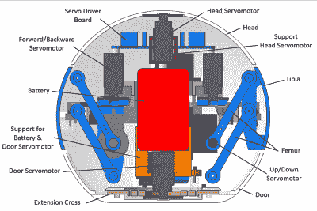

# 球形四足 Arduino 机器人

> 原文：<https://hackaday.com/2020/05/21/spherical-quadruped-arduino-robot/>

和我们大多数人一样开始学习电子学:买几套工具，读几本教程，尽最大努力把几样东西组合在一起。听起来熟悉吗？过了一段时间，你注意到你的技能开始提高，你对不同项目的适应程度也提高了。最后，您尝试制作自己的定制项目并发布自己的教程。

很少有人能幸运地拥有像[Greg 06]的四足机器人那样复杂的第一个项目。我们不知道你，但对我们中的一些人来说，我们满足于闪烁两个 led 而不是一个。

[Greg06 的]机器人有一个四足动物基础，被安置在一个 3D 打印的球形身体内。腿是可伸缩的，由身体内部的微型伺服电机驱动。[Greg06]甚至为避障装置配备了超声波距离传感器。老实说，如果不是球形主体上凸出的超声波距离传感器，你可能会认为整个机器人只是一个小 Wiffle 球。这让我们想起了之前见过的另一个设计。

如果这还不够，球形头可以旋转，扩大了超声波距离传感器和避障机制的范围。这是通过将另一个伺服电机连接到磁头上来实现的。

如果你问我们的话，这是一个非常好的设计。绝对是我们见过的最酷的四足动物之一。