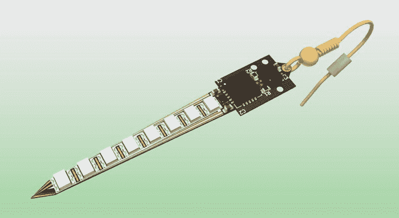
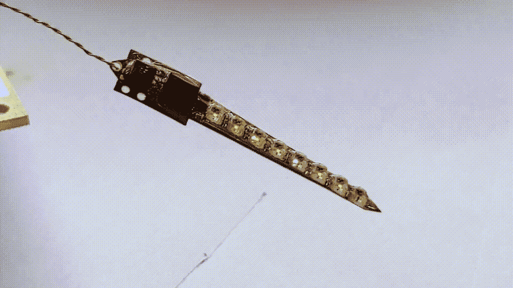

# 灵活的 PCB 耳环将艺术融入装饰艺术

> 原文：<https://hackaday.com/2020/05/24/flexible-pcb-earrings-put-the-art-in-art-deco/>

一段时间以来，耳环一直是黑客的电子附件目标，但将所需的组件组合到一个足够小的包中，以便在挑剔的位置佩戴，这是一个相当大的挑战。如果说萨瓦伊兹·赛义德的装饰艺术耳环 有什么可借鉴的话，耳用电脑有着光明的未来！

这是一个名副其实的项目。事实上，这是一款装饰艺术风格的耳环。但这种说法太低估它了。这种细长的柔性电路板是双面的，可以容纳 ATtiny、加速度计、LDO 和八个 2020 外形控制器集成 led。当然，它是运动敏感的，通过 LED 图案对佩戴者的运动做出反应。Sawaiz 提到跳舞时戴着它，我们不禁想象整个舞厅都闪烁着微小的 LED 灯。

装饰艺术风格的耳环也因其完整的文档而与众不同(我们提到过我们有多喜欢详细的文档吗？).[ Sawaiz]不仅将源代码放在您的腿上，而且顶部链接的 Github repo 中的自述文件将带领读者详细了解设计的每个组件。此外，PCBA 渲染非常完整，包括一个适合佩戴者耳朵的线圈模型；多酷啊。目前仍在研发中的是电池。耳环本身就有一个 LDO，所以只需要把电池藏在某个不显眼的地方，比如使用者的头发里？我们期待看到(萨瓦兹)的工作成果。

为了获得完整的效果，休息后查看一个组装单元的 gif。

