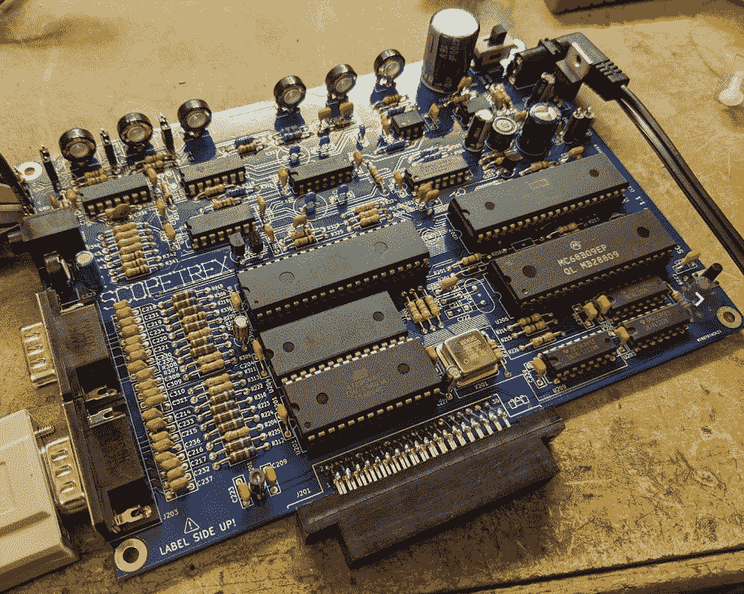

# Scopetrex 是一个游戏控制台…为您的示波器！

> 原文：<https://hackaday.com/2020/05/07/scopetrex-is-a-game-console-for-your-oscilloscope/>

你一直想要一台游戏机放在你的长凳上，但也许你没有空间放显示器或电视机？如果你长凳上的屏幕也能玩游戏，那不是很有用吗？[Tube Time]已经用 [Scopetrex 修复了这个问题，Scopetrex 是一个为你的示波器](https://github.com/schlae/scopetrex)准备的矢量图形控制台。事实上，它不仅仅是一个控制台，因为它是传说中的 Vectrex 的克隆，Vectrex 是上世纪 80 年代内置 CRT 屏幕的矢量控制台。

该板本身是原版的略微增强版本，不提供额外的功能，而是能够用更容易找到的等效物来替换一些部件。它可以完全控制显示器的大小和亮度，必要时可以使用更便宜的 6809E 处理器和 AY-3-9810 声音芯片，并且只需要一个 5 伏的电源。还有一个定制的控制板，与 handly Vectrex 兼容。一旦你做好了这块板，在你的瞄准镜上玩威格斯游戏所需要的就是一份威格斯 ROM 和一些游戏。

威格斯对我们的社区有着持久的魅力，已经在这里出现过很多次。特别令人难忘的是[CRT 的替代品](https://hackaday.com/2015/11/10/replacing-the-crt-in-a-vectrex/)，当然还有[从未发布的 mini Vectrex 原型](https://hackaday.com/2018/11/28/mini-vectrex-prototype-restored-by-national-videogame-museum/)。

感谢[Justin List]的提示。