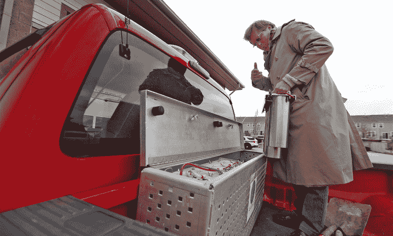

# 铝圆盘燃料氢卡车

> 原文：<https://hackaday.com/2020/05/26/aluminium-pucks-fuel-hydrogen-trucks/>

在迈向没有化石燃料的未来的竞赛中，氢正在迅速取得优势。理论上，氢听起来很棒——它是零排放的清洁燃烧，加油时间比电动汽车快得多，氢燃料汽车在加油之间的距离比依赖插座的兄弟汽车更长。

现实情况是，氢燃料汽车通常需要燃料电池将氢和氧转化为电能。他们还需要加压罐来储存气体和泵来补充燃料，所有这些都增加了重量，占用了空间，并增加了系统的爆炸潜力。

Kurt Koehler 有一个更好的主意:[利用固体催化剂和简单的化学反应，在车辆中按需制造氢气。克勒是印第安纳州初创公司 al galco——铝镓公司的创始人。经过 14 年的研发和他的系统的 5 次迭代，这个想法真的开始浮出水面了。从今年夏天开始，这些冰球将为印第安纳波利斯外的一个小镇的几辆卡车提供动力。](https://spectrum.ieee.org/energywise/transportation/alternative-transportation/hydrogen-on-tap-device-trucks-fuel-efficient-vehicles)

## 卡车用橡胶圆盘

Kurt Koehler and his hydrogen-on-tap system in the back of a Carmel, Indiana city truck. Image via [IEEE Spectrum](https://spectrum.ieee.org/energywise/transportation/alternative-transportation/hydrogen-on-tap-device-trucks-fuel-efficient-vehicles)

阿尔加尔科的氢燃料系统没有其他氢燃料汽车的笨重和危险。取而代之的是，它使用铝镓合金制成的固体圆盘，在需要的时候立即制造氢气。这些冰球一接触到水，化学反应就开始了，水分子被分解成氢气和氧气。由此产生的氢气被捕获并立即送到进气歧管为发动机提供燃料。这是最精彩的部分:氧气与铝结合，变成氧化铝粉末，加入更多的镓，可以无限期地变成新的圆盘。

今年夏天，印第安纳州的卡梅尔市正在对他们街道部门现有的五辆汽油引擎卡车进行测试。这些卡车将改装氢水龙头系统，该系统由一个金属盒和六个罐组成，位于驾驶室后面的卡车车厢内。氢气被泵入床下，进入发动机。每一天，卡车将开始使用氢气，当所有装满合金球的罐子都用完时，会自动切换到天然气。当它们滚回车辆调配场时，几分钟之内就可以换上新的滤毒罐。测试表明，该系统使这些卡车的油耗提高了 15%，二氧化碳排放量减少了 20%。

## 固体溶液

AlGalCo uses a patented secret sauce to keep the aluminium/gallium alloy in a solid state until it meets water. Image via [IEEE Spectrum](https://spectrum.ieee.org/energywise/transportation/alternative-transportation/hydrogen-on-tap-device-trucks-fuel-efficient-vehicles)

库尔特·克勒在过去的 14 年里一直在普渡大学开发这种氢水龙头系统，但这项技术本身已经很老了。HOT 系统基于杰里·伍达尔的工作，[他在 1968 年发现了这种化学反应，当时他正在开发铝镓砷化合物，这种化合物为我们提供了现在用于刹车灯、交通灯和 DVD 播放器的廉价节能的红色发光二极管。](https://sciencex.com/wire-news/148217148/led-pioneer-jerry-woodall-elected-to-national-academy-of-invento.html)

伍达尔试图在铝和液态镓的溶液中生长晶体。当他用水冲洗坩埚时，发生了剧烈的、释放气体的化学反应。那种气体原来是氢气。随着时间的推移，他尝试使用更少的镓。

下面是 Kurt 演示 HOT 系统的前一次迭代的两部分视频的第一部分，包括在 AlGalCo 罐内进行的可怕的化学反应。([链接到第 2 部分](https://www.youtube.com/watch?v=2SqwYC4-6Co))

 [https://www.youtube.com/embed/MgHOfix3JK8?version=3&rel=1&showsearch=0&showinfo=1&iv_load_policy=1&fs=1&hl=en-US&autohide=2&wmode=transparent](https://www.youtube.com/embed/MgHOfix3JK8?version=3&rel=1&showsearch=0&showinfo=1&iv_load_policy=1&fs=1&hl=en-US&autohide=2&wmode=transparent)

我们认为这是朝着广泛采用氢能源迈出的奇妙一步，氢-汽油混合动力试验可能会赢得许多支持。固体燃料更容易储存和运输，这种特殊的燃料只要保持干燥似乎就不会挥发。

所有五辆卡梅尔城市卡车应该在六月底运行。如果你碰巧住在印第安纳州中部附近，克勒每周都会在卡梅尔街道办事处的车库里展示这项技术。AlGalCo 计划将该系统应用于柴油卡车和送货车，并且已经引起了纽约市官员的兴趣。