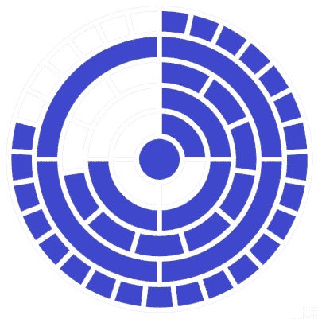

# 通过看时间来打发时间

> 原文：<https://hackaday.com/2020/05/14/passing-the-time-by-reading-the-time/>

当你的非技术同行向你询问时间时，二进制时钟是迷惑他们的一个很好的方法——并不是说了解二进制系统会神奇地给你一个快速阅读的技巧。在这种情况下，它们是一个很好的小谜题，甚至是我们最近经常遇到的隔离时钟的一个很好的替代物，因为你可以简单地选择不要费心去计算准确的时间。但是经过足够的训练，你最终会掌握它的窍门，你可能需要一个新的时间挑战。那么，是时候升级了，由[tomatoskins]制造的[神秘挂钟](https://www.instructables.com/id/Circular-Mengenlehreuhr/)肯定会让你忙个不停。

Diagram of the clock showing 08:44:47

如果你碰巧熟悉柏林的 [*Mengenlehreuhr*](https://en.wikipedia.org/wiki/Mengenlehreuhr) ，这里的这个使用了相同的概念，但是是圆形的，看起来更像一个自然的时钟。如果你不熟悉*的 Mengenlehreuhr* (这个词太好听了，我们不得不写了两遍)，那么【tomatoskins】的时钟工作方式是通过点亮围绕一个中心点的五个 LED 环中的几个部分来构建 24 小时格式的时间。

从最里面的环开始，环的每个部分代表 5h、1h、5m、1m 和 2s 的间隔，每个环分别有 4、4、11、4 和 29 个部分。中心点只是增加了一秒钟。这个想法是将每个被点亮的部分乘以它所代表的时间间隔，然后将时间加在一起。因此，如果每个环正好有一个部分被点亮，那么没有点的时间是 06:06:02，有点的时间是 06:06:03——但你会在他的详细报道中找到一些更详细的例子。

这个直截了当却又令人愉快的不直观的概念肯定会让你有点挠头，尽管你总是可以用罗马数字棕榈树钟变得更奇怪。但是不要担心，[托马斯金斯]在他的剧目中也有[一个更经典，但却迷人的方法](https://hackaday.com/2020/04/03/minimalist-magnetic-minute-minder-mesmerizes/)。