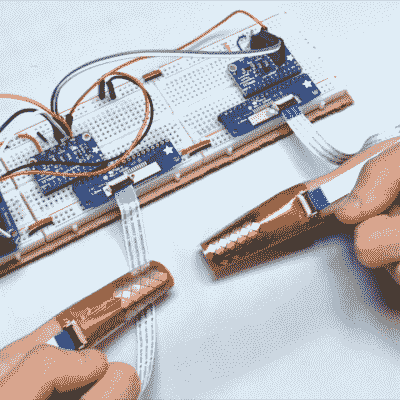

# 指尖触摸打字？原型说它可以工作

> 原文：<https://hackaday.com/2020/05/09/touch-typing-on-fingertips-prototype-says-it-could-work/>

The fingertips are covered in touch sensors, each intended to be tapped by the thumbtip of the same hand.

用拇指在手机键盘上触摸打字是一种非常熟悉的输入文本的方式，这也是导致 [BiTipText](https://www.youtube.com/watch?v=FzUTmGzAHQw) 的一部分，这是一种允许用指尖双手输入文本的方法。这个想法是将食指的第一部分视为一个小键盘的一半，用拇指敲击想象中的小键。这里展示的原型是为了看看这个概念的效果如何。

原型硬件使用触摸传感器，可以高度准确地检测出点击位置，但软件方面才是真正神奇的地方。该团队没有硬编码 QWERTY 布局并培训人们使用它，而是进行了测试，以了解用户对哪个键应该在哪个手指上以及它们应该如何精确布局的自然预期。这些数据导致了优化的布局，当与预测功能相结合时，测试参与者可以实现每分钟 23.4 个单词的平均文本输入速度。

根据原型硬件来判断，如果有人认为指尖键盘的想法可能有点超前，这是可以理解的。但是考虑到个人技术日益增长的“永远在线，永远与你在一起”的本质，该项目的目标更多的是研究用户以快速和微妙的方式提供输入的方法。这个想法似乎在原则上有一些优点。[项目的论文可以在线查看](https://dl.acm.org/doi/fullHtml/10.1145/3313831.3376306)，下面嵌入了[视频演示](https://www.youtube.com/watch?v=FzUTmGzAHQw)。

 [https://www.youtube.com/embed/FzUTmGzAHQw?version=3&rel=1&showsearch=0&showinfo=1&iv_load_policy=1&fs=1&hl=en-US&autohide=2&wmode=transparent](https://www.youtube.com/embed/FzUTmGzAHQw?version=3&rel=1&showsearch=0&showinfo=1&iv_load_policy=1&fs=1&hl=en-US&autohide=2&wmode=transparent)

一件有趣的事情是:用户熟悉 QWERTY 布局的惯性是显而易见的，即使在这样一个前瞻性的项目中。我们报道了德沃夏克自己是如何与人们不愿改变的想法作斗争的，即使这样做有明显的好处。

[via [Arduino 博客](https://blog.arduino.cc/2020/05/05/bitiptext-enables-text-entry-across-two-index-finger-worn-keyboards/)