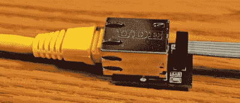
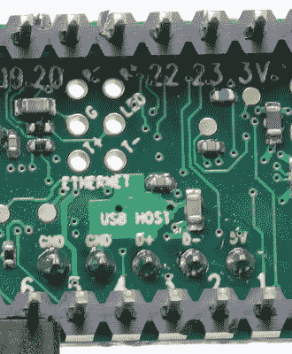
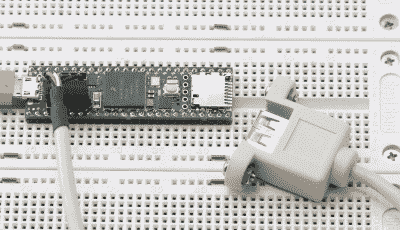
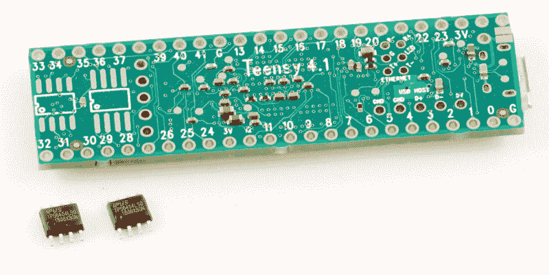
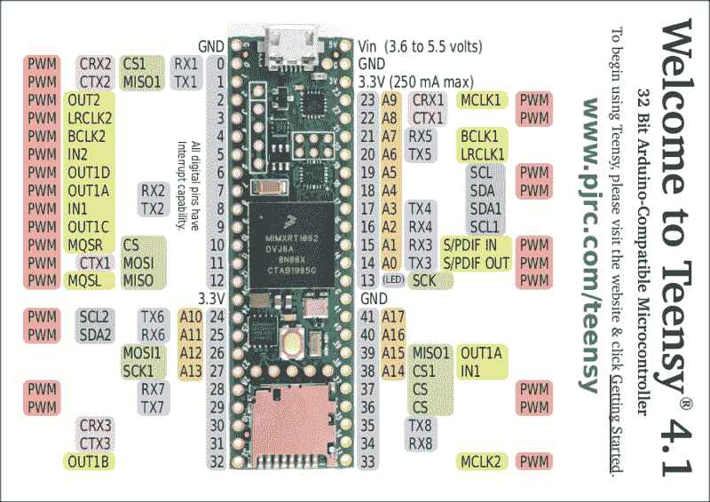

# 新的 Teensy 4.1 配备 100 Mbps 以太网、高速 USB、8 MB 闪存

> 原文：<https://hackaday.com/2020/05/11/new-teensy-4-1-arrives-with-100-mbps-ethernet-high-speed-usb-8-mb-flash/>

直到去年 8 月，PJRC 才发布了 Teensy 4.0。当时，4.0 成为世界上最快的微控制器开发板，直到撰写本文时，这个头衔仍然有效——或者说，不完全是。今天 [Teensy 4.1 已经发布](https://www.pjrc.com/store/teensy41.html)，使用相同的 600 MHz ARM Cortex M7，现在也是最快的微控制器板。4.1 带来的是更多的外设、内存和 GPIOs。虽然 Teensy 4.0 使用了与 3.2 相同的小尺寸，但 Teensy 4.1 使用了 3.5/3.6 的更大尺寸的主板来展示额外的优点。

现在稍微老一点的 Teensy 4.0 于去年 8 月 7 日发布，售价为 19.95 美元，新的 4.1 版本售价为 26.85 美元。看起来 4.1 并不是 4.0 的替代品，因为它们服务于不同的细分市场。如果您正在寻找一款名副其实的超高速实惠的微控制器板，4.0 正符合您的要求。另一方面，如果您需要额外的外围设备，并且能够负担得起更大主板的空间，那么不小的 4.1 就适合您。它有多大？我测的样板是 61 x 18 mm (2.4 x 0。7 寸)，还不算一端的 micro-usb 插孔的小突起。

让我们来看看 PJRC 能装进这个空间的所有有趣的东西。

## 100 Mbps 以太网

Add your own jack to enable the 100 Mbps Ethernet port

大新闻是 Teensy 4.1 带有 100 Mbps 以太网支持。要使用以太网端口，您需要提供外部磁铁和一个 RJ-45 插孔。由于显而易见的原因，这些没有放在电路板上——即使使用集成磁性的插孔(magjack ),它也不适合 PCB。相反，电路板上的 6 引脚接头可以连接到外部接口。这也有助于为那些需要没有以太网连接的 4.1 的其他功能的人保持低价格。

Ethernet and USB host port headers (bottom of PCB)

PJRC 可能会在未来出售所需部件的 DIY 套件，但他们还没有发布日期或价格。现在，你可以使用这个 OSH Park 共享项目轻松构建自己的项目。零件清单在项目的描述中，关键部分是磁性千斤顶，单个数量将花费您大约 2.55 美元。构建电路板的人应该注意，这是一个早期版本，事实证明只有 0.1 uF 电容是必要的。PJRC 的 Paul Stoffregen 告诉我，他刚刚收到了一个更简单的 PCB 进行测试，一旦设计得到彻底验证，他将会发布。

以太网端口能够达到 100 Mbps 的最高速度，并支持 IEEE 1588 精确时间协议，该协议允许通过有线连接将时钟同步到 100 ns 以内，从而实现一些非常有趣的可能性。但是，除此之外，在微控制器板上包含以太网也是一件大事。在此之前，如果您需要这种连接，基本上有两种选择:使用强大的单板计算机，如 Raspberry Pi，它具有所需操作系统为执行低级或实时任务带来的所有延迟和问题，或者在现有的微控制器上添加一个慢速 SPI 接口以太网板。相反，您现在可以在这款新主板上使用 600 MHz Cortex-M7 来运行高带宽、低延迟的嵌入式应用，而无需对抗操作系统。

## USB 主机端口

Just add a header and cable for USB host functionality

与 3.5/3.6 版本一样，Teensy 4.1 包括一个 USB 主机端口，该端口连接到 PCB 内部的五引脚通孔接头。端口会做 480 Mbps 高速 USB。它还增加了热插拔 USB 外围设备所需的电源管理功能，只需添加一根 USB 主机电缆，就万事大吉了。PJRC [出售这些电缆](https://www.pjrc.com/store/cable_usb_host_t36.html)，或者你可以使用从旧电脑中回收的 USB2 电缆:引脚排列是相同的。较旧的 Teensy 4.0 只有 USB 数据线连接到 PCB 上的表面贴装焊盘。

## microSD 卡插槽

像 Teensy 3.6 一样，新的 4.1 板在一端有一个 microSD 卡插槽，以添加可移动存储。虽然在较旧的 4.0 版本中，这种接口的引脚是分开的，但是包含这种插座大大简化了接口的使用。这不像你可能见过的一些 microSD 卡接口，在那里你只能使用较慢的 SPI 协议来访问卡；在这里，你可以使用快速，本土 SDIO。

## 更多内存！

Teensy 4.1 Bottom Side with user-supplied QSPI RAM chips

Teensy 4.1 拥有 8 MB 的闪存用于程序存储，高于 4.0 版本的 2 MB，这是一个相当大的增强。Teensy 4.1 上的微控制器是 IMXRT1062，与 4.0 上的芯片相同，配有 1 MB 的片内 RAM。很容易认为这对一个微控制器来说是很多的，至少在你想到这种 600 MHz 32 位处理器的能力以及人们想用它做什么之前是如此:音频和图形应用程序可以轻松地吃掉 1 MB，其他处理器/系统的仿真也是如此，例如复古游戏。因此，Teensy 4.1 允许添加两个用户提供的额外内存中的一个或两个。在 PCB 的底部，有两个 SOIC-8 封装:一个具有较大的焊盘，可容纳 QSPI 闪存，而较小的封装用于 8 MB PSRAM(伪静态 RAM)器件。你只要把零件焊上，就可以开始工作了。谢天谢地，他们都是 SOIC，这几天被认为是手工焊接的乐趣。

这些额外内存的一个关键特征是它们有一个专用的 QSPI 总线，不会降低 Teensy 4.1 内部程序内存的速度。由于长时间的擦除和写入访问，这对于使用闪存尤其重要，否则可能会使共享总线陷入停滞。同样，通过使这些部件可选，并由用户提供，PJRC 降低了那些不需要这些功能的电路板的成本；那些需要他们的人可以带来他们自己的记忆。

## 4.1 提供了一个完整的 16 位 GPIO 端口

Teensy 4.0 had surface-mount pads for additional I/O. The Teensy 4.1 moves these to the additional through-hole pads the longer board makes available.

微控制器的一个不变的规则是你总是需要更多的管脚。虽然 Teensy 4.0 和 4.1 共用的处理器有很多这样的处理器，但 Teensy 4.0 较小的尺寸限制了可以带到通孔接头的 I/O 数量。

Teensy 4.0 上的解决方案是为一些 I/O 添加表面贴装焊盘。在 Teensy 4.1 上，豪华的电路板空间允许更多引脚连接到电路板边缘的接头。这带来了一个额外的串行端口，总共 8 个，加上额外的模拟和数字 I/O。新的主板还划分了一个 GPIO 端口的完整 16 个连续位，这允许快速、宽并行 I/O。如果您曾经尝试过使用多个端口拼凑的位来实现这一点，您肯定会欣赏这不仅带来的便利，还带来了端口访问的速度。

## 包扎

那么，相对于较老的 Teensy 4.0，这里的价值主张是什么？如果你真的想充分利用 IMXRT1062 上可用的硬件，4.1 是一个不错的选择:更大的库存和可选内存，额外的引脚，以太网端口，以及 microSD 插座和 USB 主机端口的便利性使这变得更加容易。如果你不需要这些额外的东西，或者只是需要更小的主板尺寸，Teensy 4.0 仍然存在，并将为你节省一些钱。

如果你需要复习一下 Teensy 4.0 带来了什么，4.1 又是基于什么，[看看我们对那个版本的评论](https://hackaday.com/2019/08/07/new-teensy-4-0-blows-away-benchmarks-implements-self-recovery-returns-to-smaller-form/)。