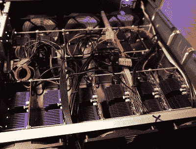

# 你所有的密码都属于 FPGA

> 原文：<https://hackaday.com/2020/05/15/all-your-passwords-are-belong-to-fpga/>

当用于破解密码时，现代高端显卡绝对会啃噬“经典”哈希算法，如 SHA-1 和 SHA-2。当一台台式机每秒可以运行 500 多亿个密码组合时，即使是不错的密码也能在令人担忧的短时间内被猜出。幸运的是，bcrypt 等高级密码散列函数是专门设计来使这种暴力攻击慢得不切实际的。

在桌面硬件上破解 bcrypt 可能是不可能的，但是【分散的秘密】的人有一种预感，一组 FPGAs 可能会完成任务。虽然与现代的 CPU 和 GPU 相比，这些可编程芯片的时钟速度可能看起来很低，但它们没有那么繁重的开销。这使得 FPGA 中的专用电路在执行相同任务时的效率提高了许多倍。使用十年前用于挖掘加密货币的 FPGA 板，该团队能够证明比最新一代的 GPU 性能提高了四倍。

An earlier version of the FPGA cracker

在看到单个四核 FPGA 板的能力之后,[分散的秘密]团队开始扩大这个概念。第一个版本的硬件将十几块 ZTEX FPGA 板和一台主控计算机塞进了一个标准的 4U 服务器机箱。对于第二个版本，他们将多达 18 块电路板增加到总共 72 块 FPGAs，并对电源和连接系统进行了增量改进。

每个 4U FPGA 破解程序每秒能够进行 210 万次 bcrypt 哈希运算，而功耗仅为 585 瓦。为了客观地看待这一点，[分散的秘密]说，你需要至少 75 个英伟达 RTX-2080Ti 显卡来匹配这一性能。这样的阵列不仅会占用整个服务器机架，还会消耗惊人的 25 千瓦。现在可能是时候把你的密码改成更长的了，[或者最终使用 2FA](https://hackaday.com/2018/01/04/two-factor-authentication-with-the-esp8266/) 了。

我们已经介绍了对为加密货币挖掘而设计的硬件进行逆向工程的尝试，[但这些都是基于专用集成电路(ASIC)](https://hackaday.com/2018/02/10/reverse-engineering-a-bitcoin-miner/)的，根据定义，这些专用集成电路很难重新利用。另一方面，废弃的基于 FPGA 的矿工提供了诱人的可能性；[无论如何，一旦你理解了它们是如何工作的。](https://hackaday.com/2019/12/06/david-williams-is-fpga-curious/)

【感谢 Piejoe 的提示。]