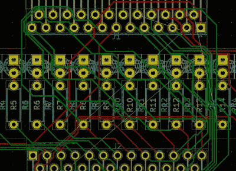

# 并行端口的闪光灯

> 原文：<https://hackaday.com/2020/05/13/blinkenlights-for-your-parallel-port/>

大多数现代设备都是通过 USB 连接的，一般来说，我们都因此而受益。但这并不是说使用串口和并口没有什么好处。例如，当设备不通信时，较慢且不太复杂的协议可能更容易调试，[[Jeremy Cook]在他的最新项目](https://github.com/JeremySCook/parallel-LEDinator)中演示了这一点。

 为了解决他的计算机和 CNC 路由器之间的一些通信问题，[Jeremy]想出了一个方便的小工具，可以让他实时可视化通过并行端口每个引脚的数据。即使在房间的另一边，他也能一眼看出通信是否活跃，并以敏锐的眼光确定他是否获得了双向通信。

从技术角度来看，这是一个非常简单的项目。定制的 PCB 本质上只是一个通道，有一个 3 毫米的 led 阵列和匹配的 10K 电阻挂在数据线上。但是[杰里米]发现这是一个提高他的 KiCad 技能的绝佳借口。正如他在休息后的视频中解释的那样，这个项目肯定不会给每天做 PCB 设计的人留下深刻印象；但是如果你还在学习诀窍，这些正是你应该寻找的项目。

在你们任何人在评论中说出来之前，我们已经知道这样的设备只需几美元就可以买到。但这不是重点。如果我们[忽视任何有商业替代方案的项目，这些地区的进展将会非常缓慢。](https://hackaday.com/2019/10/12/make-your-own-plasma-cutter/)

 [https://www.youtube.com/embed/P86tV40nX3E?version=3&rel=1&showsearch=0&showinfo=1&iv_load_policy=1&fs=1&hl=en-US&autohide=2&wmode=transparent](https://www.youtube.com/embed/P86tV40nX3E?version=3&rel=1&showsearch=0&showinfo=1&iv_load_policy=1&fs=1&hl=en-US&autohide=2&wmode=transparent)

