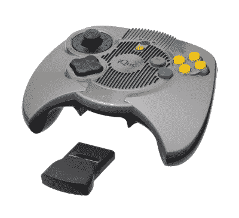
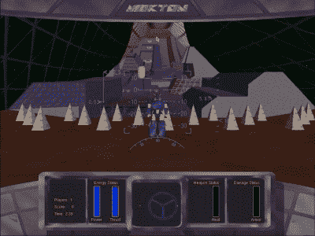

# 不，任天堂的漏洞不会帮助模拟器开发者，原因如下

> 原文：<https://hackaday.com/2020/05/21/no-the-nintendo-leak-wont-help-emulator-developers-and-heres-why/>

如果你还没有其他网站的消息，今年早些时候，任天堂的各种知识产权泄露在互联网上浮出水面。这包括可以追溯到 Game Boy 的原型软件，以及任天堂 64、GameCube 和 Wii 等系统的 Verilog 文件。这次泄漏似乎源于 BroadOn 服务器的一个漏洞，这是一家小型硬件公司，任天堂与它签订了合同，生产只在中国销售的 iQue 播放器。

所以，这就是它的主旨，但是它到底意味着什么呢？什么是 iQue 播放器？当然，现在一家公司的好东西已经公开了，爱好者可以利用它来改进他们的项目，对吗？嗯，不。很多事情阻止了这一点，而且有足够多的先例，对于仿真场景来说，这只是另一个星期二。

## 漏洞里有什么

让你自己看这些文件会有一定的风险，就像你的电脑上有一份任何受版权保护的信息一样。它的许多法律方面可能会在互联网上被忽略，但这意味着我们不能告诉你在哪里可以得到它，我们显然不能支持这一行动。然而，其他人已经彻底检查了它们，并对所有内容进行了分类，因此我们可以一眼就告诉您泄漏的内容。

In China, the Nintendo 64 was available as a plug-and-play controller system called iQue

最值得注意的是，在这次泄露中有大量与任天堂 WII 相关的源代码。这包括 boot0、1 和 2 bootloaders，加上运行在 Wii 的 ARM9 处理器上的操作系统 IOS 的全部源代码和 SDK。这些都是 Wii 软件端的底层部分，构成了 Wii 系统菜单运行的底层系统。

iQue Player 系统的所有部分都有 Verilog 源代码，这是针对中国市场的任天堂 64 的硬件版本，因此有足够的信息从头开始构建它的版本。由于该公司参与了任天堂的 iQue 和其他项目的制作，因此也有 2004-2006 年期间这类游戏机的大量规划文件。

其中一些可能是有趣的，例如，供个人用来修理他们自己的系统，就像有一个旧的家用电脑的原理图来追踪并找到故障在哪里。但除此之外，它们没有多少用处，至少在法律允许的范围内。

## 对仿真器开发人员来说是有害的，而且并不都是新的

如果你和许多人一样认为这次泄露最终会让一直困扰的任天堂 64 模拟变得完美，我们有坏消息要告诉你；使用官方机密文档来帮助构建您自己的这些游戏机的重新实现将违反版权法。因为任天堂已经因为不喜欢别人模仿他们的游戏而出名，这将会给你带来最好的停止令，最糟糕的是一场沉重的诉讼。

A proof-of-concept prototype game called Mekton running on SGI hardware from the Project Reality era.

事实上，这个月引起轩然大波的泄密事件中包含的许多文件已经在网上流传了二十年。被称为“阿曼档案”，1999 年 SGI 泄漏暴露了现实项目的源文件，任天堂 64 游戏机的基础。从那以后，由于同样的法律问题，开发者不得不避开这些文档。

自从 1997 年 Nesticle 开创了现代控制台仿真场景以来，这种软件的合法性已经被质疑了无数次。可以有这样的论点，软件是有版权的部分，而不是运行它的芯片的安排，但几乎没有任何互联网意见是合理的法律意见，我的意见也不是。但是大多数开发者之间的主要共识是，一个仿真器是合法的，只要它是完全逆向工程的，而没有引用受版权保护的源材料。也就是众所周知的…

## 洁净室设计

如果你读过早期的 IBM PC 克隆产品和围绕它们的诉讼，你可能会对这个术语很熟悉。早在 20 世纪 80 年代初，IBM 的个人电脑产品线引人注目，不仅因为它是商业市场的领导者，还因为它完全是用现成的零件制造的。这意味着 IBM 不生产计算机中的任何硬件，他们只是简单地把它们组装起来并为其编写一个 BIOS，其中就包含了他们的版权。

很快，来自三洋和 DEC 等公司的克隆产品开始出现——但由于他们编写了自己的 BIOS，没有一个完全兼容 IBM，他们只是运行自己风格的 MS-DOS。Eagle Computers 就是这样一家公司，但他们没有编写自己的 BIOS，而是被指控克隆 IBM，侵犯了 IBM 的版权。直到 1983 年，随着康柏和菲尼克斯从零开始对他们自己的 BIOS 进行逆向工程，完全兼容才得以合法实现。Eagle 和 IBM 达成庭外和解，Eagle 同意编写自己的 BIOS，但他们从未从销售损失中恢复过来。

从那时起，为了使克隆产品不受侵犯版权诉讼的法律保护，它必须完全从零开始构建，与材料本身的来源没有任何联系，仅仅是对其观察到的行为的重新实现。与手头的主题更相关的是，这两次是针对索尼的 Playstation，一次是针对 Connectix 的视频游戏站模拟器和 bleem 公司的 Bleem！仿真器。在这两起案件中，陪审团做出了有利于被告反对索尼的裁决，巩固了模拟器合法性的先例，但在这两起案件中，法律费用迫使公司破产。

## 但是数据仍然存在

那么是给谁的呢？从法律上来说，这不应该离开任天堂和 BroadOn 的手，所以很难说这对任何人有任何用处。当然，这不会阻止每个人，我们仍然有可能在未来看到它的影响。自 20 世纪 90 年代初以来，各国制造商一直在生产 Famicom(在西方被称为 nes)的克隆产品，被亲切地称为“Famicom”。这些产品今天仍然以各种形式生产，现在任天堂在硬件上的专利已经到期，[它们在盗版和复古市场比以往任何时候都更加突出。](https://hackaday.com/2020/05/11/teardown-generation-nex/)

那么有可能的是，通过一些法律漏洞的利用，这次泄漏中描述控制台硬件的文件可能最终被克隆人使用，我们可能会在几年内看到仿制的任天堂 64，但这是不可能预测的。最好的情况是，与泄漏中包含的系统模拟器的开发无关的人可以使用这些来评估逆向工程工作与真实交易的接近程度，但同时，开发人员自己需要远离它，以便继续声称他们的工作是合法的。