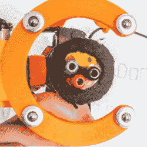

# 白板绘图仪石头三种颜色和一个橡皮擦

> 原文：<https://hackaday.com/2020/05/18/whiteboard-plotter-rocks-three-colors-and-an-eraser/>

AutoWhiteboardBot’s business end, with three markers.

[td0g]的 [AutoWhiteboardBot](https://www.youtube.com/watch?v=cjOSiXkg0Ww) 不仅仅是*的任何* 3D 打印白板绘图仪，因为它还配备了三标记载体和板载橡皮擦！该设备本身挂在步进电机上，步进电机负责在白板上移动绘图仪，让三种颜色工作的技巧是加入可伸缩的干擦标记。绘图仪上基于球形[日内瓦驱动](https://en.wikipedia.org/wiki/Geneva_drive)的组件旋转笔芯，活塞激活所选的颜色。擦除，可以说是白板上最容易做的事情，是通过一块毛毡来完成的。 [3D 打印部件在 Thingiverse 上](https://www.thingiverse.com/thing:4192091)和【td0g】说软件即将推出。这是一个聪明的装置，尤其是用可伸缩的记号笔容纳多种颜色的方法。

AutoWhiteboardBot 挂在马达上，马达可以拉着它到处跑，但是[我们也看到一个 SCARA 式的机器人在白板上写字](https://hackaday.com/2018/04/26/writing-on-a-whiteboard-performed-by-a-robot/)。观看下面嵌入的视频，它以 AutoWhiteboardBot 在棋盘表面滑动时以不同颜色绘制的加速镜头开始。

 [https://www.youtube.com/embed/cjOSiXkg0Ww?version=3&rel=1&showsearch=0&showinfo=1&iv_load_policy=1&fs=1&hl=en-US&autohide=2&wmode=transparent](https://www.youtube.com/embed/cjOSiXkg0Ww?version=3&rel=1&showsearch=0&showinfo=1&iv_load_policy=1&fs=1&hl=en-US&autohide=2&wmode=transparent)

