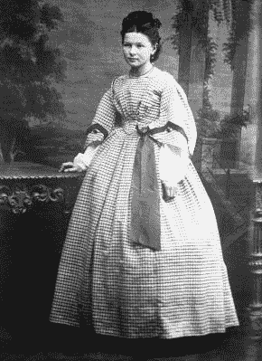
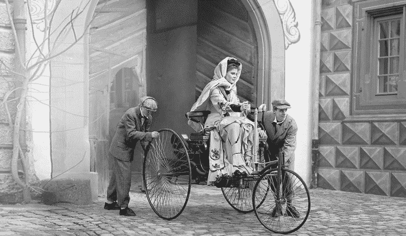
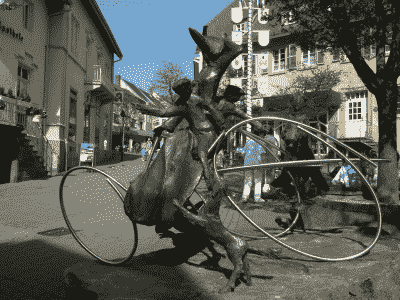

# 伯莎·本茨将汽车推向生产

> 原文：<https://hackaday.com/2020/06/09/bertha-benz-pushed-the-automobile-toward-production/>

谁发明了汽车？答案取决于你对这个词的定义。第一辆实用的气体动力马车是由卡尔·本茨制造的，他后来将自己的公司与戴姆勒汽车集团合并，成立了梅赛德斯-奔驰。

卡尔·本茨是一个设计幻想家，他的第一个爱好是机车和自行车。他的 1886 年奔驰专利 Motorwagen 是第一辆自己发电的汽车，采用二冲程发动机，通过一对链条传输到后轮轴。他认为它还没有准备好上路，他基本上是对的。

卡尔的妻子兼商业伙伴伯莎·本兹相信她丈夫的发明。她从一开始就在那里，并一路提供了大量资金。如果她没有把它开出去进行一次秘密的、非法的兜风，这辆摩托车可能永远也不会离开车库。

## 从嫁妆到落魄

Bertha Benz at age 18\. Image via [Wikipedia](https://en.wikipedia.org/wiki/Bertha_Benz)

1849 年春天，茜莉·贝莎·林格出生在德国普福尔茨海姆的一个富裕家庭。她的父亲是一名木匠和房地产投资者，他满足了小女儿对机车和其他技术事物的广泛兴趣。由于她父亲的地位，伯莎能够接受超越家庭艺术的教育，并且最喜欢研究自然科学。

伯莎长成一个美丽聪明的年轻女子，到 20 岁时，已经有许多来自富裕家庭的潜在追求者。但是他们似乎都对她不感冒。一次偶然的机会，在一个夏天，她和她的母亲与一个贫穷、衣衫不整的年轻机械工程师卡尔·本茨共乘一辆马车。当他开始谈论他正在研究的无马马车时，伯莎爱上了他。

在遇到伯莎之前不久，卡尔开了一家铸铁厂，但他有一个糟糕的生意伙伴。伯莎用自己的一部分嫁妆买下了他的公司，拯救了公司，公司开始生产内燃机。不顾她父亲的意愿和警告，他们在几年内结婚并有了五个孩子。

尽管公众完全不感兴趣，卡尔还是在接下来的十年里致力于他的无马马车。很少有人愿意投资一辆本质上是细长的三轮车，配有割草机发动机，靠较轻的液体运转。他努力向对自己的马满意的潜在投资者和买家推销这辆车。

## 第一次公路旅行是一次驾车兜风

A reenactment of Bertha’s joyride. Image via [Mercedes-Benz](https://www.mercedes-benz.com/en/classic/bertha-benz/)

对卡尔来说幸运的是，伯莎比他更相信丈夫的创造。在那个时候，摩托车只能短距离行驶。她知道这将需要一个相当长的旅程来真正折磨测试这个东西，并找出它剩余的弱点。因此，在 1888 年 8 月 5 日，她和她的两个十几岁的儿子，尤金和理查德，在黎明时分出发，开始了世界上第一次公路旅行，没有告诉卡尔或任何其他人。

A monument outside the world’s first gas station depicts Bertha’s wild ride in dramatic abstract. Image via [Wikipedia](https://en.wikipedia.org/wiki/Bertha_Benz)

三人组在前进的道路上面临着无数的障碍，但是伯莎一路披荆斩棘，闯过了所有的难关。最大的问题是这辆车没有油箱，化油器只能装 4.5 升。它使用石油醚，一种从石油中提取的重石脑油，只能在药店里找到。因此，当伯莎和男孩们在行程约 40 公里(25 英里)时燃料耗尽，她在韦斯洛克的一家药店停了下来，这家药店现在是世界上第一家加油站。

当油管堵塞时，伯莎用她的帽针让它重新流动起来。有一次，一根点火线短路了，所以伯莎牺牲了长袜上的一根吊袜带来绝缘。

最终，摩托车的木制刹车开始磨损。她设法在一个鞋匠那里停下来，让他用皮革加固它们，并在这个过程中发明了第一批刹车片。他们总共走了大约 104 公里(65 英里)，在日落时分到达普福尔茨海姆。伯莎给卡尔发了一份电报，告诉他她所做的事情以及进展情况。几天后她开车回到了曼海姆。

## …这完全成功地将汽车作为一个概念来销售

伯莎和摩托车在他们穿越乡村的驾车旅行中受到了很多关注。她走过时，各个年龄段的人都惊奇地注视着她。一些人认为这个疯狂的装置是世界末日的征兆，另一些人想要一次试驾。从那时起，人们对汽车产生了足够的兴趣，推动它向前发展。

下面有一个简短的视频，显示了一辆奔驰专利汽车被启动并推出赛道。它有很多发动机运转的特写镜头，你可以看到伯莎和孩子们在那次公路旅行中会被扔得多远。

伯莎的所作所为是冒险的、危险的，而且是彻头彻尾的可怕。她仍然理所当然地因自己的成就而受到称赞。伯莎·本茨纪念路线建立于 2008 年，司机可以根据路标指示她从曼海姆到普福尔茨海姆的路线。听起来像是一次不错的公路旅行。

 [https://www.youtube.com/embed/FucB-aaMEsM?version=3&rel=1&showsearch=0&showinfo=1&iv_load_policy=1&fs=1&hl=en-US&autohide=2&wmode=transparent](https://www.youtube.com/embed/FucB-aaMEsM?version=3&rel=1&showsearch=0&showinfo=1&iv_load_policy=1&fs=1&hl=en-US&autohide=2&wmode=transparent)

