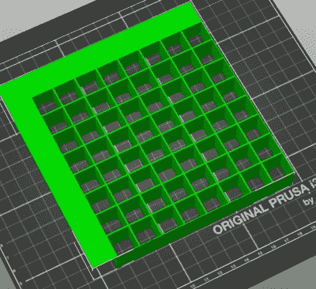

# 巨型 LED 矩阵将经典精灵带入生活

> 原文：<https://hackaday.com/2020/05/18/jumbo-led-matrix-brings-classic-sprites-to-life/>

尽管过去几十年视频游戏技术取得了令人难以置信的进步，但 8 位经典游戏似乎永远不会过时。即使你年龄不够大，无法体验这些新游戏，也不可能不对早期视频游戏先驱用如此简陋的硬件所做的事情留下深刻印象。它们提醒我们，通过奉献和技术掌握可以取得什么样的成就。

The grid has been split up for easier printing.

如果你想在你的桌子上放一点复古的灵感，看看[这个由【Josh Gerdes】](https://joshgerdes.com/2020/05/arduino-powered-led-matrix/)组装的奇妙的 16 x 16 LED 矩阵。虽然这显然不是你可以用它来做的*独有的*事情，但这款显示器看起来确实特别擅长于展示老式视频游戏精灵的像素化荣耀。内部的 3D 打印网格给了精灵一个三维的外观，而漫射的光芒让我们想起了在闪烁的 CRT 上度过的夜晚。

最棒的部分可能是为你自己把这些放在一起是多么容易。你可能已经在零件箱里找到了大部分你需要的东西；本质上，它只是一个足够长的 WS2812B 条，可以释放 256 个 led 和一个驱动它们的微控制器。[Josh]使用了 Arduino Nano，但任何与 FastLED 库兼容的东西都将是一个替代产品。你还需要一台 3D 打印机来脱离网格运行，还需要一些东西来把整个东西放进去。这里使用的 12×12 的 shadowbox 看起来很棒，但我们认为像你们这样聪明的人可以用周围的任何东西来凑合，如果你们现在不能去艺术和工艺品商店的话。

除了看起来很棒，这个项目还很好地提醒了我们 WS2812 LEDs 是多么的方便。无论你是在重现标志性的游戏精灵，还是制作你自己的发光太阳镜，很难想象在这些小奇迹出现之前，T2 是如何做到的。

 [https://www.youtube.com/embed/froi3urcf1Y?version=3&rel=1&showsearch=0&showinfo=1&iv_load_policy=1&fs=1&hl=en-US&autohide=2&wmode=transparent](https://www.youtube.com/embed/froi3urcf1Y?version=3&rel=1&showsearch=0&showinfo=1&iv_load_policy=1&fs=1&hl=en-US&autohide=2&wmode=transparent)

