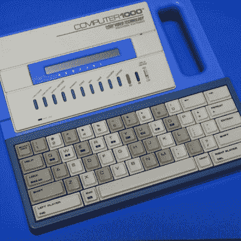
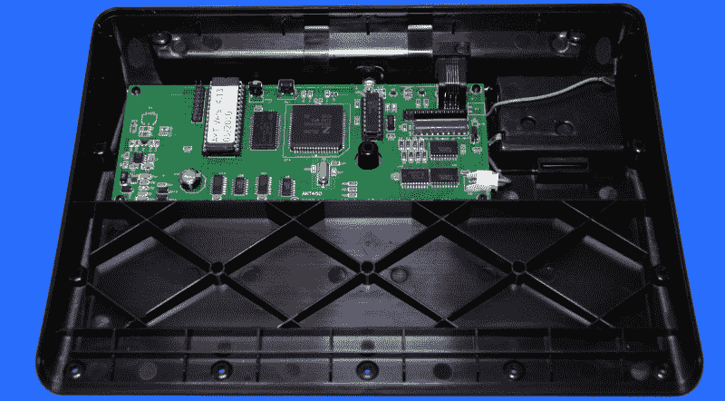
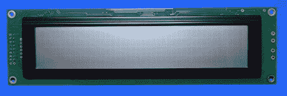
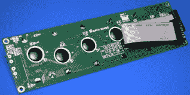
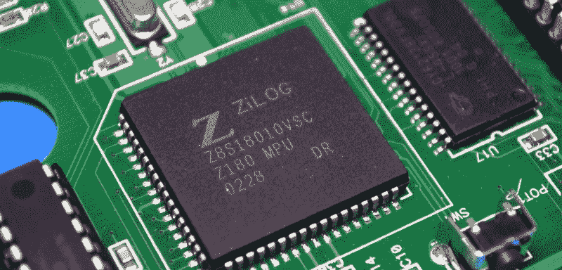
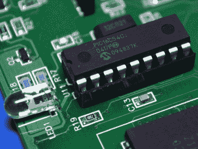

# 拆卸:Writer 文字处理器

> 原文：<https://hackaday.com/2020/06/09/teardown-the-writer-word-processor/>

对于现代学生来说，螺旋笔记本已经让位于笔记本电脑，袖珍计算器已经被智能手机取代。我们也不只是在谈论高中和大学。今天，即使是小学生的教育也与技术有着内在的联系。虽然有些人可能会质疑在这么小的年龄就离开铅笔和拍纸簿是否明智，但毫无疑问的是，所有因为新冠肺炎而被困在家里的孩子将会经历一段更艰难的时间才能过渡到远程学习。

但当先进键盘技术公司在 2003 年发布这款软件时，情况显然并非如此。当时，在第一台上网本上市的五年前，你很难找到一台便宜到可以送给小学生的笔记本电脑。相比之下，这些小型电子文字处理器只需 150 美元就能买到。不仅初始价格低，而且维护成本几乎可以忽略不计。它们使用标准 AA 电池运行了数百个小时，并且不需要学校有任何 IT 人员来管理它们。当然，他们不能上网，甚至不能运行任何软件，但他们会给学生一个磨练键盘输入技能的机会。

The 1988 precursor to the Writer

在许多方面，作者可以被认为是像 VTech preComputer 1000 这样的教育玩具的继承者。一个对孩子来说足够简单的设备，但与真实的计算机有足够的相似之处，它作为一个训练工具是有价值的。为此，作者把这个概念发展得更远。它提供了检查和提高学生打字速度的方法，甚至提供了一个简单的文件管理系统，允许学生在自定义目录中组织他们的作业。

当电脑变得足够便宜时，像这样的设备自然就被搁置了。但有趣的是，故事并没有就此结束。事实证明，许多作家，不管是专业的还是其他的，都已经开始对这种风格的文字处理器深信不疑。像 Alphasmart Neo 这样的设备很容易在二手市场上买到，被认为是在旅途中捕捉想法的可靠方式。电池寿命以周为单位，你的写作不会被不合时宜的系统更新打断，这就不难理解为什么了。

那么，这些教育性的文字处理器里面有什么呢？同样重要的是，是否值得带着它去读一本伟大的美国小说呢？让我们拆开一个看看。

## 最基本的必需品

在最基本的层面上，Writer 只不过是一个键盘、一个 LCD 和一些简单的电子设备将它们粘合在一起。没有可移动存储，没有可充电电池，甚至没有显示器的背光。你把三节 AA 电池放入它的背面，按下电源按钮，几秒钟内你就可以开始写了。你所有的作品都保存在电池供电的内存中，当需要将你的文学杰作上传到功能更强大的设备时，Writer 可以通过红外线发送文本。

所以看到这个小玩意的塑料外壳有多空并不奇怪。除了前面提到的 LCD 和键盘，所有的电子元件都可以安装在一块 75×180 毫米的 PCB 上。顺便说一句，应该说作家的总体尺寸比成年小说家所期望的要小一些；键盘主要是为青少年设计的，大约 90%的比例。这绝不是完全长大的手指不能用，但它确实感觉有点局促。

## 看到一张熟悉的脸

当拆开大规模生产的硬件时，你会经常遇到专门为该应用而定制的组件。当构建成千上万的单元时，从长远来看，旋转定制的子组件将节省时间和金钱，这是有意义的。但是偶尔你会碰到像我们这样的低级修补者和黑客不仅能识别，而且知道如何与之接口的组件。

    

典型的例子是书写器上使用的显示器。从外观上看，这是一个普通的 40×4 字符液晶显示器。尺寸、安装孔位置，甚至引脚排列都与当代模块的易贝清单相匹配。这似乎是一个简单的升级，你可以放入一个带背光的新 LCD，尽管你需要单独为 led 连接电源，因为这些引脚没有连接到 Writer 的 PCB 上。

或者，如果你遇到一堆刻录机，不知道如何处理它们，你可以只回收液晶显示器。考虑到易贝的编剧有多廉价，屏幕本身可能比整体更有价值。有趣的是，我们后来发现旧的雷达探测器也有同样的情况。

## 任何其他名字的计算机

到目前为止，我们一直在谈论 Writer 及其同类产品作为传统计算机的替代品。但这在技术上并不准确，因为作者当然在引擎盖下有一个微处理器。特别是 ZiLOG Z180，这是一种低功耗芯片，与 Z80 保持完全向后兼容。根据数据表，该芯片在待机模式下仅消耗 10 A 电流。

Z180 配有 CY62138FV30，提供 2 Mbit 的 SRAM，最大待机电流为 5 A。在这两个低功耗芯片之间，不难看出作者如何设法从标准碱性电池中挤出数百小时。事实上，8 兆比特的 M27C801 EPROM 保存着写入器的固件，它实际上消耗的能量比这台小型计算机的其余部分加起来还要多。

说到这里，眼尖的读者可能会在 EPROM 的标签上发现一个可疑的最近日期。尽管作者在启动时显示版权日期为 2003 年，但该芯片在 2010 年 5 月被刷新了固件版本 4.13。虽然官方在这一点上已经过去十年了，但看到他们生产这些设备这么长时间还是有点令人惊讶。

浏览互联网档案，似乎到 2013 年 11 月，Advanced Keyboard Technologies(该公司也称自己为 Writer Learning)仍在销售这款书写器；尽管那时它们正在清仓，售价为 99 美元。作者被能力强得多的 Forte 取代，但到了 2016 年，该网站似乎已经陷入黑暗，该公司可能已经倒闭。

## 打破语言障碍

我最后和一个作家在一起，因为我在找便宜的东西给我女儿。通常可以肯定的是，无论什么设备放在她九岁的手里，最终都会被彻底摧毁，但因为这些设备实际上是为年轻的操作者设计的，我想他们可能有机会。此外，价格肯定是正确的；一个易贝卖家以 8 美元的价格卖给我 4 个。

当然，我很快意识到为什么。为了把文件从书写器中取出来，手册上说你需要一个模仿 USB 人机接口设备的专有红外接收器:只要打开一个文本编辑器，点击书写器上的“发送到计算机”按钮，看着它一个字符一个字符地“打印”出文件。听起来很容易。

不幸的是，红外接收器相对来说非常罕见。看起来这位作家几乎总是作为包括四个红外接收器和 30 个文字处理器的教室套件的一部分出售。这并不是说它们完全买不到，但是除非你愿意从易贝卖家那里买下整个教室包，否则你可能买不到。那么我们如何在没有特殊接收器的情况下获取数据呢？

Das blinkenlights coprozessor

首先，红外传输似乎是由专用的 PIC16C54C 微控制器而不是 Z180 处理的。可以想象，接入这两个芯片之间的通信可以让数据被类似 ESP8266 的东西吸走。能够通过 WiFi 从作者那里下载文档无疑是一个引人注目的升级，尤其是如果设备的正常操作(和电池寿命)可以保持不变的话。

现在，从逻辑上讲，你可能会认为作者在模仿红外键盘，但我的实验到目前为止似乎没有证实这一点。传输一个包含单个字符的文件需要 15 秒，而包含 100 个字符的文件只需 16 秒。显然，除了文本之外，还必须发送大量的标题和格式数据，只是还不清楚是什么。我的下一步将是看看一个标准的红外接收器是否可以解调信号，然后通过逻辑分析仪运行，看看是否有任何可理解的东西从另一端出来。

如果有人能想出如何组装一个接收器，那么二手市场上所有这些廉价的作家将获得新生，而不是在仓库里无所事事。听起来像是对黑客社区的完美挑战。