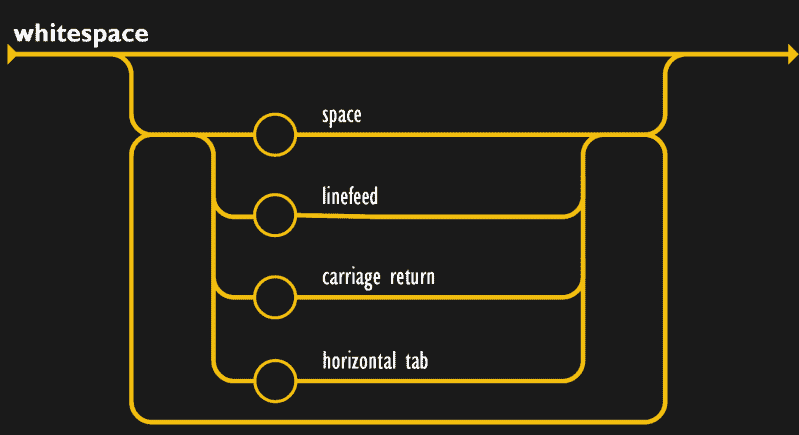
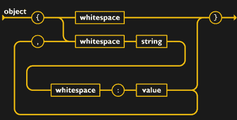
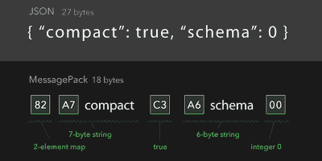
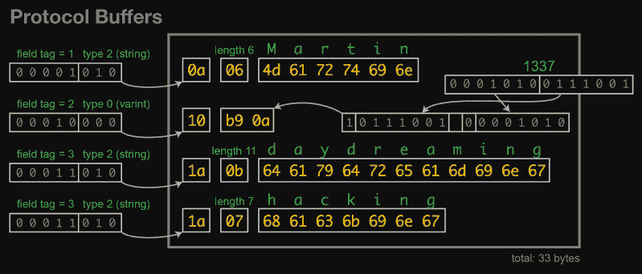

# 消息序列化的肮脏世界

> 原文：<https://hackaday.com/2020/06/10/the-ceedy-world-of-message-serialization/>

听着，我也去过那里。首先，该项目只是以易于理解的漂亮的描述性字符串为人类打印调试信息。然后一些工具需要记录一个传感器值，这样简单的调试消息就有了结构。现在，您的调试消息{ {看起来像:this}}。在添加第二个使用 floats 而不是 int 的传感器之前，这是很棒的。现在在花括号之间有了更多神奇的字符。几天后，事情开始看起来像图灵完成。在某个时候，您会发现，“我需要一个消息序列化策略”。你来对地方了！

# 消息序列化？

消息序列化有各种各样的名称，如“编组”或“打包”，但都属于声明组装消息的结构的范畴。消息序列化是将计算机内存中的数据转换为可以交流的形式的方式，就像语言将人类的思想转换为可以共享的形式一样。一个想法被序列化为一个可以发送的消息，然后在接收时被反序列化以将其转换回一个想法。非常具有哲理性。

> 消息序列化是一种将计算机内存中的数据转换为可通信形式的方式。

序列化在不同的地方都很有用。可以将原始数据结构写到磁盘上进行保存，但是如果程序员希望该数据将来可以被其他语言和操作系统轻松读取，他们可能希望以某种方式将其序列化，以使其具有一致的形式结构。在线程或进程之间传递消息可能会涉及某种形式的序列化，尽管可能会更加有限。当然，一个明显的应用是通过网络或任何其他媒介在计算机之间发送消息。

让我们避开哲学上的兔子洞，定义一些约束。(这毕竟是日常工作，不是一天一篇论文)。就本文的目的而言，我们感兴趣的是一个具体的用例:从微控制器交换消息。考虑到将微控制器连接到从串行总线到互联网的任何东西是多么容易，下一步就是赋予要发送的信息某种形状。

# 在序列化方案中要寻找什么

源源不断的“最好！”，“最快！”，“最小的！”，“最便宜的！”选项会导致一点决策瘫痪。有许多参数可能会影响您对一种序列化格式的选择，但有几个参数始终很重要。

首先要回答的第一个问题是:schemafull 还是 schemaless？这两种策略都指定了数据的格式，这毕竟是消息序列化的要点。但是每条消息的内容可以有不同的结构。schemafull 序列化方案将数据的结构(在某些方面是内容)指定为协议的一部分。在 schemafull 协议中，SensorReading 消息总是具有相同的字段集，比如 SensorID ( `uint32_t`)、时间戳(`uint32_t`)和读数(`float`)。将这些字段编码成字节的确切方式是根据协议以及它们的存在和类型来指定、序列化的。如果你的固件收到一个传感器读数，它会准确地知道内容的形状和大小。

鉴于此，描述无模式协议是很容易的，它没有任何限制！JSON 可能是最普遍的例子，但是肯定还有很多其他的例子。数据仍然以预定义的方式进行编码，但是没有提前指定每条消息的确切内容。在这样的模式中，我们的传感器读取消息没有预定义的内容。也许它只有一个浮动？也许十个整数？接收器需要检查每个字段是否存在，并尝试对其进行解码以获取内容。

## 模式和非模式的副产品

“但是等等！”你会问，“这两种方法的工作方式不是一样的吗？”。嗯，是的，算是吧。在某种程度上，这更像是参与者之间契约协议的正式化。显然，要解码一个 schemaful 消息，你必须尝试单独解码每个字段，就像在无模式系统中一样。但是，如果您假设格式是提前指定的，那么其他解码策略(如直接转换为数据结构，或代码生成编码器和解码器)可能会变得可用。

> 如果你不喜欢结构化，那么无模式协议的灵活性可能是合适的。

还有其他副产品。schemaful 解决方案通常允许开发人员从实现中单独指定协议，然后使用代码生成器以任何需要的语言产生序列化和反序列化功能。这可能会产生更有效的专门构建的代码，但更重要的是，它让开发人员清楚地知道正在交流什么以及如何交流。

如果您不喜欢结构化，那么无模式协议的灵活性可能是合适的。如果传入的数据被视为白名单，应用程序只接受它正在寻找的字段，那么创作和维护模式的开销可能会比保证的工作更多。只要确保每个人都在发送什么和如何发送的问题上意见一致。

为微控制器选择库时，需要注意的另一个约束是需要什么类型的内存分配。有时，人们倾向于完全避免动态分配的潜在麻烦，这可能会极大地限制选择。要求静态分配可能会迫使开发人员扭曲他们的代码来处理可变长度的消息，或者强制约束，如固定的最大大小。但是，内存管理需求不仅仅是强制序列化方案，还会限制可以使用哪些库。

让我们花一点时间谈谈图书馆。显然，可以手工制作协议和库来解码它，避免上面提到的大部分问题，并精确地生成任何约束所需的代码。有时候这是有道理的！但是，如果您希望不止一次或两次地扩展模式，并且需要它与多种语言或系统一起工作，那么标准的序列化协议和现成的库是不错的选择。一个公共模式将为跨操作系统和平台的语言和工具提供许多选项，所有这些都可以说同一种语言。因此，您可以为微型微控制器选择一个内存占用和静态分配较小的库，为后端选择一个动态功能齐全的库。

# 最喜欢的序列化方案和库

这里有一些我过去愉快地使用过的序列化方案，我认为值得考虑。请注意，这些建议是基于我过去对微控制器所做的工作，所以它们是用纯 C 编写的，以获得最大的兼容性并支持静态分配。

## JSON

The JSON specification is primarily composed of these excellent diagrams

JSON 已经成为 API 驱动的互联网的一种通用语言。最初它被用作传递 JavaScript 对象内容的序列化格式，现在它几乎无处不在，就像 JavaScript 一样。JSON 被编码成人类可读和可写的文本，这使得在必要时很容易检查或编辑。它是无模式的，基本上允许存储由类型化键值对组成的对象和对象数组。如果你会说 JSON，你就可以和任何东西交流。

JSON 人性化的一个副作用是对字符串的依赖，这使得在 C 中处理字符串有点麻烦，尤其是在避免使用动态分配时。解决这个问题的一个策略是严重依赖平面缓冲区来保存字符串，以及指向各种对象和字段的指针，而不为它们分配内存。在解析 JSON 时，我很乐意使用 [jsmn](https://zserge.com/jsmn/) 来处理这个问题。

Jsmn 非常简单，可以完全包含在一个头文件中，是上面提到的基于指针的技术的非常非常薄的包装。它验证 JSON 对象的格式是否正确，并允许开发人员获得指向包含在。尽管它给出了字符串的类型，但如何解释其中的字符串是由开发人员决定的。这有点像打了类固醇的 strtok。

## message pack/msgid pack

MessagePack 是介于人类友好的 JSON 和最高效的二进制打包协议之间的有趣媒介。主页上称其为“就像 JSON”。但是又快又小。”(哎哟，对不起 JSON。)和 JSON 一样，它是无模式的，基本上由键/值对组成。与 JSON 不同，它不是为人类可读而设计的，而且打字感觉更明确一些。JSON 和 MessagePack 中一条消息的对比见下图。它本身就很好卖。MessagePack 相当普遍，所以找到库来读写它是很容易的。我在 Rust 和 C 中使用过它，但对于大多数主要和许多次要语言和平台，至少有一两个选项:该项目声称支持至少 50 种。如果你对更多的细节感兴趣，[【艾尔·威莱姆斯】最近写了一篇关于它的文章](https://hackaday.com/2020/03/12/messagepack-is-a-more-efficient-json/)。

A message in JSON and MessagePack

当从微控制器讲 MessagePack 时，我使用了 [CWPack](https://github.com/clwi/CWPack) 。文档可能有点薄，但是代码很容易跟踪，并且可以很好地分解成小的功能块。事实上，这是我最喜欢的功能。CWPack 非常容易理解和使用。利用小型的自包含功能，序列化和反序列化消息轻而易举。最需要注意的是，它有时可能比预期的更加手动。例如，当发送一个映射时，您必须对映射的开始和元素的数量进行编码，然后对每个元素分别编码键名和值。一旦你习惯了 CWPack 的工作方式，它可能会产生一些最容易理解的代码。

## 协议缓冲区/协议缓冲区

[协议缓冲区](https://developers.google.com/protocol-buffers)在诡计多端的消息传递世界中举足轻重。它最初是由谷歌开发的，现在已经被用来为各种数据链接和应用程序编码数据。Protobuf 由称为 proto、proto2 或 proto3 的方言中的独立文件指定。这些定义了消息、基本的层次结构单元以及所有不同的字段和它们之间的关系。这些`.proto`文件是编码器和解码器可以使用和不可以使用的绝对规范，这些编码器和解码器是由 proto 规范的代码生成产生的。

因为您的 Protobuf 与实现是分离的，所以在这个上下文中提到的“库”实际上是指用于生成编译到最终应用程序中的源代码的代码生成器。“protocol”是 Google 提供的生成器，对于 proto2，它可以生成 Java、Python、Objective-C 和 C++的实现。proto3 的实现增加了对 Dart、Go、Ruby 和 C#的支持。但这只是谷歌的官方工具，还有很多很多选项可用。请记住，Protobuf 指定了网络上的字节，而不是与单个消息交互的 API，因此每个代码生成器可能会生成完全不同的代码来与相同的消息交互。

 

来自【马丁·克莱普曼】的精彩博文

Protobufs 可能非常强大，但仔细考虑你的信息支持什么是很重要的。原型定义指定了字段是必需的还是可选的，它们的类型是什么，等等。通常，解码器会验证每个字段的所有元数据是否与其预期的完全匹配，并且将无法解码任何其他内容。如果您的系统需要支持不同软件版本的混合，则可能会出现新的编码器和解码器拒绝与编码为不同协议版本的消息进行交互的情况。

尽管如此，特别是对于一个大型项目，协议缓冲区在迫使所有参与者就发送什么数据以及如何发送数据达成一致方面做得非常出色。对于微控制器，我通常选择 [nanopb](https://github.com/nanopb/nanopb) 作为我的代码生成器。生成代码的紧凑大小和对静态分配的支持使得它很容易集成到几乎任何项目中。最终，你把要编码的结构和要编码的缓冲区交给它，反之亦然。

# 前进并编码

不管您的约束条件如何，总有一种消息序列化格式可以满足您的需求。这些是我发现有用的一些，但显然还有更多选择。有你一直在使用的最喜欢的格式或库吗？插话发表评论；我很想听听接下来要尝试什么！