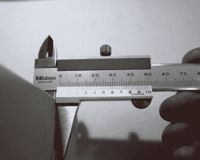
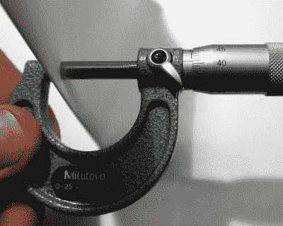
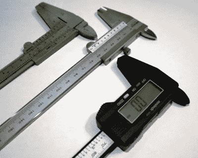
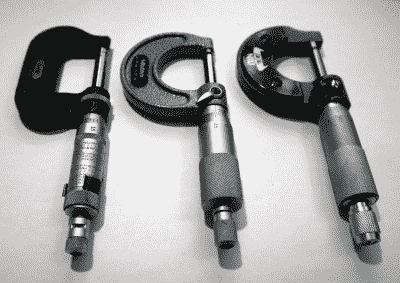
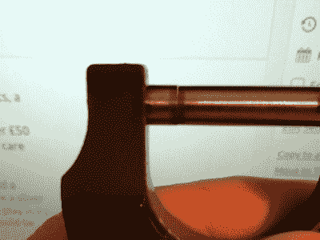

# 游标卡尺和螺旋千分尺，测量毫不妥协

> 原文：<https://hackaday.com/2020/06/08/vernier-calipers-and-micrometer-screw-gauges-measuring-without-compromise/>

我最近需要一个温度控制器模块，所以我去 Banggood 订购了一个。当我发现自己在浏览时，一件事接着另一件事，我买了一个螺旋千分尺。虽然千分尺是非常昂贵的设备，反映了它们的高精度工程和结构，但这个千分尺只花了我大约 8 英镑，或不到 10 美元，绝对符合我们长期以来审查非常便宜的工具以寻找未经加工的钻石的精神。但也许更重要的是，这也是检查高精度尺寸测量的提示。因此，我已经收集了各种质量的千分尺和游标卡尺，是时候开始测量一些非常小的东西了。

你们中的一些人会是计量爱好者，拥有一系列最好的设备，但我猜你们中的许多人不会。在我们的社区中无处不在的精密测量设备似乎是数字卡尺，一个带 LCD 显示器的滑动夹，一个实际上花费很少就可以拥有的最基本形式的工具。就本文而言，我们不是在看数字设备，而是它们的模拟前身。如果你想对计量学有所了解，并且想要一些父母传给孩子的传统工具，那么是时候了解一下游标卡尺和千分尺了。

## 数字时代的传统计量

The business end of a Vernier caliper. The Vernier scale is on the lower part of the sliding jaw.

游标卡尺是一种带刻度的滑动夹，通常长度超过 150 毫米，带有游标刻度，可以读出刻度的分数。它通常有两套用于内部和外部测量的夹爪，以及一个用于深度测量的延伸探头。在夹子的主体上是毫米或英寸，在滑动的颚上是一个刻度尺，它是主刻度尺的一个恒定的分数。这是一个数学技巧，允许用户将“10.12 毫米”变成“10.12 毫米”，方法是沿着游标刻度移动，直到其中一个刻度与主刻度上的一个刻度对齐，然后从游标刻度上读取一毫米数字的分数。

我有一个有家族企业背景的朋友，她将碳化钨研磨到非常高的精度，她开玩笑地称游标卡尺为“猜谜棒”，因为它的精度比她的工作区高十倍，但是根据游标刻度，在游标卡尺的整个相对较长的范围内，它能够将一个额外的数字和一个数字的几分之一的精度增加到毫米读数，这使它成为一个非常有用的工具。

The micrometer scale on the shaft of the gauge.

千分尺是一种 G 形夹钳，最常见的形式是大约 25 毫米大小，带有非常精确校准的螺纹。它有一个手柄，沿其长度方向有以毫米或英寸为单位的刻度，手柄上有转动螺纹的分数刻度。使用时，将它盖在要测量的物品上，从长度刻度上读出毫米，从手柄刻度上读出毫米的分数。典型的千分尺具有百分之一毫米或千分之一英寸的精度，但也有将两个千分尺刻度与仪器轴周围的游标刻度相结合的千分尺，除此之外还能提供一个数字的额外精度。所有精密计量仪器都应小心维护其校准，千分尺末端有一个棘轮，以确保拧紧时扭矩恒定。应始终使用棘轮拧紧，以防止螺纹磨损和变形。

## 游标卡尺射击

The selection of calipers under test. Left: sub £1 plastic Vernier caliper, centre: Mitutoyo 530-122 Vernier caliper, right: cheap digital caliper.

我收集了两者的精选品进行比较。在卡尺的角落里有一个非常便宜(大约 5 或 6 美元)的数字卡尺，另一个非常便宜的塑料模拟游标卡尺，和我的三丰 530-122 游标卡尺。前两个是我选择的快速测量工具，当你在我的 Hackaday 作品中看到一个产品尺寸时，它会在其中一个上被测量。塑料游标卡尺已经伴随我大约 20 年了，因为它 1 英镑(2000 年是 1.5 美元)的购买价格，它可能是我拥有的最好的工具。Mitutoyo 是他们的入门级型号，我似乎记得它花了我大约 30 英镑(约 37 美元)，当我需要一个我真正信任的精确测量时，它就从盒子里出来了。

塑料卡钳都是不结实的，稍有弹性和重量轻，钳夹不完全符合他们的整个长度，并有一个可辨别的轻微运动。数字的声称 0.1 毫米的精度，而游标的声称 0.05 毫米的精度，我可以想象可能是乐观的两种情况下，由于这些下巴。这是根据它们的使用情况和成本来评估它们的情况，所以只要我把它们用作可以在我的抽屉里敲来敲去进行快速毫米测量的工具，而不是加工核反应堆部件，那么它们就足以完成这项任务。相比之下，拿起三丰卡尺就能立即看出这是一款质量更高的工具，因为是由不锈钢加工而成，所以重量更重。给人的最大印象是坚固，下颚完美地接合，没有明显的间隙，滑动动作平稳，但有持续的轻微阻力。它的精度为 0.02 毫米，比塑料卡尺上的数字可信得多。

检查过卡钳后，它们的表现如何？是时候通过比较测量来检验他们的能力了。我带了一些我必须要带的东西，一张打印纸和一个裸露的徽章印刷电路板。值得注意的是，本页上的所有测量值都是为确保读数一致而反复尝试的结果，使用这些仪器，很容易通过在要测量的物品上错位钳口来获得较差的读数。

|  | 纸张厚度 | PCB(双面铜) | PCB(无铜) |
| 廉价的数字卡尺 | 0.0 毫米 | 1.6 毫米 | 1.5 毫米 |
| 塑料卡尺 | 0.1 毫米 | 1.55 毫米 | 1.40 毫米 |
| 三丰 | 0.1 毫米 | 1.60 毫米 | 1.56 毫米 |

廉价的数字卡尺的低分辨率立即变得显而易见，因为它将 PCB 上的铜层解析为高达 0.1 毫米。令人惊讶的是，它没有解析 0.1 毫米的纸张，但这很可能是由钳口中的间隙引起的误差。同样，塑料游标卡尺给出了与 Mitutoyo 明显不同的读数，这可能也是由于它的钳口不一致。

## 千分尺射击

The selection of micrometers on test. Left: Moore & Wright No. 964, centre: Mitutoyo 103-137, right: Daniu £8 micrometer.

与此同时，除了我的 8 微米，我还借了几个质量相当高的仪器，一个售价约 57 英镑(70 美元)的三丰 103-137 公制型号，以及一个 20 世纪 60 年代的摩尔&赖特 964 号帝国型号。后者已经停产，但我认为相当于目前售价超过 50 英镑(61 美元)的 M&W 型号。它们都是通用的 0–25 毫米/0–1 英寸车间千分尺，它们的主人对它们进行了精心的保养，因此它们的状况非常好。

8 牛大品牌千分尺构造坚固，配有珐琅涂漆的落锻框架和机械加工的铝制千分尺头和棘轮。然而，在它的加工过程中并不是一切都很好，因为我可以看到一条光线，表明当它们闭合时，它的颚之间有不完美的平整度，并且在它的螺纹中有可辨别的间隙。它有 0.01 毫米的分辨率，但考虑到不完全平坦的钳口和螺纹中的间隙，我倾向于为此添加一个显著的误差栏。

You should *NOT* be able to see light between the jaws of a closed micrometer screw gauge!

相比之下，Mitutoyo 和 Moore & Wright 都有非常相似的落锻框架和机加工铝头，但很快就能看出额外的钱花在了哪里。这两种乐器都没有明显的间隙，它们的动作很平稳，阻力比便宜的乐器稍大。它们的颚面已经研磨成镜面光洁度，当它们闭合时，颚之间没有可辨别的间隙。

看着千分尺的性能，我再次对每一个进行了一系列的测量。这张纸已经被一根从我自己头上拔下来的头发代替了，这是对工科小学那堂课的敬意，当时你被告知一个千分尺可以测量一根人类的头发。

|  | 人发 | PCB(双面铜) | PCB(无铜) |
| 牛大 | 0.02 毫米 | 1.59 毫米 | 1.54 毫米 |
| 三丰 | 0.065 毫米 ^* | 1.62 毫米 | 1.55 毫米 |
| M&W | 0.0025 英寸^*(0.0635 毫米) | 0.064 英寸(1.625 毫米) | 0.061 英寸(1.549 毫米) |
| *额外的 0.5 精度来自于判断读数是否在两点之间。 |

我们马上可以看到，三丰和摩尔&赖特彼此非常接近，而牛大在一些读数上有很大的不同。螺纹中的游隙和不完全平坦的夹爪使得读数难以一致，因为读数取决于夹爪和螺纹在所述距离处的对准。

## 物有所值

在检查了像样的和便宜的游标卡尺和千分尺后，我发现一个质量不错的仪器胜过一个非常便宜的仪器。我的塑料卡尺很适合快速的毫米测量，但可能不适合更高精度的工作。不足为奇的是，8 微米并不能以其声称的分辨率提供一致的读数，但在数字精度较低的情况下就足够了。真实的故事在于，即使在数字计量时代，高质量的仪器也能发挥多大的作用，而且一台像样的仪器的起步价可能没有你想象的那么高。

还有另外一点有点轻浮，但我怀疑不止一部分读者会认同，那就是优质乐器的*手感*。拥有一些工具是一种享受，如果你照顾好它们，它们会伴随你一生，并且会传给你的孩子，最终成为他们的传家宝。遗憾的是，我要把借来的千分尺还给它们的主人，很可能不久之后，我就要为自己的千分尺腾出空间了。如果你明白这一点，但你还没有游标卡尺或千分尺，那么我觉得你可能很快也会订购其中一个。