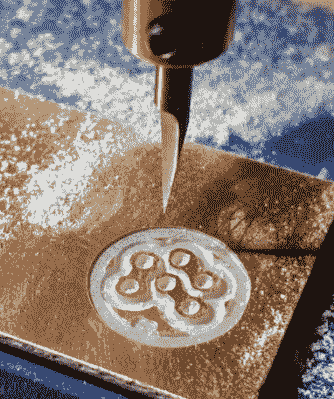

# 铣削自定义 6 针 DIN 连接器

> 原文：<https://hackaday.com/2020/05/22/milling-a-custom-6-pin-din-connector/>

当[Charles Ouweland]发现自己需要一个引脚排列有点不寻常的 DIN 连接器时，他认为他可以在比运送替代品更短的时间内制作自己的连接器。最后，听起来似乎比预期的时间要长得多，但鉴于世界范围的情况，我们不怀疑这个定制的连接器在易贝的对应连接器到达之前仍然投入了工作。

 更重要的是，连接器【查理】制作出来看起来棒极了。如果没有人告诉我们，我们会认为成品已经商业化生产了。虽然平心而论，他确实得到了一点帮助。外壳和引脚本身从牺牲连接器中拉出；他的主要贡献是绝缘块将针固定在正确的位置。

那么他是怎么做到的呢？他曾考虑用一块废料，用钻床在上面钻孔，但他担心食物是否合适。相反，他决定调用他的廉价数控路由器投入服务。通过将他的设计从覆铜 PCB 走线，他甚至能够在连接器中将适当的引脚连接在一起。

不可否认的是，现在我们没有看到很多硬件仍然使用 DIN 连接器。但这条建议确实值得存档，以防万一。你永远不知道什么时候你会发现一个只需要一点点保养就能重新启动并运行的旧硬件。谁知道呢，你[甚至可能发现一个装满它们的垃圾箱](https://hackaday.com/2020/05/09/reverse-engineering-saves-trashed-led-panels/)。