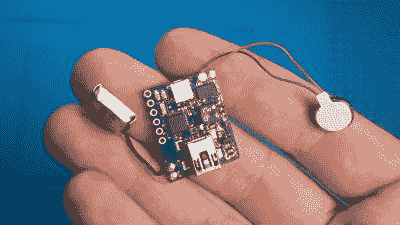

# Arduband 帮助您的眼睛

> 原文：<https://hackaday.com/2020/05/24/arduband-gives-your-eyes-a-hand/>

让我们面对现实吧，我们可能都在电脑前坐了太久而没有站起来。是的，有工作要做，有游戏要玩，互联网上到处都是犯错的人，他们必须被否决和/或纠正。我们完全理解并尊重这一切。然而，如果你想保持你的中长期视力，你真的应该定期起床，凝视窗外一会儿。

 其实，[阿杜班德](http://www.instructables.com/id/ArduBand/)确实比你强一点。它的 Arduino Nano 和加速度计每十分钟检查一次你的位置。如果到第三次检查还没有改变 Z，那么就该休息了。RGB LED、蜂鸣器和振动圆盘电机的组合应该足以将你从任何计算机化的昏迷中唤醒，并且它们不会放弃并继续睡觉，直到你站起来并保持直立一分钟。

我们喜欢[ardutronics123]旋转一块电路板，使它小到可以用表带戴在手腕上。它可以很好的戴在你的脖子上，甚至可以放进你的口袋里。休息后，在查看构建视频之前眨几下眼睛。

Arduband 在移动中会很棒，但是谁还会这么做呢？如果你每天都坐在同一张桌子前，你可以将一个飞行时间传感器对准你的椅子，启动一个计时器。

 [https://www.youtube.com/embed/NEqSY5keKio?version=3&rel=1&showsearch=0&showinfo=1&iv_load_policy=1&fs=1&hl=en-US&autohide=2&wmode=transparent](https://www.youtube.com/embed/NEqSY5keKio?version=3&rel=1&showsearch=0&showinfo=1&iv_load_policy=1&fs=1&hl=en-US&autohide=2&wmode=transparent)

