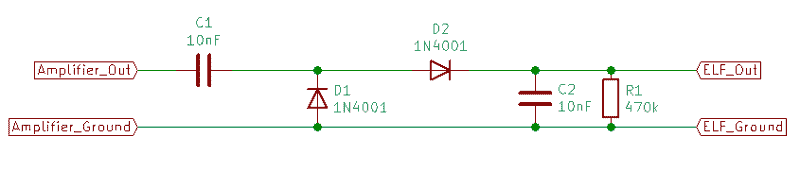

# 这个频率发生器知道如何下来

> 原文：<https://hackaday.com/2020/05/25/this-frequency-generator-knows-how-to-get-down/>

对于一个周期为 2 小时的信号，你能做什么聪明的事情？还是 20？有什么想法吗？不，说真的，告诉我们。因为[Joseph Eoff]想出了一种方法来产生令人难以置信的低频信号，这种信号可以持续几个小时，我们很想知道我们能用它做什么。

公平地说，[约瑟夫]也没有什么想法。他认为这将是一个有趣的项目，并认为现在他有了技术，也许会有一些应用程序来找他。他们说，如果你有一把锤子，所有东西看起来都像钉子，所以他给我们的下一个项目可能是一个正弦形喂鱼器。

[Joseph]说用纯数据做软件方面的事情不是问题，但是把它从计算机中取出来被证明是棘手的。原来，你的普通计算机声卡不具备处理低至毫赫兹范围的频率的能力(大惊喜)，所以它们需要用一些额外的硬件来解决。使用一个类似于调幅解调器的简单电路，他能够从 16 kHz 载波中提取低频信号。

因此，如果你发现自己需要一把赫兹，现在你已经有了产生它们的工具。至少这比他们在 1900 年代如何产生低频信号更实用。