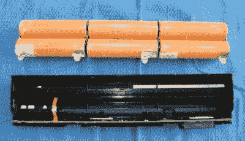
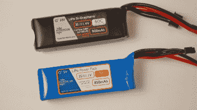
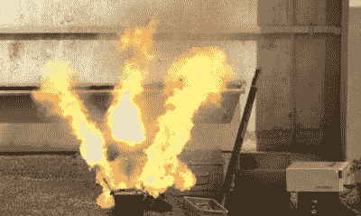
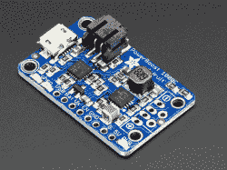
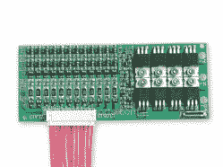

# 锂充电电池初学者指南

> 原文：<https://hackaday.com/2020/06/11/a-beginners-guide-to-lithium-rechargeable-batteries/>

电池曾经是笨重的东西，就其大小和重量而言，只能提供微弱的电流。值得庆幸的是，随着时间的推移，技术已经得到了改善，到 2020 年，我们有幸拥有强大的高功率锂聚合物电池，可以为您的移动项目提供可能需要的所有电力。然而，在使用 LiPos 时必须考虑一些因素，所以请继续阅读，了解如何在您的项目中正确使用 LiPos！

## 这么多类型！

自 1991 年第一个商用锂离子电池进入市场以来，近 30 年来发展迅速。这导致了不同技术和电池类型的激增，这取决于所使用的结构和材料。为了正确对待你的电池，知道你有什么是很重要的，所以注意这一点是至关重要的。

18650 lithium-ion cells as found in a laptop battery. Packs like these are normally spot welded together with nickel strips.

**锂离子或 Li 离子**通常指可充电锂电池的主要技术，但也特指内置于圆柱形金属体中的传统电池。古老的 18650 就是一个这样的细胞，但存在大量不同的大小和类型。它们结实的外壳使这些电池在混战中的车辆上很受欢迎。

**锂聚合物，或 Li-Po** 指的是使用聚合物电解质而不是液体电解质的锂离子电池。这使得能够构建具有不同几何形状的袋状单元。这种灵活的设计使锂聚合物电池在智能手机和平板电脑等需要高容量电池和扁平外形的应用中非常有用。它们也常用于无线电控制模型，它们的轻质结构对飞行器来说是一个巨大的好处。

Lithium-polymer pouch packs, designed for RC use. The top pack is an HV type.

**锂-高压或高压锂**是锂聚合物电池，在正极使用特殊的硅-石墨烯添加剂，可以抵抗更高电压下的损坏。当充电超过 4.2V 时，大多数锂电池会出现显著的容量损失和寿命缩短。然而，通过使用这种添加剂，电池可以被充电到 4.35V 而不表现出这些负面影响。与传统的锂聚合物电池相比，这种额外的电压使能量密度增加了 10%。

**磷酸铁锂，或 LiFePO [4]** 电池是一种改变了的锂离子化学物质，它提供了承受更多充电/放电循环的好处，同时在权衡中损失了一些能量密度。理想情况下，它们在 3.0V-3.65V 之间工作，而不是标准锂离子化学中更典型的 3.0-4.2V 范围。这一点，加上非常平坦的放电电压曲线，使它们成为许多应用中 12V 铅酸电池的理想替代品，其中四个电池取代了原来的六个电池。它们通常更稳定，随着时间的推移，自放电率和容量损失率更低。

## 尊重限制

Get it wrong, and results can be intense.

与大多数电池类型相比，锂电池更不能容忍虐待。将电池放电至低于其低电压极限会导致铜枝晶的形成，这会降低电池容量或使其完全短路。过度充电的电池会因溶液中的锂电镀而损坏阳极，产生锂枝晶，通常会导致电池短路或完全热失控，从而释放出烟雾和火焰。电池组中的每个电池也必须与其相邻的电池保持相同的电压，以避免电池过早损坏。

锂电池不要充电太快，这一点很重要。环境温度对电池性能也有很大影响。锂电池不喜欢被带到冰点以下，尤其是当它们已经充满电的时候。低于 0 C 时，充电是不切实际的，因为金属锂会在负极电镀，导致电池严重损坏甚至短路。在 0-5°C 之间，充电是可能的，但必须缓慢进行。当电池在高于 45°C 的温度下充电时，也容易发生损坏。

在这些参数之外工作，往好里说会很快导致电池没电，往坏里说会导致火灾和爆炸。它们也容易膨胀、排气，并且通常变得不适合处理。从表面上看，这似乎需要处理很多事情。令人欣慰的是，电池电子复合体已经努力解决这些问题。有了合适的硬件和预防措施，安全有效地使用锂电池是可能的。但是任何使用这些化学物质的人都应该熟悉这些危险。去年 11 月，鲍勃·巴德利发表了一篇关于锂离子安全的文章。

## 电池维护

对于使用裸电池或电池组的应用，例如当在 RC 模型中使用 LiPo 电池时，简单地使用锂就绪充电器就足够了。充电时应连接好平衡导线，尤其是当电池处于完全放电状态时。确保智能充电器在正确的电压限制下使用(特别是在使用 LiFePO [4] 和 HV 包时),将确保您最大限度地利用电池。确保当电压变低时，你有一些方法来停止电池放电，无论是通过警告灯，蜂鸣器，还是自动关机。

Modules like these are great for integrating a lithium battery into your prototypes.

如果你正在生产一个需要永久集成电池的设备，保护和充电电路就是最好的选择。现成的模块和 IC 可以解决管理锂离子电池的麻烦。种类繁多，从简单的低压切断到完整的充电和保护解决方案。像 Adafruit 这样的公司出售模块 T1，对于那些渴望集成简单的充电和电池解决方案而不必自己旋转 PCB 的人来说，这是一个很好的起点。然而，由于这些设计是开源的，因此将来可以很容易地将电路设计集成到您自己的 PCB 中。

A battery management system for a 12-cell pack, capable of delivering up to 60A.

对于采用定制电池组的大型应用，电池管理系统是一个不错的选择。基本上，BMS 与电池保护 IC 或类似产品没有太大区别，只是为更大的应用而设计。BMS 通常用于 10 节及以上的电池组，用于电动自行车和其他代步工具等运输应用。BMS 直接焊接到电池组，包括连接到每个单独的电池。其目的是保持电池平衡，出于安全原因限制最大放电电流，当然还有控制充电过程。经验丰富的电池组制造商通常会将 BMS 集成到电池外壳或外壳内，只留下一个放电端口和一个充电端口。这使得最终用户可以轻松地将电池放入工程车辆中，而不必担心如何保护自己。

如果您的应用特别关键，需要承受极端环境，您需要监控电池温度。密切关注电池温度，尤其是在充电过程中，是保护电池免受损坏的好方法。高性能保护芯片和电池管理系统具有监控电池组温度的规定，以实现这一点。在这个级别，你可能会构建定制包，从而允许你在构建过程中在精确的位置安装热电偶。对于大功率装置，温度管理是强制性的，几乎所有的电动自行车和电动汽车都包含监控电池温度和相应控制系统的硬件。

## 概括起来

锂离子电池可能会咬人，但如果使用得当，它们可以提供出色的性能，并且对于大多数应用来说都足够安全。关键是使用正确的硬件，以确保避免跨越可能导致灾难的电压和温度限制。希望这份指南能很好地服务于你，因为你想把锂能集成到你自己的项目中。而且，万一你真的遇到了有趣的电池事故，一定要进行诊断并[打开提示线](http://hackaday.com/submit-a-tip)。黑客快乐！