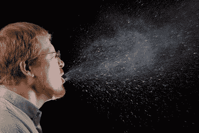
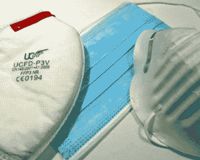
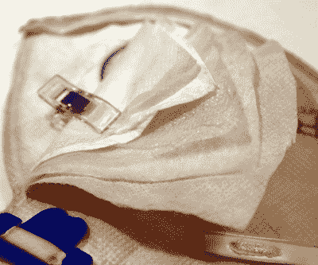
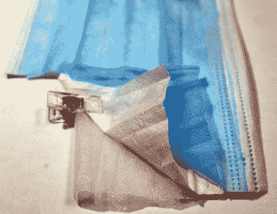
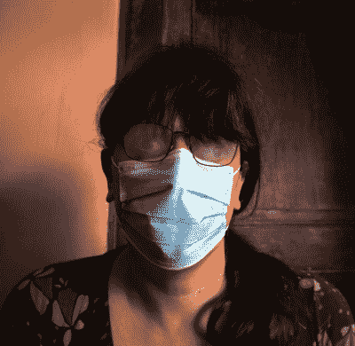

# 作为黑客在疫情生存:窥视面具背后

> 原文：<https://hackaday.com/2020/06/03/surviving-the-pandemic-as-a-hacker-peering-behind-the-mask/>

我们现在对新冠肺炎疫情的全球反应已经进行了几个月，世界大部分地区都处于封锁/社会距离/开放的道路上。

现在可以公平地说，虽然医疗紧急情况还没有过去，但对它的了解程度已经发生了显著变化。当社区在努力减缓最初的 spead 时，重点是不惜一切代价用一些有趣但可能有危险的解决方案来解决医疗防护装备和其他设备短缺的问题。现在，当公众确实需要外出时，以及随着社会学会通过安全措施让生活重新运转起来，重点已经转向保护公众。

所以，我们都需要某种面具。你需要什么类型的？一种类型比另一种更好吗？当每个人都突然需要曾经有点小众的物品时，我们如何得到它们呢？

## 口罩为公共场所的每个人提供基本的保护

It’s rather sickening to look at the quantity of droplets expelled by a sneeze. James Gathany / [Public domain](https://commons.wikimedia.org/wiki/File:Sneeze.JPG)

世界上的一些地方正在接受长期封锁的影响，而其他地方则开始考虑如何开始回归某种常态。佩戴实用口罩的问题之一，[因为有迹象表明它会减缓疾病的传播](https://www.medrxiv.org/content/10.1101/2020.03.31.20048652v1)。

当考虑口罩时，重要的是从定义什么是普通大众的口罩开始，以及它试图达到什么目的。这与重症监护人员佩戴的口罩不同，重症监护人员佩戴口罩的主要目的是通过从被病毒严重污染的空气中过滤病毒来保护佩戴者，相反，这是一种旨在在只有少数人可能传播病毒的环境中佩戴的口罩(令人讨厌的细节是不知道这少数人是谁)。

口罩的目的是减少受感染飞沫传播的机会。这是一个在“[尿检](https://www.reddit.com/r/funny/comments/gaj2a3/wear_your_mask_the_urine_test/)”迷因中巧妙说明的想法，这种口罩不能保证你逃离病毒，但它应该能显著降低病毒传播的几率。我们被告知，在一个环境中戴口罩的人越多，这些几率就越大，因为这是一个相对容易采取的步骤，所以每个人都应该采取这一步骤，以示对人类同胞的礼貌。

## 我们是制造商，是的…但是你可以从商业面具中学到很多

在我们的社区中，第一个想法总是转向制作我们自己的，事实上这是许多地区官方建议的一部分，但是在我们去那里之前，值得考虑一下商业选择。这些通常使用复合材料设计，具有舒适和过滤的多层织物，主过滤层是吹制织物而不是编织织物。

A variety of commercial masks, left to right: FFP3 industrial dust mask, T32610-2016 surgical-style mask, very cheap unrated single layer dust mask.

如果你有顶级医用口罩的供应，那你就万事俱备了，但由于疫情的需求导致了供应短缺，这是我们大多数人都不能声称的奢侈品，也不应该从需要它们的专业人士那里拿走。在车间里，我们经常会有一系列其他的防尘口罩，在这些口罩中，我们可以找到一些出乎意料的好防护。关键在于应该印在盒子上或面具外面的等级，但要解读它的含义，有时需要深入了解国际标准。

假设你没有从全球速卖通最便宜的卖家那里购买，并且你的口罩不是假冒的，你可能会遇到美国标准(N95 等)，欧盟标准(FFP EN149 等)。)，或者中国标准(T3210-2016 等。).除了其他特性之外，这些特性还涉及口罩的颗粒过滤能力，包括颗粒大小和去除率，以及使空气通过口罩所需的呼吸力。幸运的是，我们对捕滴器的要求并不需要最严格的标准。作为一个题外话，所有上述标准的官方版本似乎都在非常昂贵的付费墙后面。不过，通过你的搜索引擎在网上找到它们并不困难。

## 撕下一些面具

Five layers in this FFP3 dust mask.

因此，在我们手头的商业口罩中，我们挑选出了一对防尘口罩和一个外科口罩，它们很好地展示了我们提供的产品系列。FFP3 防尘口罩是欧洲标准的 N95 外科口罩的工业版，手指和拇指之间感觉很厚。尽管我们的 FFP3 可能具有最好的过滤性能，但它并不适合作为病毒防护，因为它通过一个单向阀来控制呼气，这会将液滴释放到大气中。

从我的整体口袋中取出用过的 FFP3 面具，在 MK Makerspace 的几次木工加工会议期间，它保护我免受灰尘的影响，切开它，它显示出有五层无纺层，包括一层厚而蓬松的层和一层非常致密的层。当用螺旋测微计压缩时，其厚度相当大，为 0.94 毫米

Three layers in this T32610-2016 surgical-style mask.

下一个要解剖的口罩是中国制造的三层外科口罩，规格为 T3210-2016，其包装盒上明确表示它不是医疗器械。那个警告听起来令人担忧，但在这种情况下却并非如此；符合该特定标准的口罩旨在供公众佩戴，而不是供医务人员佩戴。事实上，这种口罩是作为日常生活中捕捉灰尘和水滴的个人防护设备而专门制造的，所以这只是工作。切开它可以看到三层，中间的过滤层是一种致密的无纺布，千分尺显示它具有 0.28 毫米的压缩厚度。

最后一个面具是另一个防尘面具，这是我买的一包银线单层面具，用来带人们参观一座布满灰尘的教堂塔楼。这是一层 0.45 毫米厚的硬质吹塑聚合物织物，成型为面具形状，其包装上有一个不祥的警告，即它不能为佩戴者提供额定保护。它确实非常便宜，对于我购买它的目的来说也足够了，但我必须承认，在疫情期间，如果它能提供比最基本的保护水平更好的保护，我会更高兴。

With steamed up glasses and an unruly lockdown hairstyle, illustrating the importance of a good seal round the nose.

这三种面具都在鼻子上方有一根硬金属丝或金属条，旨在贴合鼻梁的轮廓，并夹住呼吸逸出的任何缝隙。如果你戴上眼镜，很容易判断它们是否有效，因为如果你呼吸中的潮湿空气逸出，它们会立即蒸发。在这三个面具中，一次性外科手术式面具在这方面做得最差，FFP3 有一个非常坚固的塑料和铁丝带，任何东西都不能通过，廉价的未分级面具有一个金属条，但外科手术式面具的单根细线根本无法胜任工作。

为了测试这三件衣服，我已经穿了很长一段时间，当我穿着这一件开车去城里开处方时，我不得不停下来把它摘下来，因为看不到我要去的地方的风险太大了。这可以用折叠起来的厨房毛巾堵住缝隙，甚至用医用胶带固定来缓解，但这种事情很快就变得非常烦人。

至于起雾，这里也有一些建议。使用不含乳液的洗洁精，或者说是为敏感皮肤准备的洗洁精会有效。涂在镜片内侧，静置一会儿，然后打磨至透明。据说剃须膏也是如此，尽管我还没有尝试过这两种方法。

## 不受感染的自由

从对面具及其构造的深入了解中能获得什么？首先，在为自己寻找面具时，接受教育和了解信息是有好处的。在过去的几个月里，我有机会从每个人那里买到口罩，从我的 PCB 供应商，到当地的工具商店，再到我的文具供应商，还有许多不请自来的电子邮件。这是一个混乱的市场，对粗心的人来说有很多陷阱，如果幸运的话，这些陷阱会变得清晰一些。

在这个系列的下一部分，我将看看自制面具的设计，并演示我是如何自己制作面具的。掸掉你缝纫机上的灰尘，那篇文章下周就要发表了。