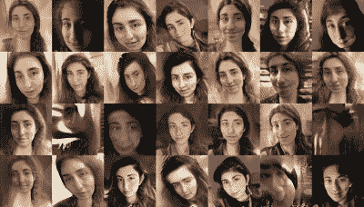
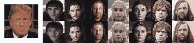

# 用机器学习创作超现实短片

> 原文：<https://hackaday.com/2020/05/29/creating-surreal-short-films-from-machine-learning/>

自从我们第一次看到 Google DeepDream 制作的噩梦般的艺术作品和 neural style transfer 制作的可笑的人造绘画，我们就知道机器学习可以应用于视觉艺术的方式。通过商业上可用的训练模型和从相对较小的训练集中生成图像的自动化管道，现在没有机器学习理论知识的开发人员可以轻松生成图像，只要他们有足够的 GPU 访问权限。电影制作人[基拉·布尔斯基]更进一步，创作了一部超现实的短片,其特色是从图像集产生的人物和纹理。

她以大约 150 张她的脸部照片、200 张电影拍摄地的照片、4600 张过去电影制作的照片和 100 张绘画作为主要数据集。

via【Kira Bursky】

在 RunwayML 中使用 GAN 模型对星云、人脸和摩天大楼进行训练，她发现训练她的人脸集的结果是解体的、逼真的和绘画般的。许多图像继续唤起她扭曲的原始面孔，尽管这是识别摩天大楼和面孔共同特征的模型，还是我们自己对面部识别的偏见，取决于观众。

另一方面，训练电影的结果是在人脸和卧室的模型上设置照片，产生抽象的纹理和“像发烧梦一样的超现实和怪诞的脸”。也许，与我们熟悉的面部特征不同，是变换后的图像缺乏可识别的特征给了它们如此超现实的感觉。

[Kira]当然利用了这些结果，为一部围绕她经历噩梦的主角的短片集思广益。虽然她的目的是用她的结果来传达一系列情感上引人注目的场景，但她用来制作这些场景的模型也很有趣。

她首先使用由苏黎世联邦理工学院和英特尔的一组研究人员创建的 MiDaS 模型来生成单目深度图。结果将图像内部的级别与其相对于彼此的适当深度相关联。她还使用[面具 R-CNN](https://github.com/matterport/Mask_RCNN) 来掩盖生成的人脸中的背景，并在 Photoshop 中结合她生成的图像来创建她的短片的主要人物。

via【Vox】

为了模拟角色行走，她使用了由上海理工大学和腾讯 AI 实验室团队创建的[液体翘曲 GAN](https://arxiv.org/abs/1909.12224) ，这是一种人体运动模仿和外观转移的框架。这使她能够拍摄原始图像，并通过使用 3D 身体网格恢复模块，从自己行走的参考姿势合成结果。后来，她在脸上应用了类似的运动跟踪技术，通过[一阶运动模型](https://github.com/AliaksandrSiarohin/first-order-model)来模拟不同的情绪。她继续用特效将她的面部动作和她的角色结合起来。

将结果汇集在一起，她使用深度图视频制作了一个 3D 相机模糊动画，通过为观众提供锚点和创建位移图来增强场景中的深度和运动感，从而创建了一个不那么令人迷惑的结果。在 After Effects 中，她还覆盖了灰尘和胶片颗粒效果，以使最终结果看起来更清晰。结果是一部令人惊讶的电影，完全由机器学习模型生成的图像和视频组成。在深度调整的帮助下，它看起来几乎就像你可能在噩梦中看到的东西。

查看以下结果:

 [https://www.youtube.com/embed/xu4m9_3HcHY?version=3&rel=1&showsearch=0&showinfo=1&iv_load_policy=1&fs=1&hl=en-US&autohide=2&wmode=transparent](https://www.youtube.com/embed/xu4m9_3HcHY?version=3&rel=1&showsearch=0&showinfo=1&iv_load_policy=1&fs=1&hl=en-US&autohide=2&wmode=transparent)

