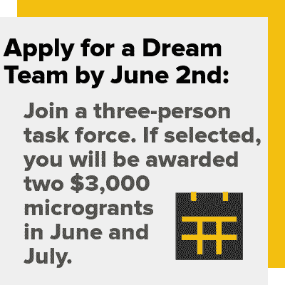

# Hackaday 奖和保护 X 实验室发布解决灭绝危机的设计挑战

> 原文：<https://hackaday.com/2020/05/28/hackaday-prize-and-conservation-x-labs-issue-design-challenges-to-address-extinction-crisis/>

当大多数人想到灭绝的物种时，他们可能会想到史前生物，如恐龙或猛犸象。灭绝是你在历史书上读到的东西，是大自然在伟大的生命游戏中淘汰参赛者的方式。这是一个残酷而野蛮的世界的产物，除了少数残存的边缘案例，人类的先进技术已经阻止了一些事情。

 可惜，事实远比这复杂。地球目前正在经历第六次大灭绝事件，这一次，是我们的错。人类可能不会*故意*破坏植物、鱼类、鸟类和其他已经灭绝的生命形式的自然栖息地，但我们同样要为此负责。人类是前所未有的顶级掠食者，唯一能阻止我们的力量是我们自己。

成立于 2015 年的 [Conservation X Labs](https://conservationxlabs.com/) 致力于尽一切努力结束这第六次灭绝浪潮。他们不满足于传统的保护速度，他们利用技术和开放式创新来开发独特的新方法，以对抗我们这个物种对这个星球上的生命造成的破坏。毕竟，这是我们唯一拥有的。

[我们已经与该组织合作](https://prize.supplyframe.com/)来帮助开发这些问题的解决方案。这包括任何人都可以参加的公开挑战，以及如果你行动迅速就可以参与的梦之队计划。让我们来看看 Conservation X Labs 是什么，以及面临的挑战涉及到什么。

## 黑客入侵地球的挑战

有了这样一个有价值的目标和他们的创新思维， [Conservation X Labs 是 2020 年 Hackaday 奖](https://prize.supplyframe.com/)的完美合作伙伴。拯救因人类活动而濒临灭绝的物种需要强大的现实世界解决方案，但如果它们有任何机会被大规模采用，它们需要以最低的成本和尽可能少的干扰来部署。对于大型商业实体来说，这可能是一个很难达到的平衡，但这是黑客和制作社区绝对擅长的事情。

对于 2020 年的 Hackaday 奖，Conservation X Labs 要求竞争对手开发创新的解决方案，以保护海洋生物和对抗入侵物种。建造可以在恶劣海洋环境中生存的硬件给这些参赛作品增加了额外的挑战，我们很高兴看到提交的设计如何考虑到这一点。

Conservation X Labs 的保护技术项目经理、今年 Hackaday 奖的导师山姆·凯利表示，想要应对这些挑战的团队需要提前做好计划，这样他们的设计才有机会存活下来。“在盐、天气、压力和水之间，任何溶液都需要做好进入和腐蚀的准备。还必须考虑任何已部署设备的潜在不可访问性，包括维护和通信。”

团队还必须为最终用户做出特殊的考虑。如果你正在开发一个设备，需要渔民在大海中的摇船上操作，一个小小的触摸屏可能不会很好地工作。如果操作起来太难或太费时间，那么很可能它就不会被使用。

 [https://www.youtube.com/embed/stC0guClp8M?version=3&rel=1&showsearch=0&showinfo=1&iv_load_policy=1&fs=1&hl=en-US&autohide=2&wmode=transparent](https://www.youtube.com/embed/stC0guClp8M?version=3&rel=1&showsearch=0&showinfo=1&iv_load_policy=1&fs=1&hl=en-US&autohide=2&wmode=transparent)

## 各个击破

你可能已经知道，[今年我们对待 Hackaday 奖的方式有点不同](https://hackaday.com/2020/05/19/2020-hackaday-prize-reveals-four-open-challenges-and-new-dream-team-program/)。我们合作的每个非营利组织都给了我们一些不同的问题，他们希望看到这些问题得到解决，另外还有一个“梦之队”任务，这个任务可以让被选中的团队获得津贴，在整个夏天全职解决问题。如果你想成为四支梦之队中的一员，请务必尽快行动，因为申请将于周二截止！

对于 Conservation X 实验室，挑战类别包括:

### 对抗入侵物种

在正常情况下，一个生态系统会自我平衡，因此其中的生命形式在很大程度上相互兼容，势均力敌。但是一旦人类开始环游地球并带走动植物，这种平衡就被破坏了。从异国情调的宠物贸易到无意中被船只和货物集装箱运送的动物，有许多物种现在被迫与大自然母亲从未打算让它们遇到的竞争对手打交道。

应对这一挑战的诀窍在于开发出一种解决方案，既能监控甚至遏制特定物种的传播，又不会伤害当地的生命。这一类别的想法可能会利用计算机视觉或机器学习进行识别，例如只有当目标入侵物种在里面时才会关闭的陷阱。

### 海洋保护的新工具

为了帮助打击非法捕鱼活动，Conservation X Labs 正在寻找方法，对指定海洋保护区(MPAs)的水上和水下发生的一切进行连续实时监控。这是团队真正面临挑战的地方，他们需要开发健壮的解决方案，这些解决方案会花费不确定的时间暴露在各种环境中。

对于这一挑战，我们特别关注价格低廉、维护要求低的系统。为了在发展中国家发挥作用，提案应该小心谨慎，不要假设当地会有可靠的基础设施。为了获得灵感，团队可能会[参考类似 OpenCTD 项目的东西，以获得如何设计低成本可部署水下传感器的想法](https://oceanographyforeveryone.com/project/openctd/)。

### 梦之队:减少幽灵装备

丢失或遗弃的捕鱼设备是一个巨大的问题，因为留在水中的陷阱或网没有关闭开关。动物被抓住，死去，成为下一波受害者的诱饵。这个过程通常会持续到设备腐烂，这可能需要几年甚至几十年的时间。美国国家海洋和大气管理局的一项调查确定，仅在切萨皮克湾就有多达 145，000 个废弃的陷阱，每年导致超过 300 万只蓝蟹死亡。

Conservation X Labs 表示，这个问题很难用一种经济实用的方式来解决。他们认为，最有希望的研究方向是能够减少捕鱼设备所谓的“浸泡时间”的技术。如果你能减少陷阱、网或线在水中停留的时间，它就不太可能被意外钩住或丢失。

其他可能的解决办法包括为回收目的跟踪或识别水下渔具的系统，或开发更具选择性的陷阱和渔网。现有技术包括安全网技术公司的 PISCES 装置，该装置表明，带有颜色协调的发光二极管的照明网有助于减少副渔获物；这是一个行业术语，用来描述不良物种与渔民想要捕获的任何东西一起被拉进来。

## 比赛开始了

无论你的团队是想应对 Conservation X Labs 提出的水生挑战，还是我们与其他三家令人难以置信的非营利组织合作获得 2020 年 Hackaday 奖的同样有价值的目标，时间已经在流逝。你必须在 8 月 31 日之前提交参赛作品，但是希望为[梦之队演讲的团体必须在 6 月 2 日(星期二)](https://docs.google.com/forms/d/e/1FAIpQLSeak3JkcrAlU83kZ4nLe7jJcn1e59vyfzlERNWXgvjOfztxGA/viewform)之前提交申请，如果他们想被考虑参加夏季小额赠款项目的话。

[主要图片来源:安德鲁·理查德·哈拉]

The [HackadayPrize2020](https://prize.supplyframe.com) is Sponsored by: