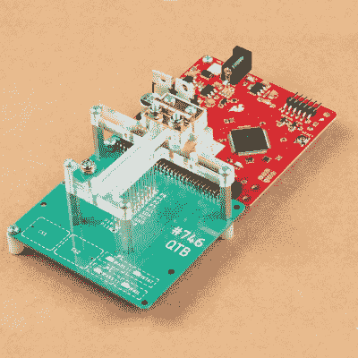

# 构建一个测试设备来管理它们

> 原文：<https://hackaday.com/2020/05/31/building-one-test-fixture-to-rule-them-all/>

测试和编程夹具对于那些需要处理大量 PCB 的人来说是非常节省时间的。不用插上连接器(或笨拙地握住探针头或电线)来编程一些固件或运行测试，人们只需用一只手将 PCB 放入定制的夹具中，用另一只手啜饮玛格丽塔酒，同时由程序来决定一切是否正常。测试夹具往往是为特定的电路板布局定制的，这意味着每种电路板或设备类型都需要一个测试人员，但这种工作很容易证明其节省了大量时间。

An inserted PCB sits atop the thick acrylic piece, with pogo pins making contact from below. Generous space on the left and right make sure there is clearance for any mounted components. Visible near the bottom of the green board are output LEDs, and two touch-sensitive pads.

但是 Sparkfun 质量控制部门的优秀人员认为，他们可以通过利用不同电路板的通用设计功能来节省更多时间，并分享了关于设计足够灵活的单个测试夹具的细节[以处理多种电路板类型和设计](https://www.sparkfun.com/news/3301)。

乍一看，测试单元看起来非常熟悉:一些硬件负责运行测试程序，激光切割丙烯酸夹具将测试 PCB 固定在一致的位置，弹簧加载的弹簧针进行临时电气连接，led 清楚地指示通过和失败状态。巧妙之处在于该夹具的设计可适应多种电路板设计，以及它如何使用多个 74LVC4066 四通道双向开关 IC 来切换 pogo 引脚的连接位置。

如前所述，要兼容多种电路板，必须有共同的设计元素可供利用。在 Sparkfun 的例子中，分线板上的通孔连接都是以标准的 0.1”间距排成一行。通过使用上述 pogo 引脚和 4066 ICs，可以适应不同的引脚排列，并且可以使用多种电路板类型，而无需切换到不同的测试硬件。

测试和编程夹具是一次性的，往往有很大的创造性空间，并经常显示出巧妙的设计或零件的再利用。我们的[Bob Baddeley]在这里解释了他们的一切。