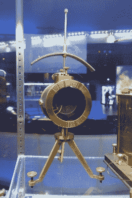

# 加载线圈、亥维赛条件和浦品线圈

> 原文：<https://hackaday.com/2020/06/19/loading-coils-the-heaviside-condition-and-pupin-coils/>

当我们画原理图时，我们可以假装电线是免费的。只有少数情况下需要考虑电线的电气特性:当电线很长或者电线上的频率相对较高时。

在第一条横跨大西洋的电缆用于电报通信后，这一点变得很明显。即使电线是线性的，线的扭曲仍然很严重，以至于点和划会互相重叠。临时解决方案是将速度限制得太慢，以至于运营商在这样的速度下发送和接收都有困难。有多慢？一个人物平均两分钟就发完了！那不是错别字。每个*角色*两分钟。按照惯例，莫尔斯电码假设一个单词有五个字符，所以你可以每 10 分钟发送一个单词。

第一条横跨大西洋的电缆于 1858 年投入使用，实际上是当时的登月。一位名叫怀特豪斯的电工对通信速度如此之慢感到沮丧，他决定将电压提高到 1000 伏以上，这导致电缆仅使用了三周就出现故障。哎呦。后来的分析显示，这条电缆很可能很快就会出现故障，但怀特豪斯承担了公众的指责。

当时的电线没有我们现在的好，这导致了一些问题。绝缘材料由多层天然乳胶古塔胶制成，这是牙医用来填充牙根管的材料。这些夹克是用柏油麻做的，用铁丝捆着。1858 年没有办法建造水下放大器，所以电缆只是铺设在纽芬兰和爱尔兰之间海底的巨大电线。

## 最先进的

Mirror Galvanometer

虽然今天在海底铺设电缆不是一件小事，但 1858 年的情况甚至更糟。甚至电线的建造也是一件大事。有七根导线，用于铠装电缆的铁丝需要两家公司来制造。众所周知，这两家公司以相反的方向缠绕电线，导致了一场广为人知的黑客攻击，允许拼接。

铺设电缆也很危险。已经有一些在小水体下铺设较短电缆的工作，但这种规模的工作以前从未做过。没有一艘船能装下 2500 英里长的电缆，所以他们用了两艘船。经过几次失败的尝试后，两艘船在大西洋中部相遇，连接好电缆，向相反的方向出发。成品电缆本身将近 2000 英里长。

甚至莫尔斯电码在长电缆上也不一样。横跨大西洋的电缆不是通或断，而是用一个方向的电流来表示一个点，另一个方向的电流来表示一个划——我们现在称之为电流回路。接收器端是一个非常灵敏的检流计，它使用一面镜子来最大化灵敏度，由一个名叫汤姆森的人开发，他更为人熟知的名字是开尔文勋爵。汤姆森和怀特豪斯相处得不是很好，但事实证明汤姆森的想法和预测是正确的。

## 堕落

起初，电缆如何扭曲信号是个谜。怀特豪斯对地下线路的测试取得了成功，尽管汤姆森不同意这些测试，并担心电缆只能支持低速。电缆很长，但光速非常快。即使电缆的速度系数为 0.25，传输延迟也只有大约 44 毫秒。没什么好担心的。此外，如果它只是作为一个延迟，不会改变通信速度，只是延迟。

汤姆森的想法是基于平方律的速度问题。该定律指出，进入电缆的电压阶跃在某一时间将具有最大电流，该时间与线路距离的平方成正比。事实证明，这并不完全正确，因为该公式没有考虑电感和泄漏，但它足够接近，表明线路延迟可能存在问题。电缆项目进展顺利，但新公式表明电缆应该更大，以减少电阻和电容。但是，正如经常发生的那样，[没有人想听这个，所以它被争论和忽视](https://hackaday.com/2017/10/02/books-you-should-read-feynmans-appendix-to-the-challenger-disaster-report/)。

## 真正的原因

奥利弗·亥维赛需要更好地解释正在发生的事情。直观地说，您可以认为信号的高频成分与低频成分在导线中的传播速度不同。例如，方波可以被认为是基波频率加上所有奇次谐波之和的正弦波。高次谐波比低次谐波传播得快，导致失真。在某一点上，一部分信号的较高频率会赶上前一部分信号的较低频率。

亥维赛提出了一对微分方程，称为电报员方程。1876 年，他的论文提供了一个长传输线的现实模型，这项工作应用于各种传输线，甚至天线。事实证明，汤姆逊平方定律是忽略电感和漏电的电报方程的特例。

## 解决方案

如果你研究亥维赛的数学，你会发现，对于给定数量的电缆，当泄漏与电容之比等于电阻与电感之比时，电缆不会发生失真。从数学上讲，如果 C 是每米电容，L 是每米电感，R 是每米电缆电阻，G 是分流电导(即导体间电阻的倒数)，则得出这个公式，称为亥维赛条件:

通常情况下，G 很小，所以 G/C 会比 R/L 小很多，那么如何平衡公式呢？简单地改变其中一个变量，直到比率计算出来。降低 R 很有吸引力，因为更低的 R 也意味着更少的损耗，但这也意味着更大的导线或更昂贵的材料，这并不总是可行的。尤其是当你在谈论一条 2000 英里长的电缆时。减小电容也有类似的问题。它确实改变了比率，但是需要更大的间距或不同的绝缘。你可以增加 G，但这会导致更高的损耗，所以这不是你通常想做的事。

这样就剩下电感 l 了。一些长电缆有一个高磁导率的内置负载线，以迫使电感更高。还有另一种方法来解决这个问题，那就是使用沿电缆规则间隔的离散负载线圈。这不是完美的，但它是实用的，并减少失真。这些线圈有时被称为浦品线圈，以发明者迈克尔浦品命名。浦品就乔治·坎贝尔的一项专利起诉美国电话电报公司，该专利使用电话线上的负载线圈。坎贝尔的专利是在浦品之后申请的，但这项工作似乎更早。亥维赛的工作甚至更早，所以浦品可能没有一个好的索赔。

然而，这对美国电话电报公司的价值是如此之大，他们决定购买浦品专利的期权，这样他们就可以控制这两项专利。浦品在大约 20 年的时间里积累了大约 45.5 万美元——大约相当于今天的 2500 万美元。但与美国电话电报公司的储蓄相比，这只是小数目。电话线的低失真意味着他们可以使用一根电缆覆盖两倍于以前的距离。据估计，美国电话电报公司在 20 世纪前 25 年节省了 1 亿美元。这使得不到 50 万美元的浦品只是沧海一粟。

## 时代变了

现代人很难想象建立一个远程系统，当你与另一方的唯一通信方式是一封由船携带的信。恶劣的天气可能意味着横渡大西洋需要数周时间。花费在许多有线电视尝试上的钱也是惊人的。成功的电缆花费了大约 100 万美元。那时候是一笔巨款。在第一条电缆失败后，一些人声称整个事情是一个骗局；真正意义上的登月。

现在，当然，电线更好了，我们不用担心亥维赛的情况。此外，如果没有中继器，你不可能铺设 2000 英里长的电缆。这不仅可以防止损失，还可以在一定程度上消除失真。但是不要搞错了。仍然有大量的海底电缆，它们承载着大量的数据。

虽然像这样的技术历史本身是令人愉快的，但你必须考虑你能从这个故事中吸取什么教训。首先，wire 并不是完美的，它以意想不到的奇怪方式运行，很少会产生影响(直到它们产生影响)。其次，出于商业原因忽视技术建议通常充满危险。做一个关于浪费了多少钱的研究是很有趣的，因为没有人喜欢汤姆森的结果，即电缆会“慢”诚然，如果电缆出现故障，这不会是一个巨大的损失，但仍然有一个失真较小的电缆可能会防止电缆尽早出现故障。

浦品线圈在很大程度上已经成为过去。但是他们如何来来去去的故事可以教给我们今天的事情。如果你想更详细地了解跨大西洋电缆的历史以及它们是如何发展的，我们之前已经讨论过了。你可能也会喜欢下面的视频。

 [https://www.youtube.com/embed/nV0Wc9Y33so?version=3&rel=1&showsearch=0&showinfo=1&iv_load_policy=1&fs=1&hl=en-US&autohide=2&wmode=transparent](https://www.youtube.com/embed/nV0Wc9Y33so?version=3&rel=1&showsearch=0&showinfo=1&iv_load_policy=1&fs=1&hl=en-US&autohide=2&wmode=transparent)

