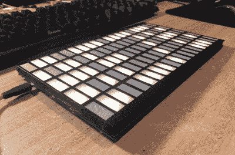
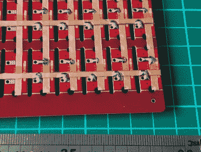

# 滚动你自己的 LED 矩阵驱动器，用铜箔带来拯救

> 原文：<https://hackaday.com/2020/05/30/rolling-your-own-led-matrix-driver-with-copper-foil-tape-to-the-rescue/>

这一切都是从[达米恩·沃尔什]得到一些多余的 LED 板开始的。每个面板包含 100 个微型印刷电路板，上面有一个明亮的 LED，可以根据需要断开。[Damien]有一个更好的主意:[将它们放在 20×5 的阵列中，设计一个驱动程序](https://www.damow.net/led-matrix-driver/)，允许通过 WiFi 控制每个 LED。他是成功的(休息后，下面嵌入了一个简短的演示视频),并分享了一些关于从头制作过程的有趣技巧。

他遇到的第一个障碍是我们大多数人都能理解的；当一个人不知道正确的术语时，很难研究一些东西。在[Damien]的案例中，他的搜索使他找到了大量用于室内照明或背光的 led 驱动器。这些设备使一大堆较小的发光二极管像一个较大的光源一样工作，但他希望能够单独寻址每个发光二极管。

最终，他遇到了来自 ISSI 的 IS32FL3738 6×8 点阵 LED 驱动器 IC，它击中了所有正确的基础。其中三个就足以控制 100 个 LED 面板；它提供 I2C 控制，甚至能够在多个芯片上同步 led 的 PWM，因此不同驱动器上的 led 之间不会出现不匹配的闪烁。至于微型控制器和 WiFi 连接，我们都有自己的最爱，[达米安]是 Espressif 的 ESP32 系列的忠实粉丝，并使用了 [ESP32-WROOM](https://www.espressif.com/en/products/hardware/esp-wroom-32/overview) 来领导这一切。

LED pads bridged to copper tape, with Kapton (polyimide) tape insulating any crossovers.

另一个需要注意的问题是布线。每个 led 都在自己的小 PCB 上，带有方便的暴露焊盘，但焊接 100 个 led 是一项需要一点规划才能完成的工作。[达米恩]选定了一个聪明的系统，使用铜带条，由 Kapton 绝缘(一种超级方便的材料，有着悲惨的历史[。)对于焊接到铜带，Damien 有一个建议:确保有一个抽油烟机在运转，因为这是一个比焊接到电线更烟雾弥漫的过程。](https://hackaday.com/2018/04/04/kapton-miracle-material-with-a-tragic-history/)

一个 3D 打印的挡板使用描图纸来漫射光，形成一个 20 x 5 的独立控制矩形矩阵，平滑均匀地发光。最终结果看起来棒极了，您可以在下面嵌入的短视频中看到它的实际效果。

 [https://www.youtube.com/embed/3tFtflpYUJs?version=3&rel=1&showsearch=0&showinfo=1&iv_load_policy=1&fs=1&hl=en-US&autohide=2&wmode=transparent](https://www.youtube.com/embed/3tFtflpYUJs?version=3&rel=1&showsearch=0&showinfo=1&iv_load_policy=1&fs=1&hl=en-US&autohide=2&wmode=transparent)

如果你发现自己也有驱动 LED 阵列的类似需求，请务必阅读[这份关于驱动 LED 矩阵的指南](https://hackaday.com/2018/11/27/a-guide-for-driving-led-matrices/),了解一些可用的技巧。