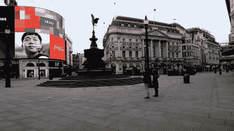
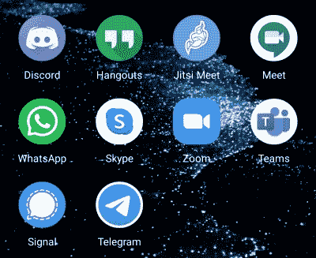
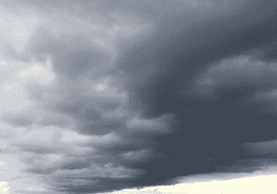

# 作为一名黑客在疫情生存:注意你的心理健康

> 原文：<https://hackaday.com/2020/06/17/surviving-the-pandemic-as-a-hacker-take-care-of-your-mental-health/>

正如我们在本系列的前两部分[中所看到的面具主题，我们的重点一直放在帮助你顺利通过新冠肺炎疫情的物理步骤上。但考虑到为保护民众而颁布的所有社会变革所造成的动荡可能会给经历过这些变革的人留下不可磨灭的印记，幸存下来的一些重要方面超出了物质层面。](https://hackaday.com/series_of_posts/surviving-the-pandemic-as-a-hacker/)

对于许多人来说，这将是一生一次的事件，相当多的人会发现这在某种程度上是创伤性的，对这些人中的许多人来说，这将对心理健康产生直接和持续的影响。如果有人怀疑这是从什么立场来的，我也是其中之一。

## 一生一次的压力

Piccadilly Circus, London, during the COVID-19 lockdown. Normally this is packed. Kwh1050 / [CC BY-SA 4.0](https://commons.wikimedia.org/wiki/File:Piccadilly_Circus_during_London_COVID-19_lockdown.jpg)

不同的国家对他们的人口设置了他们自己的公共卫生限制，但很可能你们中的许多人处于某种形式的封锁状态，社会或公共活动和场所被关闭或缩减，外出受到限制，你周围的所有人都处于同样的情况。一场完美的风暴:社交渠道被移除，同时又被困在家里，也许是和你不愿意花太多时间在一起的家人或室友，这并不理想。再加上来自疫情本身的多重压力，以及来自我们这个动荡世界的其他新闻报道，它造成的影响也就不足为奇了。

I’m almost at the point of forgetting which group uses which app, there are so many.

就我而言，我发现自己突然被剥夺了主要的社交渠道，因为我的黑客空间在此期间关闭了，我的朋友们也不能再出去玩了。像我这样生活在农村深处，在平时可能会很棒，但被禁止离开我的小地方，几个月内除了家人之外见不到任何人，这让我过得很艰难。

起初，我一头扎进在线会议，很快在我的手机上积累了一堆不同服务的新应用。但后来，大量的社交团体占据了我大部分的晚上，我发现自己没什么可说的了，并获得了新的压力来源，以免我说错话，或没有充分支持某人，或看起来像个傻瓜。在过去的几个月里，我的生活时好时坏，同样的担忧也可以在我是否能找到足够的日常故事来弥补一个月的不足，或者我是否按时给我的车上税。

## 没关系，这不正常

这太疯狂了，当一个人由于生活中正常压力的减少而应该过得更轻松的时候，却发现自己正在接近精疲力竭。但我怀疑我并不孤单。我认为，我的错误在于，以为在非常时期，我可以像往常一样继续生活，因为尽管我们周围的世界变得有些疯狂，但在我的小办公室里，一切都是一样的，电脑发出轻轻的嗡嗡声，键盘超大，噼啪作响。

Less of this…

如果说我从这一切中学到了什么，那就是我需要做的是认识到*这不是正常的*。期望能够像以前一样做事，甚至能够比以前做得更多，这是不合理的。在这之前，我没有开无休止的 Jitsi 和 Zoom 会议，事实上我甚至没有这两种服务。那么，为什么我突然认为自己能够成为派对 24-7 的生命和灵魂，然后责备自己不能做到这一点？

喂饱像 Hackaday 这样持续发行的日报的饥饿的肚子是如此令人生畏，为什么我会感到惊讶呢？我们很少有人能在最好的情况下成为超人，所以也许我们都应该认识到，当事情变得太多时，稍微后退一点是可以的。我发现远离互动帮我减轻了负担，分散我的日常工作也让它不那么令人生畏。

…and more of this.

认识到自己的极限并减少让我沮丧的事情可能已经恢复了一些平衡，但我仍然与我的同龄人隔绝，与家人的距离也令人不安。在这一点上，我要感谢一个小的朋友网络，我经常和他们保持电话联系。不是 Jitsi 或者 Zoom，好老式的*手机*。我们交谈，我们帮助，我们让彼此保持理智。我希望我对他们的帮助和他们对我的帮助一样多。

## 最后，你们其他人也有自己的角色

这是我根据自己的经历，试图将疫情事件理解为一个心理健康事件。我还没有脱离险境，但我希望如果你发现自己处于类似的状态，那么我的一些应对策略可能会对你有所帮助。

然而，这还有另一面，那就是你们中那些没有遭受这一切的人。哇，我羡慕你！虽然你们中的一些人可能不会意识到不是每个人都像你一样，所以现在是时候考虑这个问题了，在这个艰难的时刻，在你说话和行动之前要考虑清楚。如果我们的社区有时有丑陋的一面，那可能是它的文化不宽容，有时在论坛或社交媒体上对你来说似乎是一次性的评论可能会对其他人产生毁灭性的影响。我们都经历的一部分是更加努力地善待他人，从而让自己变得更好。就这么办吧。

小心，想想你发布的内容，如果你看到某个你认识的人突然消失了，检查一下他们。我们会一起度过这一切。