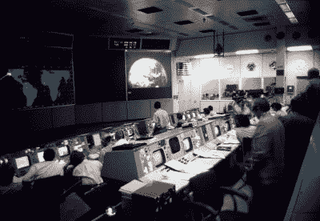

# 如果这是你来自太空的灵感，那你就错了

> 原文：<https://hackaday.com/2020/05/31/if-this-is-your-inspiration-from-space-youre-doing-it-wrong/>

因此，在因恶劣天气而启动失败后，SpaceX 公司首次搭载两名宇航员的龙太空舱载人发射顺利进行。在与国际空间站追逐了大约 27 个小时后，他们现在安全地登上了飞船。有时，航天发射似乎已经成为每天的事情，但他们仍然是冒着生命危险推进人类探索太空的英雄。他们以及所有支持他们的科学家、工程师和其他工作人员的成就是巨大的。

我通过实时视频观看了这场戏剧的展开。当他们安全进入轨道后，大大松了一口气，画面切换到演播室，然后继续采访美国国家航空航天局局长吉姆·布里登斯汀。他自然对成功的发射感到欢欣鼓舞，并对该机构的成就感到兴奋。你可以观看下面嵌入的完整采访，但引起我注意的是[的临别赠言](https://www.youtube.com/watch?v=pMsvr55cTZ0&t=17222):

> 如果这能激励一个小孩成为下一个埃隆·马斯克，下一个杰夫·贝索斯，或者下一个理查德·布兰森爵士，那么这就是这一切的意义所在

从美国宇航局局长那里听到这些，我感到有点震惊和难过，因为在我看来，马斯克、贝佐斯或布兰森的职业生涯不应该首先出现在太空发射的脑海中。这不是对这三者本身的评论；虽然他们有许多批评者，但不可否认的是，他们都通过各自的航天公司为太空飞行世界带来了很多。相反，这是一个关于 NASA 管理者应该努力启发孩子们什么的评论。

问问你自己，与科学家、工程师、数学家、技术人员、物理学家等相比，一场成功的太空竞赛需要多少位亿万富翁宇宙大师。根据美国宇航局局长的轶事，大约需要三位，但如果他要实现 2024 年重返月球并最终将人类带到火星的目标，将需要充满这些其他角色的一代人。要理解这一点，我们必须回到阿波罗时代，以及那一代孩子是如何被屏幕上的宇宙飞船激发的。

Inspiration from probably the coolest room in the world at the time, the Apollo mission control in Houston. NASA on The Commons / [No restrictions](https://commons.wikimedia.org/wiki/File:Apollo_16,_Mission_Control_-_Flickr_-_NASA_on_The_Commons.jpg)

五十年前，我们非常接近成为一个太空行星。美国宇航员在月球上迈出了他们的第一步，苏联宇航员占据了真正的空间站，很快就能一次容纳他们几个月。行星探测器正在从其他星球传回彩色电视图像，可以肯定的是，在阿波罗计划之后，我们将立即把宇航员甚至可能是宇航员送到更远的地方。也许是在 20 世纪 80 年代的火星基地，然后跟随我们虚构的《星际迷航》中的英雄到更远的地方。

我们现在知道它并不完全是那样的，但是整整一代倾向于技术的孩子在成长过程中除了参与太空飞行之外别无所求。我们中的绝大多数人从未成功过，但有了这个灵感，我们带着烙铁和 8 位家用电脑跑了起来。那些国家航空航天局的人是最酷的榜样，毫无疑问，他们的苏联同行对铁幕另一边的孩子们来说也是如此。

怀着最美好的愿望，任何一个孩子成为下一个杰夫·贝索斯的几率都和他们成为下一个尼尔·阿姆斯特朗的几率一样高。与世界上孩子的数量相比，亿万富翁的数量和宇航员的数量都显得微不足道。但是，一个孩子成为工程师或科学家的机会要高得多，在这些职业中，他们参与太空工作的机会也不是完全不可能的。

我明白美国国家航空航天局局长想说什么，但我无法摆脱这样一种感觉，如果他推出这些人来激励孩子们观看太空发射，他就错过了一个机会。这些都是我们都认识的名字，但是难道我们不应该提升那些做出科学突破的人，这样他们的名字也能得到同样的认可吗？像[玛格丽特·哈米尔顿](https://hackaday.com/2018/04/10/margaret-hamilton-takes-software-engineering-to-the-moon-and-beyond/)、[吉恩·克兰兹](https://en.wikipedia.org/wiki/Gene_Kranz)和[谢尔盖·科洛列夫](https://en.wikipedia.org/wiki/Sergei_Korolev)以及他们之前的许多人一样，我们应该让像[汤姆·穆勒](https://en.wikipedia.org/wiki/Tom_Mueller)和[玛格丽塔·马里诺娃](https://en.wikipedia.org/wiki/Margarita_Marinova)这样的名字成为科学职业能带你走向何方的突出例子。但老实说，真正的问题是我们没有听到太多关于所有人都在做这项迷人的工程，这是一个可悲的事态。

看起来是时候让 Hackaday 根据许多伟大的思想来撰写一系列传记了，这些思想传递了今天(和明天)太空竞赛的承诺和愿景。请在下面的评论中谈论你最喜欢的幕后科学家，让我们开始吧。

 [https://www.youtube.com/embed/pMsvr55cTZ0?version=3&rel=1&showsearch=0&showinfo=1&iv_load_policy=1&fs=1&hl=en-US&autohide=2&start=16900&wmode=transparent](https://www.youtube.com/embed/pMsvr55cTZ0?version=3&rel=1&showsearch=0&showinfo=1&iv_load_policy=1&fs=1&hl=en-US&autohide=2&start=16900&wmode=transparent)

