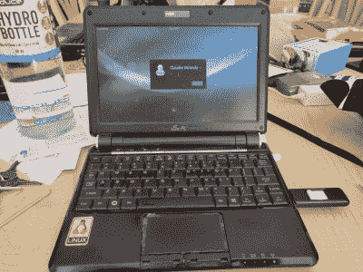
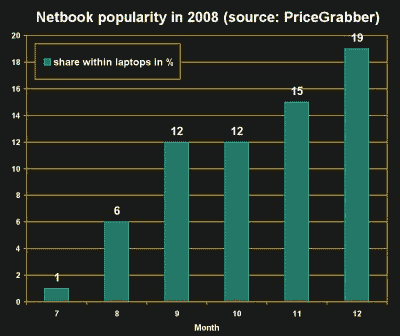
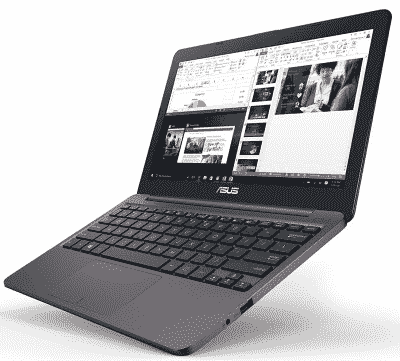

# 上网本:被时间遗忘的外形

> 原文：<https://hackaday.com/2020/06/04/netbooks-the-form-factor-time-forgot/>

很久以前，在智能手机无处不在、餐馆里的孩子们被 iPads 上可怕的游戏弄得安静下来之前，有一个美丽的时刻。最终用户可以以低廉的价格购买一台小巧便携的 x86 计算机。2007 年，上网本横空出世，席卷全球，但几年后突然消失了。究竟是什么让上网本如此伟大，它们又去了哪里？

## 美丽的组合

An Asus EEE PC shown here running Linux. You could run anything on them! Because they were real, full-fat computers. No locked down chipsets or BIOS. Just good, clean, x86 fun.

第一台掀起热潮的机器是华硕 EEE PC 701，灵感来自“每个孩子一台笔记本电脑”项目。它包装了一个 700Mhz 的赛扬处理器，一个 7 英寸的小液晶屏和一个 4 GB 的固态硬盘，出厂时安装了 Linux 或 Windows XP。凭借这款机型，华硕似乎找到了东芝 10 年前的唱本机从未涉足的市场。无线网络和越来越令人兴奋的互联网的出现，突然让一台小巧便携的笔记本电脑变得有吸引力，而在以前，它只是一台工作起来很痛苦的机器。“上网本”这个名字不是偶然的，它突出了流行的使用案例——一种轻便、便携的机器，非常适合网络浏览和休闲任务。

但是上网本不仅仅是其部件的总和。电池续航时间超过 3 小时，CPU 是全脂 x86 处理器。这不是一台需要用户运行特殊的精简软件或在使用上妥协的机器。任何你可以在普通的低规格电脑上运行的东西，你也可以在这台电脑上运行。USB 和 VGA 输出可用，还有 WiFi，所以演示很容易，获取文件也不在话下。还需要记住的是，在 Windows XP 时代，通过网络共享文件很容易，不需要点击 7 个不同的权限标签，也不需要输入 19 次密码。

Netbook sales in 2008, as a proportion of total laptop sales.

上网本是目前最完美的机器。它充分利用了现代硬件的进步，创造了一个高度可用的机器来完成整天网上冲浪和与朋友聊天的重要工作。后来的型号开始挑战极限，屏幕扩大到 9 英寸，后来又扩大到 10 英寸，存储空间更大，甚至电池寿命长达 6 小时。早在 2008 年，这些都是疯狂的数字，拥有不到 20GB 的存储并不像今天这样是一种负担。最后，还有价格。300 美元以下就可以买到低端型号。购买大众很喜欢它，销量直线上升。2008 年 7 月，上网本仅占笔记本电脑总销量的 1%。到 12 月份，他们已经拥有了将近五分之一的市场份额。

然而，上网本很快成为自己成功的牺牲品。硬件制造商不喜欢他们削减利润率更高的高端机型的销售。微软和英特尔开始向制造商施压，限制规格。任何屏幕尺寸超过 10.1 英寸的机器的 Windows 7 许可费用都被抬高了，扼杀了一系列向 12 英寸屏幕靠拢的更大的上网本。微软还提出了精简 Windows 7 入门版的想法，仅限于一次运行 3 个程序。与此同时，随着制造商寻求在功能上进行竞争，高端机型的价格开始上涨，超出了上网本最初的廉价和愉悦的简约风格。

最终，上网本的真正丧钟以 iPad 的形式敲响了。对于绝大多数用户来说，他们想要的是一台简单、便宜的互联网机器来运行脸书和浏览网页。随着平板电脑销量的增长，上网本的销量直线下降。被困在一个新的竞争对手和急于阻止他们进入市场的供应商之间，上网本很快就消失了。在他们的位置上，笔记本电脑和超极本蜂拥而至——更大的型号，价格超过三倍。到 2012 年，[上网本实际上已经死了。](https://www.pcmag.com/archive/where-did-all-the-netbooks-go-301895)

## 对于超级用户来说是不可替代的

虽然普通用户发现基本平板电脑比微型笔记本电脑更好，但当上网本被淘汰时，超级用户损失最大。笔记本电脑有很大的魅力和实用性，可以用一只手轻松携带，没有掉落或翻倒的风险。尽管体积很小，但许多上网本配备了功能强大的键盘；在一台早期的 EEE PC 901 上，我可以轻松地达到每分钟 100 个单词。结合多个 USB 端口和完整的 Windows 安装，它成为一个优秀的便携式开发机器。

上网本可以在野外随身携带，并与各种硬件接口。作为一台全脂肪 x86 计算机，它运行 ide，编程 Arduinos，并连接到网络，所有这些都在一个整洁的软件包中。确切地说，这些都不是平板电脑能轻易实现的。有大量的蓝牙键盘、适配器加密狗和用于硬件工作的特殊应用程序，但平板电脑在做真正的工作方面根本无法与真正的计算机竞争。对于一个忙碌的硬件黑客来说，这是一个光荣的工具。而且，以如此低的价格，每个人都能买得起——甚至是一个破产的大学生。

谢天谢地，希望就在眼前。2020 年的硬件市场是一个不同的地方，上网本概念再次向制造商展示了可行性。要成为真正的上网本，一台机器必须坚持让它们变得伟大的最初价值观。运行移动操作系统、ARM 处理器(尽管随着操作系统继续提供支持，这种情况可能会在不久的将来发生变化)或有其他软件限制的机器不值得使用这个名称。紧凑的尺寸和低廉的价格也是关键的属性。

ASUS’s early netbooks boasted great battery life. Other notebooks have caught up in recent years, but 10 years from the Vivobook is nothing to sniff at.

像[惠普 Stream](https://www.amazon.com/HP-14-inch-Celeron-Windows-14-cb159nr/dp/B07WMDV7CW/ref=sr_1_2?dchild=1&keywords=hp+stream&qid=1590982223&sr=8-2) 和[华硕 VivoBook](https://www.amazon.com/ASUS-Ultra-Thin-Processor-L203MA-DS04-Microsoft/dp/B07N6S4SY1/ref=sr_1_4?dchild=1&keywords=asus+vivobook&qid=1590982273&sr=8-4) 这样的型号继承了上网本的遗志。只装了 4GB 内存和低端 CPU，它们不是强大的机器——但它们不应该是。这是一台售价不到 300 美元的真正的电脑，搭载 Windows 10 S。这是 Windows 的“应用商店”版本，但可以免费升级到完整的 Windows 10。由于存储空间不足 100GB，您不会希望将所有照片、视频和应用程序都加载到这些文件中。但是，无论如何，我们中的许多人都将所有这些留在云中，这不会阻碍您的发展。

阻碍上网本走向真正荣耀的主要竞争对手不再是平板电脑，而是 Chromebook。这些机器运行谷歌开发的基于 Linux 的特殊操作系统，旨在成为轻量级网络浏览器，仅此而已。它们不是运行本地应用，而是被设计成几乎完全在云中工作，具有基于浏览器的应用框架。该平台在笔记本电脑市场的低端广受欢迎，排除了上网本全面复苏的可能性。当然，他们有一个铁杆 Linux 追随者，很高兴地放弃 ChromeOS 来安装 Linux，或者并行运行它们，并提供适当的变通方法来适应硬件。当上网本硬件标准变得稀缺时，这就是许多上网本爱好者的归宿。

## 对未来的展望

我们不太可能看到上网本回到它们在过去十年之交的那四年中曾经占据的突出地位。寻找社交媒体机器的普通用户最好选择平板电脑或精简版 Chromebooks。这使得超级用户成为上网本的主要市场，许多钱包更大的用户会选择更强大的超极本。为大学生倒一杯，他们将不得不抵押他们破旧的卡罗拉，或者拖着一辆笨重的 15 英寸旧车去他们的顶点项目，看看他们是如何让烟出来的。目前，上网本还在沉睡——也许有一天它们会再次崛起。