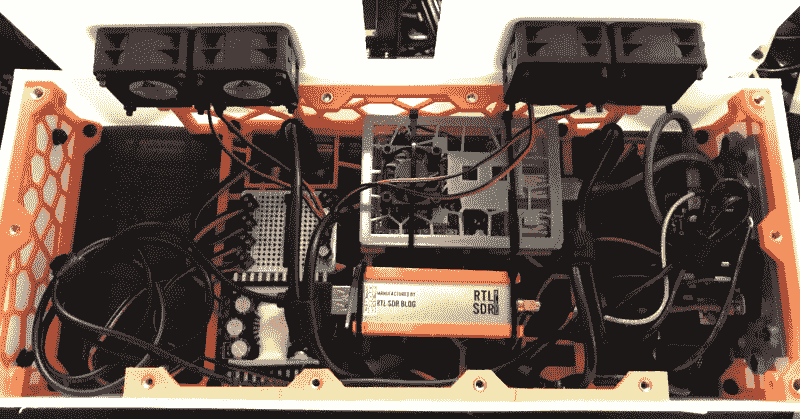

# 集成 RTL-SDR 的双屏便携式

> 原文：<https://hackaday.com/2020/06/03/a-dual-screen-luggable-with-integrated-rtl-sdr/>

看着定制的移动电脑从几张泡沫板和一个树莓皮发展成看起来像是从另一个现实中被运送到这里的硬件，这真是令人着迷。诚然，树莓派通常仍在电脑上使用，但这些非常个人化的电脑的整体设计和构造技术已经有了突飞猛进的发展。

这些电脑平台中最新的一款来自[dapperrogue]，它是一款双屏“便携式”电脑，让人想起康柏便携式电脑或 Kaypro 等经典电脑。由 Raspberry Pi 4 提供动力，并具有一个临时构建的机械键盘，以完美适应机器的特定尺寸，这很容易是我们见过的更实用的构建之一。虽然看起来很醒目，但从可用性的角度来看，很少有人会认为似乎是大多数甲板特征的小偏移显示是理想的。

虽然键盘板是在 CNC 上磨出来的，但[dapperrogue]表示，HDPE 机身面板和后部聚碳酸酯观察窗的设计非常简单，可以在带锯上手工完成。PETG 内部框架使用了 Voronoi 图案，不仅减少了打印所需的时间和材料，而且最大限度地提高了气流。它看起来像某种外星生物生命形式的事实只会有助于复古未来主义美学。

围栏内仍然有足够的空间，这很好，因为[dapperrogue]说还会有更多好东西。增加内部电池电源是合乎逻辑的下一步，现在 Pi 4 可以引导到外部驱动器，SSD 也在未来升级的名单上。

对于可能从这个项目中获得似曾相识感的读者，[dapperrogue]指出，这个设计的灵感来自于[Dave Estes]今年早些时候发布的非凡漫骂。