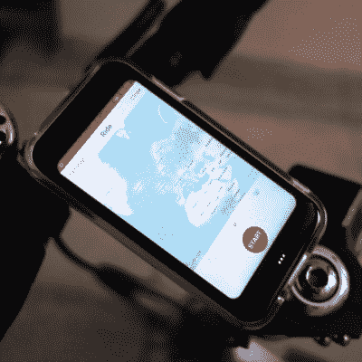

# Palm 的迷你手机变成了自行车电话

> 原文：<https://hackaday.com/2020/06/04/palms-mini-mobile-phone-becomes-bike-phone/>

[Jim Yang]拿到的迷你手机应该有一些背景知识。Palm 有一个*伴侣*手机的概念，这在 2018 年末表现为一个可爱的手掌大小的智能手机，当你不想带着他们的“真正”手机时，你可以随身携带。这款更小更简单的手机原本是为了与主手机共享同一个手机号码(尽管后来它已经可以作为独立设备使用。)

 

【吉姆】的设备，作为车载智能手机使用。

【Jim】[拿到了一款翻新的 Palm PVG100，扎根其中，分享了一些内部组件的图片](https://jsyang.ca/guides/tiny-palm-pvg100-phone-on-three-uk/)。这款手机没有锁定运营商，但启动并运行它仍然比插入 SIM 卡要复杂一些。例如，语音通话工作正常，但要访问英国三大移动网络的移动数据，需要更新接入点名称(APN)设置。[吉姆]也扎根于 Android 手机，并描述了他如何删除威瑞森膨胀软件。

Palm 的配套手机还没有真正在商业意义上流行起来，但在某种程度上，[Jim]正在验证这个概念。在它启动并运行后，他用一个定制的支架将它连接到自行车上，以享受随身携带移动电话的好处，而不必实际上拿他的主要设备冒险。

如果你想知道，这个 [Palm](https://palm.com/) 确实是 1996 年推出 [PalmPilot](https://en.wikipedia.org/wiki/PalmPilot) 的同一个 Palm，[其独特的折叠键盘配件已经在过去的黑客攻击中出现](https://hackaday.com/2015/04/04/repurposing-a-palm-portable-keyboard/)。