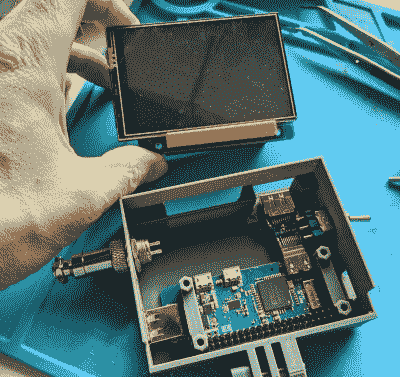

# 用这个迷你网络平台加入这场运动

> 原文：<https://hackaday.com/2020/06/05/join-the-movement-with-this-mini-cyberdeck/>

全球化的疫情让许多人有更多的时间呆在家里，这无疑推动了无数项目的完成。不幸的是，它也扰乱了全球商业和航运，以至于获得零部件比我们想象的要困难得多。这就是为什么[无脸科技]决定用他已经放在周围的东西来组装这个异常移动的网络平台。

 平心而论，他的零件箱可能比大多数零件箱更适合这种东西。他已经制作了几个 Raspberry Pi 便携式电脑，所以 Pi Zero W、显示器和电池管理板已经在使用了。他只需要想出一个新的 3D 打印外壳，将所有这些与一点点赛博朋克风格结合在一起。

为此，他在记录构建方面做得非常出色，并发布了 3D 打印组件的 STL 文件。考虑到所有的事情，我们会说这可能是目前最平易近人的赛博甲板设计；如果你一直想知道这些定制的小电脑有什么大惊小怪的，这是一个开始的理想项目。

请记住，cyberdeck 的想法是为自己定制一些东西，所以没有必要完全复制这个版本。如果你缺少零件，你可以放弃电池供电的方面，只是让它拴着。多余的(但非常酷的)GX12 连接器当然也可以删除，尽管会造成严重的风格损失。你可能需要订购[facelesstech]设计的设备下半部分的特定键盘，但它足够常见，应该不难找到。无论你采取哪种方式，这个设计都是一个很好的起点。

如果你正在寻找一些更实际的东西，并有灯丝燃烧，[你可以看看虚拟示波器](https://hackaday.com/2019/09/20/3d-printed-virtuscope-is-a-raspberry-pi-4-cyberdeck-with-a-purpose/)来满足你的胶印屏幕需求。

 [https://www.youtube.com/embed/OqACVpz1b8Q?version=3&rel=1&showsearch=0&showinfo=1&iv_load_policy=1&fs=1&hl=en-US&autohide=2&wmode=transparent](https://www.youtube.com/embed/OqACVpz1b8Q?version=3&rel=1&showsearch=0&showinfo=1&iv_load_policy=1&fs=1&hl=en-US&autohide=2&wmode=transparent)

