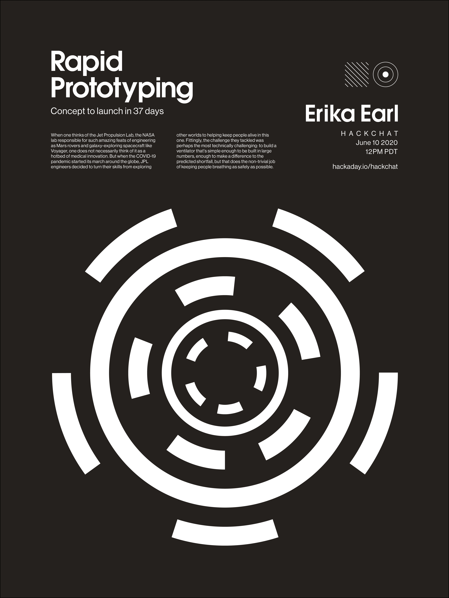

# 快速原型黑客聊天

> 原文：<https://hackaday.com/2020/06/08/rapid-prototyping-hack-chat/>

加入我们太平洋时间 6 月 10 日星期三中午[与](https://hackaday.io/event/171243-rapid-prototyping-hack-chat)[艾丽卡伯爵](https://hackaday.io/hacker/254174-erika-earl)的快速原型黑客聊天！

当人们想到喷气推进实验室时，人们不一定会认为它是医学创新的温床。喷气推进实验室是美国宇航局的实验室，负责诸如火星漫游者和像旅行者号这样的星系探索飞船等令人惊叹的工程技术。但是当新冠肺炎疫情号开始环球航行时，JPL 的工程师们决定将他们的技能从探索其他世界转向帮助这个世界的人们生存。相应地，他们应对的挑战可能是技术上最具挑战性的:制造一种足够简单的呼吸机，可以大量制造，足以对预测的短缺产生影响，但也能尽可能安全地保持人们的呼吸。

结果是[至关重要的](https://hackaday.com/2020/05/01/fda-approves-ventilator-designed-by-nasas-jet-propulsion-laboratory/)，或当地可获得的呼吸机干预技术。它是在一个令人难以置信的雄心勃勃的时间表上设计、制作和测试的:总共 37 天。光是这个数字就已经足够令人震惊了，但当人们加上 JPL 工程师团队在设计过程中突然需要自我隔离和远程工作而被迫中断和断开时，这个团队能够取得任何进展都是一个奇迹。但是他们解决了技术和管理问题，并交付了一个设计，这个设计现在已经被[免费授权给八家制造商。](https://www.jpl.nasa.gov/news/news.php?feature=7668)

如何在如此短的时间内将像呼吸机这样复杂的东西推向市场？为了深入研究这个问题，Supply Frame 的 Erika Earl 是 VITAL 团队的一员，他将在 Hack Chat 上停下来。我们将和她谈谈 JPL 团队的情况，设计和原型制作过程是什么样的，以及在这里学到的经验如何应用到任何基于团队的快速原型制作工作中。你可能不会在 37 天内造出一台呼吸机，但是你很有可能从那些做过的人身上学到一些有用的东西。

 我们的黑客聊天是 [Hackaday.io 黑客聊天群发消息](https://hackaday.io/messages/room/2369)中的社区直播活动。本周，我们将于太平洋时间 6 月 10 日星期三中午 12:00 坐下来讨论。如果时区让你失望，我们有[一个方便的时区转换器](https://www.timeanddate.com/countdown/generic?iso=20200610T12&p0=224&msg=Rapid+Prototyping+Chat&font=cursive)。

点击右边的那个发言气泡，你会被直接带到 Hackaday.io 上的黑客聊天群，不用等到周三；随时加入，你可以看到社区在谈论什么。

