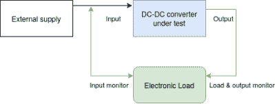

# 一个 DIY 的电子负载

> 原文：<https://hackaday.com/2020/06/06/a-diy-electronic-load-with-a-twist/>

如果你正在测试电源或电池组，电子负载是一个很好的工具。通过观察增加电阻时的电压，您可以快速、轻松地验证该装置的实际性能。但是[Xavier Bourlot]想要比这些设备通常提供的信息更多一点的信息，所以他想出了自己的[scratch build 负载，可以测量电路](https://github.com/reivax-boucoi/Electronic_Load)中多个点的电压。

 现在乍一看，你为什么想要这样的能力可能并不明显。但是[Xavier]希望用这个设备做一些非常特殊的事情:分析 DC-DC 转换器的效率。这个想法是，如果电子负载可以测量转换器两侧的电压，它就可以计算出发生了什么样的损耗。

你能用万用表和传统的电子负载来做这件事吗？当然可以。但是如果这是你经常要做的事情，就不难理解为什么这种方法更可取了。

但是，即使忽略转换器的分析功能，这看起来也是实验室中非常有用的设备。[Xavier]表示，它可以吸收超过 5 安培的电流，并处理高达 100 伏的输入电压。该负载由 ATmega328P 供电，也是完全可编程的，甚至具有一个 I2C 扩展端口，可以用来悬挂额外的硬件或传感器。股票固件已经很有能力，未来的增强列表有一些非常有趣的条目，如通过串行或 SD 卡记录数据的能力。

这些年来，我们已经看到了许多[可编程电子负载项目](https://hackaday.com/2014/04/29/a-simple-programmable-electronic-load-using-the-arduino/)、[从 Arduino shields](https://hackaday.com/2014/02/24/an-arduino-programmable-load/) 到[配备 VFD 的单元，它们将成为任何黑客工作台](https://hackaday.com/2020/02/28/a-simple-yet-feature-packed-programmable-dc-load/)的骄傲。