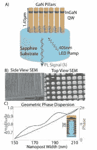

# 超曲面设计方法可以使 LED 灯的行为更像激光

> 原文：<https://hackaday.com/2020/06/18/metasurface-design-methods-can-make-led-light-act-more-like-lasers/>

发光二极管(led)并不完全是新技术，但随着时间的推移，它们的使用已经从控制面板中白炽灯信号灯的昏暗替代品发展到今天的家庭照明。尽管 led 以节能著称，但仍有很大的提升空间。

加州大学圣巴巴拉分校的研究人员[Jonathan Schuller]和他的团队发现，产生的大量光子从未从 LED 中发出。这意味着用于产生这些光子的能量基本上被浪费了。理想情况下，我们应该能够让每一个光子都成功地从 LED 中出来，为照亮事物的任务做出贡献。

在[他们的论文](https://www.nature.com/articles/s41566-020-0641-x)题为“*InGaN/GaN 量子阱元表面的单向发光*”([预出版 Arxiv 版本](https://arxiv.org/ftp/arxiv/papers/1905/1905.01816.pdf))中，他们描述了 led 中的光子发射问题。光子通常向各个方向辐射，导致光子“喷射”,这在某种程度上可以通过 LED 的封装和其他参数来引导。因此，挑战在于从头开始，让 LED 向一个方向发射尽可能多的光子。

他们的解决方案是使用基于超表面的设计，由蓝宝石衬底上的氮化镓(GaN)纳米棒组成。这些都嵌入了铟镓氮化物(InGaN)量子阱，可以发射真正的光子。据一名研究人员称，这一想法是基于亚波长天线阵列，该阵列已经与激光等相干光源一起使用。

随着实验显示模拟的改进，如果这些发现转化为大规模生产，这项研究似乎可能在不久的将来导致更亮、更高效的 led。

(谢谢 Qes)