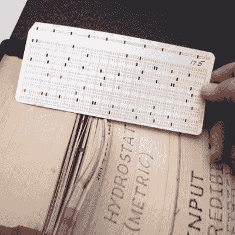

# 问 hack aday:2020 年每行 80 字还合理吗？

> 原文：<https://hackaday.com/2020/06/18/ask-hackaday-are-80-characters-per-line-still-reasonable-in-2020/>

软件开发人员永远不会失去争论和斗争的主题。其中一些可能是项目的基础——比如语言的选择或开始时的编程范例。其他的在一开始看起来更像是个人偏好，但是在更大的范围内也同样重要——比如选择哪个字符缩进，在哪里放置花括号，或者如何处理换行符。最近，当不止一个开发人员合作时，是时候找到一个编码风格指南形式的共同协议了，当然这可能需要一点妥协。

不管品味如何，最糟糕的决定是没有决定，即使你不同意某个特定的细节，为了统一格式的代码，通常最好还是和解。在专业环境中，风格指南最好是在团队内部或团队之间合作制定，并考虑每个相关人员的意见和建议——如果你的公司一开始没有，最好的办法可能是退出。

不过，在开源项目中，情况可能会变得更复杂一些，这取决于项目的结构和规模。如果没有官方的风格指南，优雅的做法是简单地采用代码库的当前风格。但是习惯了大量随机贡献者的大型项目通常会有一个定义，这个定义要么是由核心开发人员制定的，要么是由其[仁慈的终身独裁者](https://en.wikipedia.org/wiki/Benevolent_dictator_for_life)宣布的。

在 Linux 内核的情况下，那当然是[Linus Torvalds]，他最近通过邮件列表的回复震惊了整个社区，声明一个过于常见，甚至经常是不成文的代码格式化规则基本上已经过时:[80 个字符的行限制](https://lkml.org/lkml/2020/5/29/1038)。考虑到他的咆哮和粗鲁的恶名，他的回应，这是由[提交的补丁](https://lkml.org/lkml/2020/5/28/1237)中的一个换行变化发起的，这次看起来完全是外交辞令。

[Linus]反对继续执行 80 个字符的行限制的理由主要是，今天的屏幕足够大，可以轻松容纳更长的行，即使多个终端(或窗口)相邻。正如他所说，坚持限制的唯一原因是使用实际的 VT100，无论如何，它在内核开发中不会有太大用处。

另一方面，允许更长的行会鼓励使用更冗长的变量名和空格，这反过来实际上会增加可读性。当然，在某种程度上，所有的都是如此，而且[Linus]显然没有要求完全废除换行符。但他说得有道理；在 2020 年坚持一个几十年前的、现在看来相当武断的限制真的有意义吗？

## 历史上的线路长度

这种限制到底是从哪里来的？这似乎是每个人都知道并遵循的事情之一，而没有质疑或真正理解它。80 个字符就在我们身边——过去有这些设备显示 80 个字符，您的终端仿真器的默认宽度预设为 80 列，当然还有所有那些不断提出 80 个字符行限制的编码风格指南。这一切似乎神奇地以某种方式走到了一起，事情就是这样，就这样。现在一点用都没有了，不是吗？所以让我们后退几步。

It all started [here](https://moca.ncl.ac.uk/iomedia/pc.htm).

是的，从早期的终端开始，屏幕尺寸确实大多被限制在 80 个字符以内。两个方向都有例外，比如 72 和 132，但 80 是最常见的。考虑到我们在这里谈论的是 20 世纪 60 年代末，似乎有道理的是，显示技术根本不够先进，无法实现更大的屏幕和更长的线条，这就是为什么它们最终有 80 个字符。但也不是这样。

当然，20 世纪 60 年代的显示技术肯定也有一些影响，但这种选择最终是出于习惯，而不是必要。回到那个时候，当第一个终端被设计出来的时候，使用任何类似计算机的东西的人主要知道一种通用的存储介质:[穿孔卡片](https://hackaday.com/2014/05/20/retrotechtacular-once-upon-a-punched-card/)。当时主宰行业的明星是 [IBM 的 80 列乘 12 行卡](https://en.wikipedia.org/wiki/Punched_card#IBM_80-column_punched_card_format_and_character_codes)。嗯，差不多就是这样。

这种特殊卡片的流行导致了在终端上使用相同数量的列的决定，这反过来又将它定义为编码风格的黄金标准，至今仍在广泛使用。在某种程度上，这是可以理解的，考虑到 80×12 穿孔卡是自当时切片面包以来最伟大的发明——因为这两项发明都是在 1928 年 7 月向世界展示的。是的，80 个字符的完整起源可以追溯到 1928 年。

(该卡的[专利申请](http://ibm-1401.info/Patent1772492.pdf)于 1928 年 7 月 20 日提交，第一个切片面包于 1928 年 7 月 7 日[售出](https://en.wikipedia.org/wiki/Sliced_bread#History)

## 当前线路长度

所以我们在这里，接近一个世纪后，仍然在同样的 80 个字符行中压缩文本。当然，并不是所有地方都是这样，今天一些语言有不同的看法，如果不是这样，框架可能会有自己的指导方针。但是，尽管如今我们有了更大的屏幕，但长长的队伍最终会干扰我们的视野。换句话说，需要我们移动我们的眼睛，甚至整个头部，扰乱了阅读流程，增加了忽略重要内容的风险。

话说回来，讨论并不是要完全摆脱行限制，而是要挑战一个强制的、硬性的 80 个字符的限制。从阅读舒适度的角度来看，例如 80 和 85 之间的差异可以忽略不计，坚持前者充其量只会导致笨拙的换行符——就像[Linus]解决的那样——而最坏的情况是隐晦的变量名和其他有问题的格式。

一个常见的折衷方案是鼓励 80 个字符，但允许最多 100 或 120 个字符，并在此处划定硬性限制。这样，如果你超过了软限制，你不必太担心，当你达到硬限制时，有足够的空间以连贯的方式拆分线条。

在理想的世界中，这些都无关紧要，IDE 将为我们透明地处理所有这些。我们将配置风格指南的限制，并另外设置我们自己的首选限制。IDE 按照我们喜欢的方式显示代码，并按照样式指南要求的方式保存代码。

虽然对于缩进样式这样的东西来说，这样做很好，但不幸的是，换行符要复杂得多。为了保持代码的可读性并保留逻辑块，应该在哪里进行拆分呢？如果天真地使用强制换行符，我们又回到了[Linus Torvalds]试图表达的观点。也许机器学习能让我们在未来到达那里，但在那之前，我们只能靠自己。

## 你的极限是多少？

你对这一切有什么看法？你在哪里设置了线长限制？你的副业和你在这里的工作环境有什么不同吗？

你同意[莱纳斯]的观点吗？对于 80 个角色的疯狂，你已经说得够多了吗？还是你更喜欢更短的线？

请在评论中告诉我们！