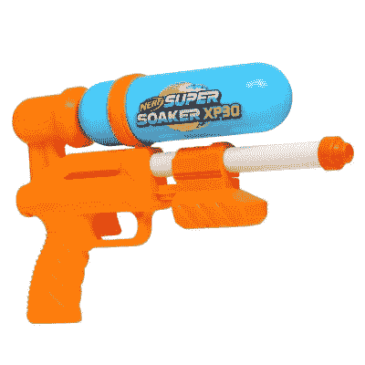
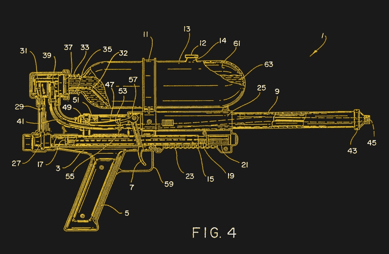
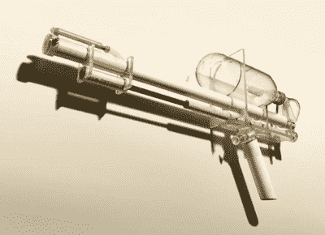
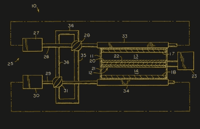

# 朗尼·约翰逊，多产的工程师，数百万孩子心目中的英雄(即使他们不知道)

> 原文：<https://hackaday.com/2020/06/16/lonnie-johnson-prolific-engineer-and-hero-to-millions-of-kids-even-if-they-dont-know-it/>

The current generation Super Soaker XP30\. (Hasbro)

在 20 世纪 70 年代和 80 年代，作为一个孩子，就是从玩具中的电子技术中受益的第一代人。当这些幸运的孩子与块状的 8 位数字敌人作战时，大人们曾担心这会腐蚀他们的大脑。孩子们不像过去几代人那样经常在户外玩耍，因为现代玩具把他们吸引到了小屏幕前。说实话，当你可以用想象中巨大的虚拟武器与外星人战斗时，你如何与之竞争？

当 1990 年*有史以来最好的*玩具*之一*上市时，那些 80 年代的孩子一定很羡慕他们的弟弟妹妹，这是一种储存压力的水枪，我们称之为超级吸水枪。它由塑料制成，不需要电池，远远超过了之前所有的水枪，迅速成为每个闷热夏日的热门玩具。超级水枪和水枪系列重新定义了孩子们在相互淋湿时的乐趣。最好的水枪不再是那些电池昂贵的电动型号，你的父母肯定会拒绝更换——这些水枪做得更好。

你可能知道超级透雨器，但你可能不知道它是由一位名叫朗尼·约翰逊的航空航天工程师发明的，他的职业生涯包括研究隐形技术和美国宇航局的许多项目。

## 地球上最酷的玩具的发明者也研究了太阳系中一些最酷的“玩具”

Lonnie Johnson, pictured in 2016\. Office of Naval Research from Arlington, United States / [CC BY 2.0](https://commons.wikimedia.org/wiki/File:160202-N-PO203-046_(24659795822).jpg)

当你是一个孩子的时候，你的思想从来不会偏离到你的玩具是从哪里来的。它们只是*在那里*，但是也许当你稍微大一点的时候，你开始意识到在某个地方有人发明了它们，让你的生活变得更加*精彩*。在超级酒鬼的例子中，那个人不是玩具公司的一个匿名团队，而是一个人，一个前美国空军和国家航空航天局的工程师，名叫朗尼·约翰逊博士。

在朗尼·约翰逊 20 世纪 50 年代早期生活的故事中，阿拉巴马州的莫比尔将会是许多 Hackaday 读者认为年轻硬件黑客的标志。拆除他姐姐的洋娃娃的头部来研究它的闭眼机制，在家庭厨房里制造火箭燃料，或者建造一辆割草机发动机驱动的卡丁车。他在采访中讲述了他父母的支持，在火箭燃料事件中几乎烧毁房子后，他得到了一个电炉，并被告知继续在户外活动，而不是受到惩罚。

在他高中种族隔离的最后一个班，他代表学校参加了 1968 年的阿拉巴马州科学博览会，并以一个压缩空气驱动的机器人获得了一等奖，然后在第二年去塔斯基吉大学学习机械工程。他终于在 1973 年毕业，获得了机械工程学士学位和核工程硕士学位，然后加入了美国空军，在那里他参与了新生的美国隐形机队的工作。朗尼在美国宇航局喷气推进实验室度过了大约 12 年的职业生涯，在那里他研究了伽利略号、火星观测者号和卡西尼号，这只是其中的几个例子。

## 轻型高压油箱的卓越性能

The Super Soaker, cut away to reveal its inner workings. From [US patent 5305919B1](https://patents.google.com/patent/US5305919).

一个核工程师如何成为世界上最牛逼的水爆器的设计者？故事是这样的:20 世纪 80 年代初，作为一名美国国家航空航天局的工程师，当他在一个以水为推进剂的家庭项目热泵工作时，他会测试泵的组件，并立即意识到高压水射流穿过他的浴室所固有的乐趣。

First Super Soaker Prototype

从那时到 20 世纪 90 年代“电动水帘”玩具进入市场，然后被重新命名为“超级透雨”，这是一条漫长而曲折的道路，有着多次失败的开端。但是他的想法是从一个吹胀的 PET 容器中使用压缩空气，这是一个真正的创新，永远改变了水枪玩具的世界。这种坦克储存压缩空气压力，而不是制造更重、更昂贵的模制部件，使轻便的手持设备有足够的动力推动强大的水流，这不同于之前的任何玩具。

无论是探索太阳系的外层空间，还是保护后院免受小学同学入侵，高质量的工程都是值得的。

## 不是一个安于现状的人…

The Johnson Thermoelectric Convertor, from [US patent 20020064692A1](https://patents.google.com/patent/US20020064692A1)

如果说那时候发财是理所应当的，那就是朗尼·约翰逊的工作。但故事还没有结束，因为他没有退休，享受色彩鲜艳的喷水枪的收益，而是继续自由地成为最幸运的工程师:拥有选择自己工作的资源。他的专利数不胜数，但最具影响力的可能是绿色能源领域。通过他的 [Johnson R & D](http://www.johnsonrd.com/) 公司，他正在[寻求一种新型热机](http://www.johnsonems.com/about/)，目的是实现 80%的热能发电效率。这在固态设备中实现了爱立信热力学循环，氢气穿过两个电极之间的质子交换膜，形成了再生热交换器的等效物。它仍在开发中，但当它进入市场时，它可能会对太阳能的可行性产生重大影响，并在许多其他应用中取代热泵。

所以当我在大洋彼岸的亚特兰大基地写这封信时，朗尼·约翰逊是我心目中的工程英雄之一。他的发明可能比他同时代的任何一位工程师都更能引起青少年自发的快乐，但他在超级酒鬼之前和之后的工作远远超出了一个令人敬畏的塑料玩具。今天，他以给兴高采烈的孩子们提供相互淋湿的方法而闻名，但我敢打赌，在未来几十年，他会因为廉价的无碳能源而出名。