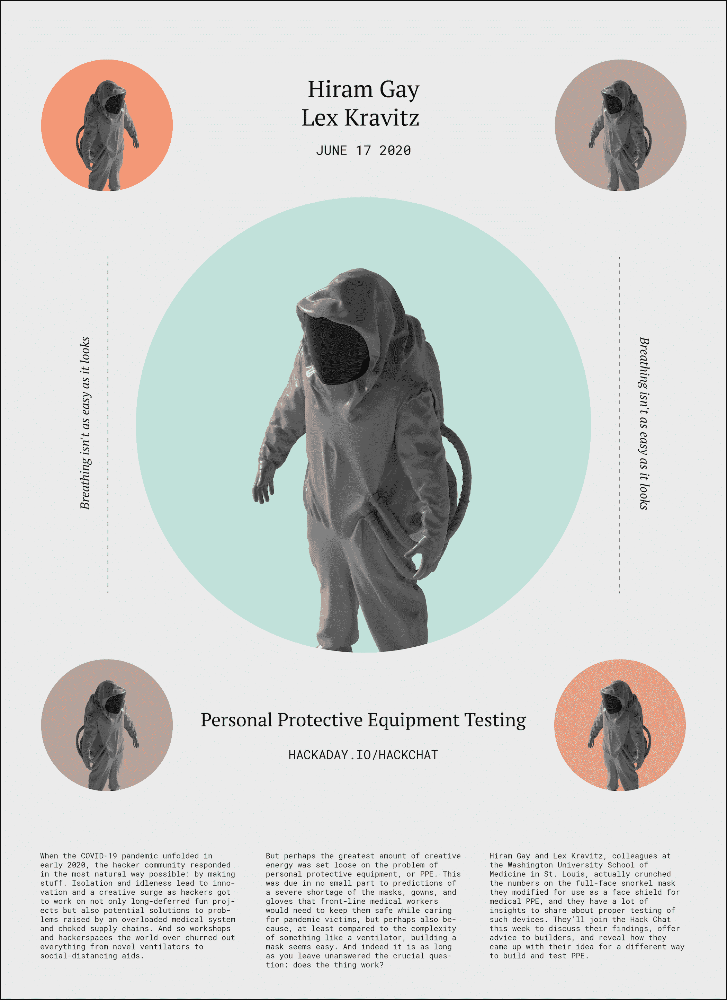

# PPE 测试黑客聊天

> 原文：<https://hackaday.com/2020/06/15/ppe-testing-hack-chat/>

加入我们太平洋时间 6 月 17 日星期三中午的 [PPE 测试黑客聊天](https://hackaday.io/event/171601-ppe-testing-hack-chat)与[希拉姆·盖伊](https://hackaday.io/hacker/558514-hiram)和[莱克斯·克拉维茨](https://hackaday.io/hacker/294140-lex-kravitz)！

当新冠肺炎疫情在 2020 年初展开时，黑客社区以最自然的方式做出了回应:制作东西。与世隔绝和无所事事导致了创造力的激增，因为黑客们不仅参与了长期推迟的投资项目，还参与了超负荷的医疗系统和拥挤的供应链所引发的问题的潜在解决方案。因此，世界各地的工作室和黑客空间生产出了从新型通风设备到社交距离辅助设备的各种产品。

但是也许最大数量的创造性能量被释放在个人防护装备或 PPE 的问题上。这在很大程度上是因为预测到前线医务工作者在护理疫情受害者时需要的保护他们安全的口罩、长袍和手套将严重短缺，但也可能是因为，至少与呼吸机等复杂的东西相比，制造口罩似乎很容易。事实上，只要你不回答这个关键问题:这个东西有用吗？

然而，回答这个问题并不像看起来那么简单。仅仅假设在用户和世界之间进行一些过滤是不够的；你必须实际进行测量。圣路易斯华盛顿大学医学院的同事海勒姆·盖伊(Hiram Gay)和莱克斯·克拉维茨(Lex Kravitz)实际上计算了他们改造的用作医用个人防护设备面罩的全面罩呼吸面罩的数据，他们有很多关于正确测试这种设备的见解可以分享。他们将在本周加入 Hack Chat，讨论他们的发现，为构建者提供建议，并透露他们如何想出一种不同的方法来构建和测试 PPE。

 我们的黑客聊天是 [Hackaday.io 黑客聊天群发消息](https://hackaday.io/messages/room/2369)中的社区直播活动。本周，我们将于太平洋时间 6 月 17 日星期三中午 12:00 坐下来讨论。如果时区让你失望，我们有[一个方便的时区转换器](https://www.timeanddate.com/countdown/generic?iso=20200617T12&p0=224&msg=PPE+Testing+Chat&font=cursive)。

点击右边的那个发言气泡，你会被直接带到 Hackaday.io 上的黑客聊天群，不用等到周三；随时加入，你可以看到社区在谈论什么。

