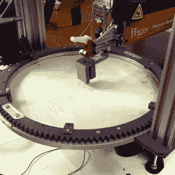

# 机器制造从灰烬中升起

> 原文：<https://hackaday.com/2020/06/13/machine-builds-rise-from-the-ashes/>

本周我被一个失败的项目迷住了。【安德鲁·康斯洛】的[数控卷锯](https://hackaday.com/2020/06/04/cnc-scroll-saw-makes-promising-first-cuts/)还不行，重点在“还”字上。见鬼，即使它确实有效，也可能没有意义，但这不是重点。

滚动锯工作台有一个垂直于工作台的垂直往复锯片，很像带锯，但锯片较短。你把要切割的木板推进刀片，因为它很薄，你可以扭曲和转动各种有趣的拼图形状。[Andrew]用一个 X-Y 门架和一个创新的齿轮旋转环来自动化这个，需要保持木材进入刀片的切割边缘。

这是一个疯狂的装置，也是一个困难而独特的运动规划问题，看着它在视频中运动是一种享受。但这也不起作用:动作上的错误累积起来超过了一次切割，他最终在每一块上都折断了刀片。这是该设备的第三个版本！

但是灵感来了。首先，他拍摄这部电影的唯一原因是记录这个项目在这个阶段的进展——他已经在计划下一个阶段了。第二，这个*就是*做中学的灵魂。除非你尝试新事物，否则你什么也学不到。

最后，[Andrew]的项目让我想起了为什么我喜欢快速原型时代的机器制造。在三台完全不同的机器间穿梭，他基本上没花一分钱。拆开第一版留给他的是和他刚开始时一样的步进电机、铝型材和电子设备。除了他现在对他的特殊问题空间了解得更多。现在他准备再次出发。

因此，如果你完全倾向于机器人，但你正在考虑电机、皮带、轴承和钢材的成本，不要认为这是这个项目的费用，而是多年的迭代，甚至可能是完全不同的机器。

一定要以[Andrew]为榜样，在拆开之前记下并记录下来！见鬼，把它送到黑客日，它会永远存在。

This article is part of the Hackaday.com newsletter, delivered every seven days for each of the last 200+ weeks. It also includes our favorite articles from the last seven days that you can see on [the web version of the newsletter](https://mailchi.mp/hackaday.com/hackaday-newsletter-649368). Want this type of article to hit your inbox every Friday morning? [You should sign up](http://eepurl.com/gTMxQf)!