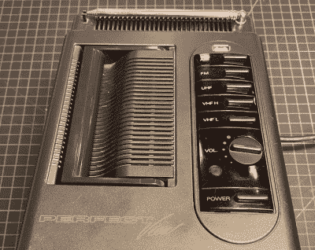

# 便携式视频活套像 Pi 一样简单

> 原文：<https://hackaday.com/2020/06/15/portable-video-looper-is-easy-as-pi/>

我们都有一把拇指驱动器，但对其中的大部分只有模糊的概念，对吗？那么，为什么不掸去灰尘，把它放在某个地方，赋予它新的用途呢？这正是[Cher_Guevara]制作这款[便携式树莓 Pi 视频 looper](https://www.reddit.com/r/RASPBERRY_PI_PROJECTS/comments/h0dn9t/vintage_portable_tv_with_usb_pi_video_looper/) 所做的。重现这一幕最困难的部分可能是  拿出这样一个很好的候选迷你 CRT 电视。

一旦通电，塞在这个小 Magnavox 里的 Pi Zero W 就会等待一个拇指驱动器被插入，并在屏幕上以漂亮的绿色文本显示出来。然后，它会显示在驱动器上找到的视频文件的数量，并在[无限循环播放它们之前给出一个小的倒计时](https://learn.adafruit.com/raspberry-pi-video-looper)。

我们喜欢[Cher]完美地将 USB 端口和嵌入式 Pi 关机按钮集成到电视顶部的控制面板中。就像是另一个时间线的便携版。

[Cher]很幸运，因为这台电视碰巧有一个视频输入插孔，用于连接 Pi。如果你的没有，如果天线是可拆卸的，你可以使用 RCA 到 RF 转换器。在这些信息之后，我们已经为您准备好了演示视频。

好吧，这是一个被改变用途的 u 盘。现在找到另一个并[尝试给它添加 USB OtG](https://hackaday.com/2016/06/20/add-usb-otg-to-a-usb-thumb-drive/)。

 <https://hackaday.com/wp-content/uploads/2020/06/DASH_1080.mp4?_=1>

[https://hackaday.com/wp-content/uploads/2020/06/DASH_1080.mp4](https://hackaday.com/wp-content/uploads/2020/06/DASH_1080.mp4)

通过 [r/raspberry_pi](https://www.reddit.com/r/raspberry_pi/comments/h0fxqx/vintage_portable_tv_with_usb_pi_video_looper/)