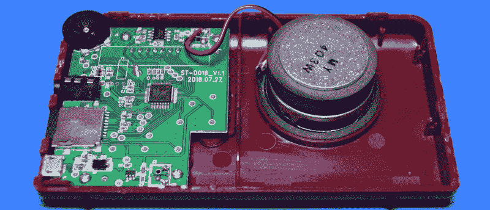
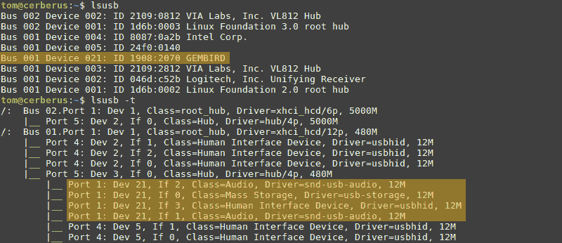
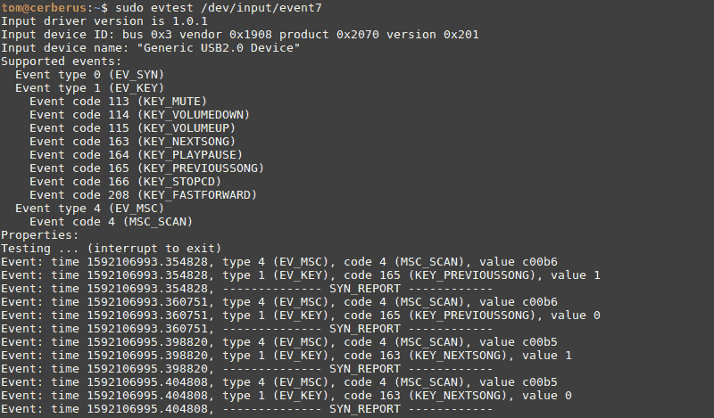

# 拆卸:神奇圣经

> 原文：<https://hackaday.com/2020/06/22/teardown-wonder-bible/>

即使是我们当中最世俗的人也能理解为什么有人想要一本电子版的圣经。如果你是那种从阅读“好书”中获得安慰的人，你可能会喜欢随时随地这样做的能力。但碰巧的是，很多对更方便携带的圣经版本感兴趣的人可能没有足够的技术资源来操作 Kindle 并下载一本。

这正是神奇圣经背后的想法，这是一种口袋大小的电子设备，用户只需按一下按钮，就可以听到大声朗读的圣经。其保守的设计，高对比度的 LED 显示屏和大按钮使其易于操作，即使是视力或灵活性有限的用户。

《神奇圣经》的广告展示了所有年龄段的人都在使用这款设备，但不难从字里行间看出这款设备真正针对的是谁。我们瞥见一个年轻的商人把一本神奇的圣经塞进他昂贵跑车的中控台，但事实上，一个退休人员坐在客厅沉思的场景更接近事实。

事实上，智能手机应用程序可以轻松复制神奇圣经的功能。从大多数标准来看，这甚至可以说是一种进步。但并不是每个人都愿意或能够走这条路，这为一个负担得起的独立设备创造了市场。市场是否足够大，可以在产品上投入大量费用和工程时间？让我们打开这些神圣的滚动个人伴侣之一，找出答案。

## 现成的拯救

让我们从一开始就非常清楚:奇迹圣经只是一个 MP3 播放器。字面上。有一个微型 SD 卡插在旁边，里面有大约 4 GB 的 MP3，在一个分层的目录结构中，将旧约和新约的不同书籍分开。这些曲目甚至有适当的 ID3 标签，所以你可以很容易地将它们导入你选择的媒体播放器，而不是使用神奇的圣经本身。

这样一来，不难看出你可以多快多便宜地制造出像神奇圣经这样的设备。如今，一个功能强大到足以解码 MP3 的微控制器几乎不是一个高要求，你只需要几个备用的 GPIO 引脚来运行这样一个简单的用户界面。将电池和扬声器放入注塑外壳中，您所缺少的就是喷涂在十字架上的产品。

也就是说，奇迹圣经的构建质量没有任何问题。如果有什么不同的话，它就像一辆坦克。粘在一起，用一个隐藏在显示屏边框下的螺丝，我有点不好意思地承认，在这个拆卸系列中，我第一次不得不物理地打开设备才能进入。

 你会注意到《奇迹圣经》中没有[可怕的黑色环氧树脂斑点](https://hackaday.com/2020/05/11/teardown-generation-nex/)的痕迹，但不幸的是，这在这种情况下对我们没有太大帮助。该设备由一个标签为 CCK2F9L 的 SQFP-48 芯片驱动，但我还没有找到它的任何数据表。

虽然芯片上有非常独特的制造商标志，但也许我们的一个忠实读者至少会认出制造商。

除了主芯片和扬声器旁边的 8002 放大器，主板上没有太多其他东西。通过电池连接的五针装置可能是充电控制器，尽管它没有可辨别的标记来给我们一个肯定的 ID。

## 不惜工本

考虑到《神奇圣经》的售价如此之低(大多数零售商售价 15-20 美元)，它的质量和对细节的关注相当令人印象深刻。例如，扬声器是一个很大的单元，声音很大，听起来就其大小而言相当不错，而 micro SD 插槽实际上有一个弹簧加载的动作。电池也是一个很好的可拆卸的 18650 电池，而不是热粘在外壳上的银袋。

显示器似乎也是定制的，这肯定不便宜。可读性可能是设计奇迹圣经时最关心的问题，明亮的 led 加上几乎镜面加工的塑料漫射器使它从任何角度都容易看到。即使在明亮的光线下，数字和图标也是充满活力和清晰的。

揭开盖子，我们可以看到模块上有趣的黑色纹理以及各种图标，这些图标会随着神奇圣经的运行而发光。但是我们也看到了一些神秘的东西:USB 图标。该手册没有提到使用设备上的 USB 端口做任何事情，除了充电，那么它可能是什么呢？

## 潜得更深

 将 PCB 翻过来后，仔细检查确认 USB 端口的数据线确实连接好了。很自然地，我把它插到我的电脑上，看看它会做什么。屏幕瞬间亮了起来，说“PC”，这似乎是一个好兆头。尽管有点讽刺的是，专用的 USB 图标显然没有被使用。

几秒钟后，设备中的微型 SD 卡安装在我的系统上，我可以看到所有的 MP3 文件。这似乎是一个足够方便的功能，如果考虑到设备的功能有点不必要。毕竟，圣经的内容不可能在不久的将来改变，也不需要更新。

考虑到对神奇圣经报告给计算机的信息进行检查可能会提供一些有用的线索，我运行`lsusb`来看看内核对硬件有什么看法:

那就奇怪了。根据这一点，硬件不仅被内核的 USB 大容量存储驱动程序拾取，而且还作为音频和输入设备出现。快速检查我系统的音频设置显示，我确实可以选择《神奇圣经》作为音频输出，它在播放作为 Hackaday 实际配乐的[环境电子音乐方面做得相当不错。](https://hackaday.io/project/167031-python-somafm-player)

但是人机界面设备呢？通过查看`/proc/bus/input/devices`,我能够看到它被内核映射到的文件，并且`evtest`程序让我检查它并监听事件。这表明，虽然该设备报告说它能够提供一套标准的媒体播放控制，但它只有在您按下后退和前进按钮时才会响起:

现在*为什么*它能做到这一切谁也说不准。网上的快速搜索显示，金鸟制造了许多 MP3 播放设备，这些功能可能只是最初携带这种芯片的任何设备的遗留物。也有可能，尽管可能性较小，有一些 PC 端软件计划允许用户将他们的神奇圣经连接到计算机上，使用设备的熟悉控制来收听额外的内容。

## 过去的时代

最终，神奇圣经是一个非常有趣的装置。虽然硬件显然非常简单，但它比我第一眼看到的要好得多。你甚至可能会说它建设过度了；有许多显而易见的削减成本的措施可以用来降低《神奇圣经》的生产成本，但制造商们已经决定采取更高的方式。拆卸也被证明是一个很好的练习，可以使用未知的 USB 设备并识别它们的能力。

所以，你能买一本二手的《奇迹圣经》并在里面载入黑客日播客的前几集吗？当然可以。我已经做到了，而且效果很好。你甚至可以通过在键盘上输入剧集编号来浏览它们。但是用你的手机会简单得多。这到底是这个硬件的问题:几十年前，一个令人惊讶的制作精良的设备可以处理数百个精心组织的 MP3 文件，这将是一件大事，但在 2020 年，它只不过是一个多余的小工具。