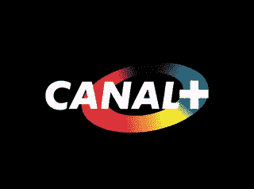
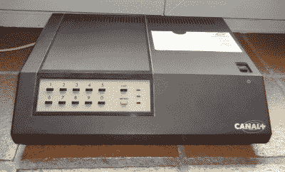

# 灰色齿轮:法国电视加密，20 世纪 80 年代风格

> 原文：<https://hackaday.com/2020/06/25/old-tech-french-tv-encryption-1980s-style/>

我们当中有谁没有把青春的一部分浪费在徒劳地看一两个付费有线电视频道上呢？奇怪的是，我们没有吹灭视锥和视杆，看着那些怪异的颜色和波浪线像发烧梦一样在屏幕上跳舞。

在美国国家付费电视的早期，任何人只要付了钱，在后院竖起一个 6 英尺高的卫星天线，就可以收看 HBO、Showtime 和第一个 24 小时新闻网 CNN 等频道。受够了吃白食的人，这些频道联合起来加密他们的传输，并强迫人们购买昂贵的解码盒。最重要的是，用户必须每月支付微薄的费用来保持解扰器的工作。

 [在法国，第一个全国性的有线频道是 Canal+，于 1984 年 11 月 4 日首次亮相](https://fabiensanglard.net/discret11/index.html)。他们可能已经采用了美国使用的视频密码系统，并已不再使用，但他们不能——视频密码是为 NTSC 广播系统设计的。法国电视以 séCAM 格式广播，该格式使用与 PAL 相同的帧速率和隔行扫描行数，但处理颜色信息的方式不同。Canal+需要一个加密方案来匹配。他们提出的系统简单而有效，但可能有点目光短浅。

模拟电视使用电子枪在屏幕上快速地一次一行地描绘图像。通过延迟线条的绘制——通过将信息从屏幕推到右边并用黑色从左边填充来填充图片 Discret11 简单地加密了 Canal+信号。该系统通过将信号分成两个波段并颠倒高端和低端，将音频变成了令人无法忍受的呜呜声。

Canal+decoder box via [Home Cinema France](https://www.homecinema-fr.com/forum/chaines-tv-demodulateurs/decodeur-canal-uhd-2018-t30085205-2340.html)

Discret11 因其 11 位密钥而得名，该密钥用于植入线性反馈移位寄存器，进而计算线路的延迟时间。订户必须将这个密钥输入到他们的解码器盒中，为了防止盗版，Canal+每个月都会更换密钥。

这项服务首播仅一个月后，DIY 解扰器的示意图就开始流传。尽管 Canal+继续发展并取得了相当大的成功，但离散加密方案在 1995 年被淘汰。

即便如此，这项技术仍作为一种艺术媒介存在——你可以买一个由解码器组装而成的新奇的离散编码器，然后制作你自己的迷幻视频。

主图像通过[@ HTP . synthesis](https://www.instagram.com/htp.syntonie/)

你有什么旧技术需要我们调查吗？[提交您对未来部分的想法](mailto:tips@hackaday.com?Subject=[Retrotechtacular])。