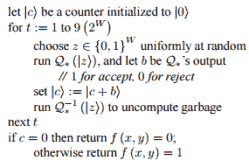

# 新的 Silq 编程语言旨在使量子编程更容易

> 原文：<https://hackaday.com/2020/06/22/new-silq-programming-language-aims-to-make-quantum-programming-easier/>

新的 Silq 编程语言从苏黎世联邦理工学院新鲜出炉。他们也有[向](https://dl.acm.org/doi/abs/10.1145/3385412.3386007) [PLDI 2020](https://dl.acm.org/conference/pldi) 大会提交了一篇论文，阐述为什么他们觉得它是迄今为止最好的[量子编程](https://en.wikipedia.org/wiki/Quantum_programming)语言。虽然这可能不是常识，但缺乏可用的通用量子计算机并没有阻止多个团队为这种计算机系统开发编程语言。

微软的 Q# 是这一领域的有力竞争者，还有更老的 [QCL 语](https://en.wikipedia.org/wiki/Quantum_Computation_Language)。Silq 团队的[声称](https://silq.ethz.ch/comparison)他们的语言更好的确切原因似乎可以归结为“更高层次”,以及支持自动(和安全)非计算。虽然“高级”方面是可疑的，因为 Q#无疑是一种高级编程语言，但他们的非计算声明至少有一些优点。

Quantum algorithm with uncompute step.

取消计算是量子编程中的一个概念，偶尔需要从当前状态中删除一些中间对象，因为它们可能会导致量子干涉，从而影响最终的输出。通常，我们会将中间结果保存到寄存器中，然后复位状态并继续。然而，状态的哪些部分要保留，哪些部分不需要计算，这并不容易确定，快速浏览一下量子计算栈交换和理论计算机科学的相关答案可能会发现。

因此，主要的问题似乎是 Silq 能够自动确定哪些“垃圾”可以安全地被计算出来，以及哪些应该是量子干涉的一部分。我们都见过像 Java 和 C#这样的语言，即使是传统的计算，像垃圾收集这样简单的事情也会出错。也许在这个特殊的波形完全崩溃之前，我们还不应该数我们的量子鸡。

(感谢量化宽松)